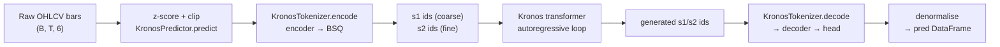

# Kronos — architecture

Kronos is a two-stage system. Stage 1 compresses each continuous OHLCV bar into a
pair of discrete tokens; stage 2 is an ordinary decoder-only transformer trained
on those tokens. Forecasting is autoregressive token generation followed by
detokenisation back into prices.



Everything below refers to `model/kronos.py` (top-level classes) and
`model/module.py` (building blocks).

---

## 1. Input representation

A bar is six numbers: `open, high, low, close, volume, amount`. `amount` is
turnover (price × volume). Both `volume` and `amount` are optional at the API
level; `KronosPredictor` fills them in (see
[API_REFERENCE.md](./API_REFERENCE.md#missing-volume-and-amount)).

Normalisation is **per series, per call**: the mean and standard deviation are
computed over the context window, applied as `(x - mean) / (std + 1e-5)`, and the
result is clipped to `[-clip, +clip]` (default 5.0). The same statistics are used
to invert the transform on the output. Two consequences:

* Kronos never sees absolute price levels, only shape. A ¥10 stock and a $400
  stock with the same normalised trajectory are the same input.
* Clipping at ±5σ means a genuine limit-up gap inside the context window is
  flattened, and the model can never predict a move further than 5σ from the
  context mean.

Timestamps are encoded separately as five integer calendar features —
`minute, hour, weekday, day, month` (`calc_time_stamps`) — never as an absolute
epoch. This is what lets the model condition on intraday session structure and
day-of-week effects.

---

## 2. Stage 1 — the tokenizer (`KronosTokenizer`)

A transformer autoencoder with a Binary Spherical Quantizer (BSQ,
[arXiv:2406.07548](https://arxiv.org/pdf/2406.07548.pdf)) in the bottleneck.

```
x (B,T,d_in)
  └─ embed: Linear(d_in → d_model)
  └─ encoder: (n_enc_layers - 1) × TransformerBlock
  └─ quant_embed: Linear(d_model → codebook_dim)      codebook_dim = s1_bits + s2_bits
  └─ BSQuantizer  ───────────────► quantized bits, indices, bsq_loss
       ├─ post_quant_embed_pre: Linear(s1_bits → d_model) ─┐ coarse-only path
       └─ post_quant_embed:     Linear(codebook_dim → d_model) ─┐ full path
  └─ decoder: (n_dec_layers - 1) × TransformerBlock  (shared weights, run twice)
  └─ head: Linear(d_model → d_in)
```

### Binary spherical quantization

`BSQuantizer` (a thin wrapper over `BinarySphericalQuantizer`) does the following
per timestep:

1. **L2-normalise** the `codebook_dim`-dimensional latent onto the unit sphere.
2. **Sign-quantise**: `zhat = sign(z)`, giving a vector in `{-1, +1}^codebook_dim`,
   then scale by `1/sqrt(codebook_dim)` to stay on the sphere. Gradients pass
   through with a straight-through estimator (`z + (zhat - z).detach()`).
3. **Pack the sign bits into integers.** This is the token id.

Because the code is one bit per dimension, the vocabulary is `2^codebook_dim`
implicitly — but the codebook is never materialised. There is no embedding table
to collapse, no dead-codebook problem, and no codebook size/quality trade-off to
tune. That is the reason BSQ is used here rather than a classic VQ-VAE.

The quantizer loss has two parts:

* **Commitment**: `beta * mean(||sg[zq] - z||²)`, pulling the encoder output
  toward its own quantised version.
* **Entropy penalty**: `gamma0 * per_sample_entropy - gamma * codebook_entropy`,
  the whole thing scaled by `zeta`. Maximising codebook entropy spreads usage
  across the vocabulary; minimising per-sample entropy makes each individual
  assignment confident. Computing the exact codebook entropy over `2^codebook_dim`
  states is intractable, so it is approximated by splitting the code into groups
  of `group_size` bits and summing per-group entropies (`soft_entropy_loss`);
  `embed_dim` must be divisible by `group_size`.

### Hierarchical (coarse/fine) split

The bit vector is cut in two: the first `s1_bits` are the **coarse** token `s1`,
the remaining `s2_bits` are the **fine** token `s2`. `encode(x, half=True)`
returns them as two separate integer streams; `half=False` returns one composite
id over all bits.

The tokenizer is trained to reconstruct from *both* depths simultaneously —
`forward()` runs the decoder twice, once on the coarse bits alone (`z_pre`) and
once on the full code (`z`), and the training loss sums both reconstruction
errors. This is what makes the coarse token meaningful on its own, which is the
precondition for the two-step decoding in stage 2.

### Bit-order conventions

Two different bit orderings coexist in the file, and they do not mix:

* `BSQuantizer.bits_to_indices` and `KronosTokenizer.indices_to_bits` both use
  **ascending** powers (`2 ** arange(0, n)`). These two are inverses of each
  other and form the encode/decode path you actually use.
* `BinarySphericalQuantizer.codes_to_indexes` uses **descending** powers
  (`2 ** arange(n-1, -1, -1)`). It feeds the metrics dictionary only (codebook
  usage statistics) and never round-trips through the tokenizer.

If you write your own detokeniser, follow the first convention.

---

## 3. Stage 2 — the predictor (`Kronos`)

A decoder-only transformer over `(s1, s2)` token pairs.

### Embedding

`HierarchicalEmbedding` holds two tables, `emb_s1` of size `2^s1_bits` and
`emb_s2` of size `2^s2_bits`. Both lookups are scaled by `sqrt(d_model)`,
concatenated, and projected back to `d_model` by `fusion_proj`. It accepts either
a `(s1_ids, s2_ids)` pair or a composite id tensor, which it splits with a bit
mask.

`TemporalEmbedding` sums five per-field embeddings for
`minute/hour/weekday/day/month`. With `learn_te=False` these are fixed sinusoidal
tables (`FixedEmbedding`, frozen); with `learn_te=True` they are trainable
`nn.Embedding`s. The result is added to the token embedding, then
`token_dropout_p` dropout is applied.

### Transformer block

Pre-norm, and modern throughout:

* `RMSNorm` instead of LayerNorm.
* Multi-head self-attention with **rotary position embeddings** applied to Q and
  K, dispatched to `F.scaled_dot_product_attention` with `is_causal=True`.
* `FeedForward` is SwiGLU: `w2(silu(w1(x)) * w3(x))`, no biases.

Positional information therefore arrives twice and independently: RoPE encodes
*relative order within the window*, `TemporalEmbedding` encodes *absolute wall-clock
identity*. That is why a forecast for 09:35 on a Monday differs from the same
context replayed at 14:00 on a Friday.

### Dual head and the dependency-aware layer

Predicting `s1` and `s2` independently would ignore the fact that the fine token
is only meaningful given the coarse one. Kronos handles this with a two-step
head:

1. The transformer output `x` goes through `DualHead.proj_s1` → **s1 logits**.
2. An `s1` id is chosen (sampled at inference, or teacher-forced from the target
   during training).
3. `DependencyAwareLayer` cross-attends with `query = emb_s1(chosen_s1)` and
   `key = value = x`, adds the result to `x` residually, and RMSNorms it.
4. That conditioned state goes through `DualHead.proj_s2` → **s2 logits**.

`forward()` does all four steps in one call. `decode_s1` / `decode_s2` split them
so the inference loop can sample `s1` before computing `s2` without a second
pass over the transformer stack.

Training loss is `(CE(s1) + CE(s2)) / 2` (`DualHead.compute_loss`).

---

## 4. Inference (`auto_regressive_inference`)

The generation loop, in order:

1. Clip the normalised context to `±clip` again (belt and braces).
2. **Fan out for sampling**: repeat the context `sample_count` times along the
   batch dimension. All paths are generated in parallel as one big batch — this
   is why raising `sample_count` costs memory, not wall-clock, up to the point
   where the GPU saturates.
3. Encode the context to `(s1, s2)` streams with `half=True`.
4. Allocate a fixed **rolling buffer** of width `max_context` for each stream and
   seed it with the most recent `max_context` context tokens.
5. For each of `pred_len` steps:
   * slice the stamp tensor to the same window (`full_stamp` is the concatenation
     of context and future stamps, so future calendar features are available —
     the model knows *when* it is predicting);
   * `decode_s1` → take the last position's logits → `sample_from_logits` → `s1`;
   * `decode_s2` on the returned context → last position → sample → `s2`;
   * append to the buffer, or `torch.roll` the buffer left by one and write at
     the end once the window is full.
6. Concatenate context and generated tokens, decode the final `max_context`
   window back to feature space with `tokenizer.decode(..., half=True)`.
7. Reshape to `(batch, sample_count, T, d_in)` and **average over the sample
   axis**.

Step 7 is worth internalising: `sample_count > 1` returns the *mean path*, not a
distribution. If you want quantiles or a fan chart, call `predict` repeatedly
with `sample_count=1` and collect the results yourself.

There is no KV cache. Each of the `pred_len` steps re-runs the full stack over
the whole window, so cost is `O(pred_len × max_context²)`. Halving `max_context`
is the cheapest lever on latency.

### Sampling controls

`sample_from_logits` divides logits by temperature `T`, optionally filters, then
draws with `torch.multinomial` (or takes the argmax if `sample_logits=False`,
which the shipped inference path never does).

`top_k_top_p_filtering` **short-circuits**: if `top_k > 0` it applies top-k and
returns immediately, so `top_p` is ignored. Nucleus filtering only happens when
`top_k == 0` and `top_p < 1.0`. Use one or the other, not both.

---

## 5. Behavioural notes and gotchas

Observations from reading the code; useful when the model does something
surprising.

* **`sample_count` averaging smooths.** Averaging several sampled candlestick
  paths pulls the result toward the conditional mean, and mean OHLC bars are
  systematically less volatile than real ones. High `sample_count` gives a
  visually "tame" forecast that will understate realised range.
* **`top_k=None` crashes.** `sample_from_logits` guards with
  `top_k is not None or top_p is not None` and then evaluates `top_k > 0`, so
  passing `top_k=None` while setting `top_p` raises `TypeError`. Always pass an
  integer `top_k` (0 disables it). `KronosPredictor.predict` defaults to `0`, so
  this only bites when calling the lower-level functions directly.
* **Cross-attention causality is tied to `.training`.** `MultiHeadCrossAttentionWithRoPE`
  sets `is_causal=self.training`, so the dependency-aware layer is causal during
  training and non-causal at eval. It is only ever applied position-wise on the
  last token during generation, so it does not leak future information there.
* **Padding-mask polarity is inconsistent.** `key_padding_mask` is handed
  straight to `scaled_dot_product_attention` as `attn_mask` (boolean: `True` =
  attend), while `DualHead.compute_loss` treats `padding_mask == 0` as the valid
  positions. Nothing in `KronosPredictor` or either fine-tuning pipeline passes a
  padding mask, so both paths are untested in practice — verify the polarity
  yourself before introducing one.
* **No `amount` in, no `amount` out that means anything.** When `amount` is
  absent it is synthesised as `volume × mean(OHLC)`; when `volume` is absent too,
  both columns are zeros. The model still emits values in those columns. Ignore
  them in that case.
* **Truncation is silent.** A lookback longer than `max_context` is not an error;
  the extra history is dropped.
