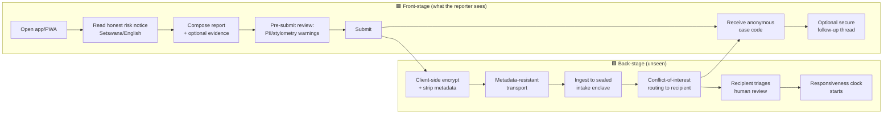
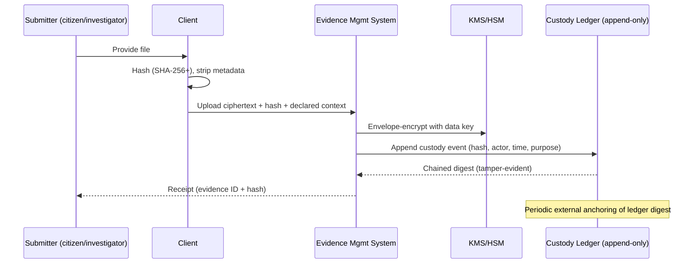

# 05 — Service Blueprint

> **What a service blueprint adds over a user journey:** it lines up, for each step, the
> *user action*, the *front-stage* (what the user touches), the *back-stage* (staff/system
> actions the user does not see), the *support processes* (platform capabilities enabling
> it), the *evidence/artifacts* produced, and the **fail points** (where it breaks) with the
> **threat IDs** and **mitigations** that apply. Blueprints are the connective tissue between
> stakeholder needs (`03`), gaps (`04`), and the domain/services (`06`, `07`).
>
> Blueprinted here: **J1 Confidential report** (Mode 1, safety-critical), **J2 Track my
> case** (access), **J3 Evidence handling** (integrity), **J4 Court scheduling & status**
> (adjudication), **J5 Public transparency access** (Mode 4). Others (appeals, oversight
> escalation, disclosure) follow the same template in the Design phase.

**Legend:** 🟦 front-stage · 🟩 back-stage · 🟨 support process · 📄 evidence/artifact ·
🔴 fail point.

---

## J1 — Citizen files a confidential integrity report (Mode 1)

| Step | 🟦 Front-stage | 🟩 Back-stage | 🟨 Support | 📄 Artifact | 🔴 Fail point → threat → mitigation |
|------|---------------|---------------|-----------|-------------|-------------------------------------|
| Open | App/PWA/USSD entry | App authenticity check | Signed builds, cert/onion pinning | — | Fake app harvests report → **S-1** → published fingerprints, official channels |
| Risk notice | Layered plain-language + Setswana | — | Safety-critical UX content | Consent record (non-identifying) | User skips/misreads → **U-1** → mandatory, layered, unskippable key points |
| Compose | Text + evidence attach | — | Draft store (local, encrypted) | Draft | Draft leaks on device → **DT-1/A-TEC-05** → local encryption, panic wipe |
| Pre-submit review | PII/stylometry warnings | AI redaction suggestions (advisory) | AI Decision-Support (bounded) | Redaction suggestions | Content self-IDs reporter → **I-3/U-2** → warn, never block; human choice |
| Submit | "Sending securely…" | Client-side encrypt, strip EXIF/metadata | Crypto lib, KMS public keys | Ciphertext + integrity hash | Metadata leak → **I-2/ID-2** → onion transport, no IP logs, padding 🔒 |
| Route | — | CoI-aware routing to authorized recipient(s) | Governance-signed recipient directory | Signed routing record | Routed to implicated party → **T-4/P7** → CoI rules, multi-recipient, audit |
| Ack | Anonymous case code shown | Delivery/receipt record created | Non-repudiation (operator side) | Signed receipt | Reporter thinks it vanished → **R-1** → responsiveness metrics, escalation |
| Follow-up | Secure thread by case code | Recipient replies; no identity added | Secure Messaging (deniable for reporter) | Thread | Credential theft on device → **S-2** → high-entropy client code, no server identity |

**Success criteria (measurable):** submission works over 2G/offline-draft; zero server-side
IP retention (audited); recipient receives within SLA; reporter can retrieve status without
providing any identifier; risk notice comprehension tested with target users. 🔒
HUMAN-EXPERT-REVIEW-REQUIRED (crypto, metadata, safety UX).

---

## J2 — Litigant/citizen tracks their case (access, Mode 3-adjacent)

| Step | 🟦 Front-stage | 🟩 Back-stage | 🟨 Support | 📄 Artifact | 🔴 Fail point → threat → mitigation |
|------|---------------|---------------|-----------|-------------|-------------------------------------|
| Authenticate | Identity or matter-scoped code | Verify entitlement to this matter | IAM (ABAC, phishing-resistant MFA) | Auth event | Over-broad access → **E-1/I-4** → matter-scoped ABAC, least privilege |
| View status | Case state, next hearing, party role view | Read judiciary-owned case state (role-filtered) | Case Management (CQRS read model) | — | Cross-party leakage → **I-5/DD-1** → per-role projections, no raw record |
| Notifications | "Hearing moved to…" | Event → notification fan-out | Notification Platform (privacy-aware) | Notification log | Sensitive detail in push → **DT-2** → minimal payloads, detail behind auth |
| Guidance | Rights/next-steps, formal + customary | Content service | Transparency/Info service | — | Misleading guidance → fairness risk → human-reviewed content, "not legal advice" |

**Success criteria:** a litigant sees accurate status without seeing others' data; notifications
carry no sensitive detail in the clear; guidance covers formal **and** customary pathways.

---

## J3 — Evidence intake & chain of custody (integrity spine)

| Layer | Detail | 🔴 Fail point → threat → mitigation |
|-------|--------|-------------------------------------|
| 🟦 Front | Upload, receive evidence ID + verifiable hash | Wrong/garbage evidence → data-quality → declared context + human validation |
| 🟩 Back | Hash, envelope-encrypt, append custody event | Tamper at rest/in transit → **T-1/I-4** → content-addressed storage, E2E, keys outside storage |
| 🟨 Support | KMS/HSM, append-only ledger, trusted timestamp | Ledger tampering to hide misuse → **T-2** → hash-chained + externally anchored |
| 📄 Artifact | Evidence object, custody chain, receipt | Custody dispute in court → **A-LEG-05** → admissibility-aligned records 🔒 |
| Access | Every access authz + logged | Insider exfiltration → **E-1** → least privilege, dual control, DLP |

**Success criteria:** any access re-verifies integrity; custody chain reconstructs who-touched-
what-when; ledger tamper is detectable; timestamps independently anchored. 🔒 HUMAN-EXPERT-
REVIEW-REQUIRED (forensics, crypto).

---

## J4 — Court scheduling & case-status update (adjudication)

| Step | 🟦 Front-stage | 🟩 Back-stage | 🟨 Support | 📄 Artifact | 🔴 Fail point → threat → mitigation |
|------|---------------|---------------|-----------|-------------|-------------------------------------|
| Registrar sets hearing | Court admin portal | Write to judiciary-owned case state | Case Mgmt (state machine) | Cause-list entry | Executive alters court data → **A-JUS-03/E-1** → judiciary-owned zone, hard boundary |
| Conflict check | Calendar shows clashes | Scheduling engine detects conflicts | Court Admin Portal | Schedule | Double-booking → delay (P2) → conflict detection |
| Notify parties | — | Event → notifications to on-record parties | Notification Platform | Notifications | Leak of sealed matter → **A-JUS-04** → sealing-aware notifications |
| Publish (open justice) | Public cause list (permitted subset) | Redaction/exception engine | Transparency Dashboard | Public entry | Publishing a protected matter → **A-JUS-04/I-*** → auto-exception enforcement |

**Success criteria:** only the judiciary can alter adjudication data; scheduling conflicts are
detected; open-justice publication automatically excludes protected matters.

---

## J5 — Public accesses transparency data (Mode 4)

| Step | 🟦 Front-stage | 🟩 Back-stage | 🟨 Support | 📄 Artifact | 🔴 Fail point → threat → mitigation |
|------|---------------|---------------|-----------|-------------|-------------------------------------|
| Browse dashboard | Aggregated stats/trends | Serve pre-verified aggregates | Transparency Dashboard (read-only) | — | Re-identification from small cells → **L-1/ID-1** → k-anonymity/aggregation thresholds |
| Drill down | Non-attributable breakdowns | Enforce minimum aggregation | Analytics (privacy-preserving) | — | Individual allegation exposed → **hard rule breach** → no individual data path exists |
| Methodology | "How we compute this" | Publish methodology + caveats | Governance transparency | Methodology doc | Misinterpretation by media → context/caveats, no raw allegations |

**Success criteria:** no query returns individually identifying data; small-cell suppression
enforced; methodology public; nothing an unverified allegation could leak into public view.

---

## 5.1 Cross-journey fail-point themes

1. **Authenticity at the edge** (J1) — fake front-ends bypass all backend controls (S-1).
2. **Metadata, not content** (J1) — the real de-anonymization risk (I-2/ID-2/DT-1).
3. **Integrity provability** (J3) — the difference between usable and useless evidence.
4. **Separation-of-powers boundaries** (J4) — writes to judiciary data must be judiciary-only.
5. **Aggregation floors** (J5) — the line between transparency and re-identification.

## 5.2 Definition-of-Done

- [x] Key journeys blueprinted across all five layers with explicit fail points.
- [x] Every fail point mapped to STRIDE/LINDDUN IDs and a mitigation.
- [x] Measurable success criteria per journey.
- [x] Safety-, crypto-, and forensics-critical steps flagged 🔒.
- **Required specialist review:** safety-critical UX (J1), cryptography/forensics (J1, J3),
  judicial/registry process owners (J4), privacy/statistics for disclosure control (J5).

*Next: `06-domain-model.md`.*
