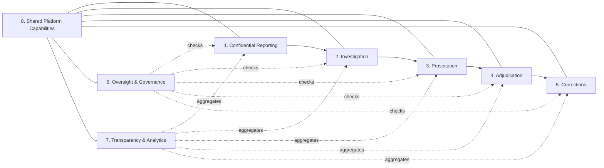

# 07 — Capability Map

> **Purpose.** A **business capability map** answers "*what* the platform must be able to do,"
> independent of *how* (services) or *who* (org). It gives a stable backbone for scoping,
> sequencing, ownership, and the GitHub epic structure (Delivery phase). Capabilities are
> nouns of ability, not features. Each L1 capability decomposes into L2 sub-capabilities,
> mapped to the owning **bounded context** (`06`) / **service**, with a **maturity target**
> and the **root problem** (`02`) it serves.
>
> **Maturity key:** ● MVP · ◐ Phase 2 · ○ Phase 3+ (proposals; checkpoint may re-sequence).

---

## 7.1 Level-0 capability domains

## 7.2 Capability breakdown (L1 → L2)

### 1. Confidential Reporting `[Context: Confidential Reporting]`
| L2 sub-capability | Maturity | Service | Root |
|-------------------|----------|---------|------|
| Anonymous intake (multi-channel) | ● | Reporting Portal · Citizen App/PWA | P1/P5 |
| Honest risk communication | ● | Citizen App (safety UX) | P1/U-1 |
| PII/stylometry pre-submission assist | ◐ | AI Decision-Support | I-3/U-2 |
| Anonymous case tracking & follow-up | ● | Reporting Portal · Secure Messaging | P1/R-1 |
| CoI-aware routing to recipients | ● | Governance routing · API Gateway | P7/T-4 |
| Anti-abuse (anonymity-preserving) | ● | Reporting Portal | S-4/D-3 |

### 2. Investigation `[Context: Investigation]`
| L2 | Maturity | Service | Root |
|----|----------|---------|------|
| Report/tip triage & assignment | ● | Investigator Workspace | P4 |
| Case collaboration (least privilege) | ◐ | Investigator Workspace · Case Mgmt | P4/E-1 |
| Evidence collection & custody | ● | Evidence Mgmt | P3 |
| Investigative scheduling | ◐ | Case Mgmt · Notification | P2 |

### 3. Prosecution `[Context: Prosecution]`
| L2 | Maturity | Service | Root |
|----|----------|---------|------|
| Charge/decision management | ◐ | Prosecutor Workspace | P9 |
| Disclosure management (audited) | ◐ | Prosecutor · Defender Workspaces | P9 |
| Deadline/obligation tracking | ◐ | Case Mgmt | P2 |

### 4. Adjudication `[Context: Adjudication / Customary Justice]`
| L2 | Maturity | Service | Root |
|----|----------|---------|------|
| Case registry & state management | ◐ | Case Mgmt · Court Admin Portal | P2/P8 |
| Scheduling & cause lists | ◐ | Court Admin Portal | P2 |
| Orders/judgments management | ◐ | Court Admin Portal · Digital Archive | P8 |
| Appeals workflow | ○ | Case Mgmt · Governance | P9 |
| Customary-justice support | ○ | Customary module (co-designed) | P5/A-JUS-06 |
| Open-justice publication (redacted) | ○ | Transparency Dashboard | P6/A-JUS-04 |

### 5. Corrections `[Context: Corrections]`
| L2 | Maturity | Service | Root |
|----|----------|---------|------|
| Remand/custody status linkage | ○ | Corrections integration · Case Mgmt | P2 |
| Court-production scheduling | ○ | Court Admin · Notification | P2 |

### 6. Oversight & Governance `[Contexts: Oversight, Governance]`
| L2 | Maturity | Service | Root |
|----|----------|---------|------|
| Responsiveness accountability metrics | ◐ | Oversight Portal · Analytics | P1/R-1 |
| Independent scrutiny / pattern analytics | ◐ | Oversight Portal | P6/P7 |
| Escalation workflow | ◐ | Oversight · Governance | P1/P6 |
| Policy engine & decision logging | ◐ | Governance Portal | P7 |
| Conflict-of-interest controls | ● | Governance Portal | P7/T-4 |
| Threshold/split-trust approvals | ● | Governance · KMS/HSM | I-1/E-1 |
| Transparency reporting | ◐ | Governance · Transparency | P6 |
| Audit scheduling & assurance | ● | Audit Platform · Governance | P7/T-2 |

### 7. Transparency & Analytics `[Context: Transparency & Analytics]`
| L2 | Maturity | Service | Root |
|----|----------|---------|------|
| Privacy-preserving aggregation | ◐ | Analytics Platform | P6/P10 |
| Public transparency dashboard | ◐ | Transparency Dashboard | P6 |
| Small-cell suppression / disclosure control | ◐ | Analytics | L-1/ID-1 |
| Methodology transparency | ◐ | Governance/Transparency | P6 |
| Policy insight (purpose-limited) | ○ | Analytics | P10/DD-2 |

### 8. Shared Platform Capabilities `[Generic-critical contexts]`
| L2 | Maturity | Service | Root |
|----|----------|---------|------|
| Identity & access (zero trust, ABAC, MFA) | ● | Identity Platform | P7/S-3/E-1 |
| Encryption & key management (HSM, threshold) | ● | KMS/HSM · Security Arch | I-1/I-4 |
| Secrets management | ● | Secrets manager | I-4/E-2 |
| Secure messaging (mode-appropriate E2E) | ● | Secure Messaging | P1/P9 |
| Notifications (privacy-aware) | ● | Notification Platform | P2/P5 |
| Tamper-evident audit (anchored) | ● | Audit Platform | P7/T-2 |
| Observability & SIEM & anomaly detection | ● | Monitoring Platform | P7 |
| API gateway & rate limiting & WAF | ● | API Gateway | S-*/D-* |
| Digital archive (retention, sealing, DR) | ○ | Digital Archive | P8 |
| Disaster recovery & business continuity | ● | DR Platform | NFR |
| AI decision-support (bounded, explainable) | ◐ | AI Services | P5/P10/A-AI-* |
| Configuration & feature flags | ● | Platform config | ops |
| IaC & CI/CD (secure supply chain) | ● | DevSecOps | T-3 |

## 7.3 Capability → service coverage sanity check

Every one of the 22 architecture components in the brief maps to at least one capability
above (and vice-versa): Citizen App/PWA, Secure Reporting Portal, Case Management, Evidence
Management, Investigator/Prosecutor/Public-Defender Workspaces, Court Admin Portal, Oversight
Portal, Governance Portal, Transparency Dashboard, Analytics Platform, Audit Platform, API
Gateway, Identity Platform, Notification Platform, Secure Messaging Platform, AI
Decision-Support, Digital Archive, Monitoring Platform, DR Platform. **No orphan services; no
uncovered capabilities.**

## 7.4 Sequencing logic (why this maturity assignment)

- **MVP (●)** = the safety-critical Mode-1 slice **plus** the shared security spine (IAM, KMS/
  HSM, audit, monitoring, API gateway, DR, secrets) that *everything* else depends on, plus
  the governance controls (CoI, threshold) that make operator-in-threat-model real. These are
  mostly **operator-controlled** and do not block on multi-institution adoption (A-JUS-05).
- **Phase 2 (◐)** = investigation/prosecution collaboration, oversight accountability,
  transparency dashboard, AI assistance — each needs institutional MoUs and data-sharing
  agreements.
- **Phase 3+ (○)** = full court adjudication, corrections integration, customary-justice
  support, appeals, digital archive migration — the deepest institutional and separation-of-
  powers integration, sequenced last and co-designed with the Judiciary.

## 7.5 Definition-of-Done

- [x] L0 domains and L1→L2 capabilities defined across the whole justice value chain.
- [x] Each capability mapped to owning context/service, maturity, and root problem.
- [x] Bidirectional coverage check against the 22-service brief (no orphans/gaps).
- [x] Sequencing rationale tied to adoption risk (A-JUS-05) and the security spine.
- **Required specialist review:** product/sponsor for maturity/sequencing; each institution
  for its domain's capabilities; security for the "spine as MVP" call.

*Next: `08-threat-model-stride-linddun.md` (expanded to the ecosystem).*
