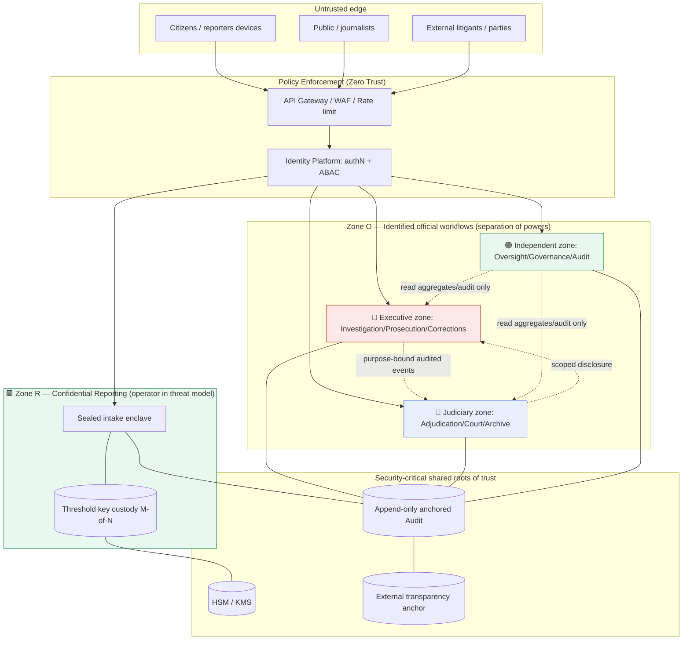

# 09 — Trust Model

> **Purpose.** State explicitly **who trusts whom, for what, and why** — and, more importantly,
> **who is NOT trusted** and how the design survives that. The trust model is the bridge from
> the threat model (`08`) to the Zero-Trust Security Architecture (Design phase). It encodes
> two hard rules as machine-enforceable boundaries: **operator-in-threat-model** (Zone R) and
> **separation of powers** (Zone O). "Zero trust" here is literal: no implicit trust from
> network location, org membership, or prior authentication.

---

## 9.1 Trust principles

1. **No implicit trust.** Every request is authenticated, authorized, and audited on its own
   merits, regardless of origin (zero trust).
2. **Trust is minimized, split, and made auditable.** Where trust is unavoidable, shrink the
   trusted base, split it so abuse needs collusion, and log its exercise.
3. **Trust is per-purpose and per-zone.** Being trusted to *investigate* does not confer trust
   to *adjudicate*, *de-anonymize*, or *publish*.
4. **The operator is not trusted with reporter identity** (Zone R). By design, no single
   operator can de-anonymize.
5. **No arm is trusted to read another arm's data** without lawful, audited, purpose-bound
   access (Zone O / separation of powers).
6. **AI is not trusted to decide.** It is trusted only to *assist*, with human verification.
7. **Trust is revocable and time-boxed.** Standing trust is a liability; access is
   just-in-time and expires.

## 9.2 Trust zones and boundaries

**Boundary rules (enforced by IAM/ABAC + ACLs, not convention):**
- **Edge → anything:** default-deny; authenticate + authorize every call; no network-location
  trust.
- **Into Zone R:** only the sealed intake path; no operator role can read intake in a way that
  links to identity; de-anonymizing operations (none should exist for normal ops) require
  **M-of-N threshold** custodians.
- **Executive ↔ Judiciary:** **no direct reads.** Only purpose-bound, audited **events** and
  **scoped disclosure** cross, each behind an ACL. This is the separation-of-powers boundary
  (A-JUS-03, threat I-6).
- **Independent (Oversight/Governance/Audit) → Executive/Judiciary:** **read aggregates and
  audit only**; cannot mutate case/adjudication data.
- **Any zone → Transparency:** one-way, aggregate-only, through the disclosure-control gate.

## 9.3 Who trusts whom — trust relationships table

| Trustor | Trusts | For what | Basis / bound | If betrayed |
|---------|--------|----------|---------------|-------------|
| Reporter | Platform intake | To not collect/leak identity | Verifiable client behavior, published fingerprints, audits | Catastrophic (A1) → why operator is in threat model |
| Reporter | *No single operator* | — (explicitly withheld) | Threshold custody; minimization | De-anon needs collusion of M-of-N |
| Citizen/party | Judiciary zone | Correct, independent case record | Judicial ownership, tamper-evident log | T-5 case-fixing → four-eyes + anchoring |
| Defence | Prosecution disclosure | Complete, timely disclosure | Audited disclosure workflow | R-3/disclosure failure → audit + oversight |
| Judiciary | Executive | To not read/alter court data | Hard access boundary (I-6) | Separation-of-powers breach → ABAC deny + audit |
| Oversight | Platform | Honest aggregates + audit access | Independent read, anchored logs | Manipulated data → external anchoring, reproducibility |
| Public | Transparency outputs | Verified, non-attributable truth | Methodology transparency, disclosure control | Re-identification (I-8) → suppression thresholds |
| Everyone | HSM/KMS + governance threshold | Root of confidentiality/anonymity | Hardware root, M-of-N, audits | Root compromise = systemic → strongest controls, 🔒 |
| Everyone | AI | *Only* to assist, never decide | A-AI-01, human-in-loop, audit | AI overreach → architecturally excluded from decisions |

## 9.4 Roots of trust (the small, hard core we must trust — and therefore harden most)

| Root of trust | What rests on it | Protection | Split? |
|---------------|------------------|------------|--------|
| **HSM / KMS** | All confidentiality; reporter anonymity | FIPS-validated HSM, strict access, dual control | Keys for de-anon-capable ops are **threshold-split** across governance custodians |
| **Governance threshold (M-of-N)** | Any capability that could de-anonymize or override safety | Independent custodians, conflict-of-interest rules, audited | Yes — that is its purpose |
| **Append-only anchored audit** | Detectability of all abuse (Zone R + O) | Hash-chained, externally anchored, SoD (log admin ≠ sys admin) | Anchoring is external/independent |
| **Signed recipient/policy directory** | Correct routing, correct policy | Governance-signed, versioned, auditable | Signing is threshold/governed |
| **Reproducible signed client builds** | Edge authenticity (S-1) | SLSA provenance, independent build verification, published fingerprints | Independent verifiers |
| **Identity Platform** | All authorization | Phishing-resistant MFA, ABAC, zero standing privilege | Federated per-arm; no single super-admin |

> **Trusted Computing Base (TCB) minimization.** The anonymity-critical path (intake, metadata
> handling, threshold crypto) is deliberately kept **small and tiny-dependency** (threat T-3)
> so the thing we must trust is auditable by humans. 🔒 HUMAN-EXPERT-REVIEW-REQUIRED.

## 9.5 Separation of powers as a trust invariant

The constitutional separation of powers (A-JUS-01/03) is expressed as three **non-collapsible
data zones** — Executive, Judiciary, Independent — with:
- **Ownership:** each zone owns and controls its data lifecycle (purpose, retention, deletion).
- **No shared database.** Integration is event-driven + scoped APIs behind ACLs, never a common
  pool a single admin could read (defeats I-6, DD-3, and the "one big case record" temptation).
- **Directional constraints:** Executive→Judiciary is handoff-only; Judiciary→Executive is
  scoped-disclosure-only; Independent→both is read-aggregates/audit-only.
- **Audit of every crossing.** Every inter-zone event/disclosure is logged and anchored.

This is the Zone-O analogue of the Zone-R "no single operator can de-anonymize": **no single
arm can silently absorb another's data.**

## 9.6 Trust in AI (bounded)

- AI operates **only** on assistive tasks (A-AI-01) and **only** in advisory position — never
  in the write path of a decision affecting a person.
- AI outputs are **explainable, logged, human-reviewed, and contestable** (A-AI-02).
- Sensitive-data models are **self-hosted** (no third-party endpoint that could retain/leak);
  ⚠️ COST accepted.
- Model/version is pinned and audited; bias is evaluated; Setswana/minority-language output is
  treated as error-prone and human-verified for anything consequential (A-AI-03).

## 9.7 Residual trust (stated honestly)

Even a zero-trust design cannot reduce trust to zero. We **still must trust**:
- a **threshold** of governance custodians to not collude (mitigated: independence, CoI, audit,
  small M relative to N);
- the **HSM vendor and firmware** (mitigated: validated hardware, defense in depth);
- a **minimal TCB** of crypto/metadata code (mitigated: tiny dependency surface, expert review,
  reproducible builds);
- **at least one honest auditor** and honest external anchor (mitigated: multiple, independent).

If **governance is captured** (A-GOV-01) the split-trust guarantees become theater — this is
the single largest residual trust risk and is a *governance*, not a *technical*, problem. It is
carried into the Governance Framework (Design phase) and the Risk Register (`10`).

## 9.8 Definition-of-Done

- [x] Trust principles, zones, and boundaries defined and diagrammed.
- [x] Explicit "who trusts whom / who is not trusted" with betrayal consequences.
- [x] Roots of trust enumerated with protection and split status; TCB minimization stated.
- [x] Separation of powers encoded as a non-collapsible data-zone invariant.
- [x] AI trust explicitly bounded; residual trust stated honestly.
- [x] Maps to threats: operator-in-threat-model (I-1, E-1), separation of powers (I-6, E-3),
  authenticity (S-1), integrity (T-5, T-2), disclosure control (I-8), AI (T-7).
- **Required specialist review:** security architect (zero trust, IAM), cryptography engineer
  (roots of trust, threshold), judicial/constitutional advisor (separation-of-powers zones),
  governance advisor (A-GOV-01 residual), AI/privacy (§9.6).

*Next: `10-risk-register.md`.*
