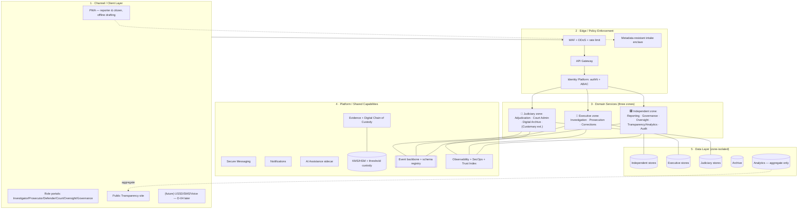
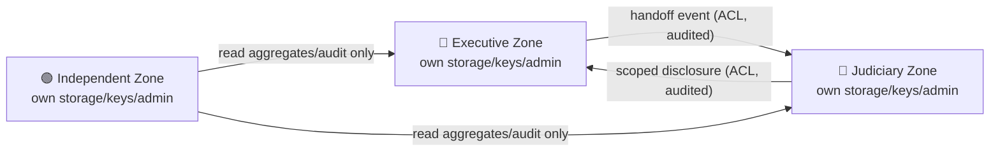
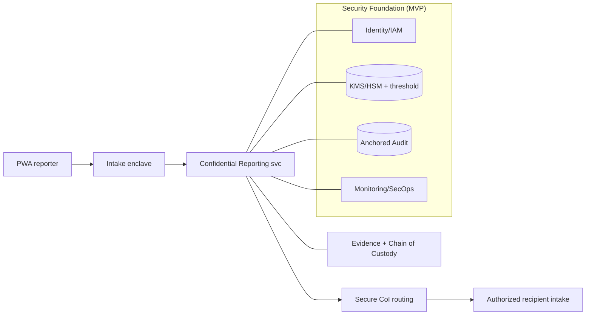

# Design 01 — Enterprise Reference Architecture (ERA)

**Implements:** D-01, D-03, D-05, D-06, D-08, D-10 · **Inputs:** Discovery `06`, `07`, `09`, `12`.

> The ERA is the whole-system skeleton: the layered reference model, the **Constitutional
> Architecture** (three data zones), the **deployment-model comparison and hybrid
> justification** (D-03), how the 22 services + 5 cross-cutting capabilities compose, and the
> **MVP slice** (D-05). Detailed data/integration/security/AI/observability/DevSecOps follow in
> `02`–`07`.

---

## 1. Architectural style & principles

- **Modular, domain-aligned services** (DDD bounded contexts `06`), **event-driven** backbone
  (`03`), **API-first**, **zero-trust** (`04`).
- **Constitutional Architecture (D-06/D-10):** the single most important structural rule —
  three **non-collapsible data zones** with independent storage, encryption, administration, and
  only audited API/event communication. This is *architecture*, not policy.
- **MVP-first (D-05):** build the safety-critical, operator-controlled slice first; sequence
  multi-institution workflows behind MoUs.
- **Extensible for customary justice (D-08):** the reference model has a first-class extension
  point for a Customary Justice zone/context; implementation deferred.

## 2. Layered reference model

**Layer responsibilities (summary):** L1 clients hold no secrets beyond ephemeral session/keys;
L2 enforces zero-trust on every request and isolates the anonymity-critical intake path; L3 is
partitioned into the three constitutional zones; L4 provides shared, security-critical
capabilities (each itself zone-aware); L5 is **physically/logically separated per zone** (no
shared database — DDR-04 in `02`).

## 3. Constitutional Architecture (the three-zone invariant)

**Invariants (machine-checkable — enforced in IAM/ABAC + network policy + CI tests):**
1. No service in zone X opens a database connection to zone Y (network + credential isolation).
2. Every cross-zone datum moves as a **signed, purpose-tagged event or API call** through an
   ACL, and is **logged to the anchored audit** (`06`).
3. Each zone has **independent KMS key hierarchies**, **independent admin/RBAC roots**, and
   **independent backups**. A compromised zone-admin cannot reach another zone.
4. The **Independent zone** (which contains Reporting) can read only **aggregates and audit**
   from the others — never raw case data.

> This is the architectural expression of **judicial independence + separation of powers**
> (A-JUS-01/03) and mitigates **I-6** (cross-arm over-reach), **E-3** (insider escalation across
> arms), and **T-5** (case-fixing). Requires judicial/constitutional review before build.

### DDR-01 — Modular, event-driven, three-zone reference architecture
| Field | Content |
|-------|---------|
| **Context** | National justice platform spanning arms under separation of powers; operator in threat model. |
| **Problem** | How to integrate the sector without collapsing constitutional boundaries or creating a de-anonymization/over-reach honeypot. |
| **Decision** | Modular DDD services on an event-driven backbone, partitioned into three non-collapsible data zones with audited API-only cross-zone flow. |
| **Alternatives** | (a) Monolith + shared DB — rejected: single admin can read everything (I-6, E-1). (b) Central data lake — rejected: honeypot + separation-of-powers breach. (c) Fully siloed per agency, no integration — rejected: fails P4 fragmentation. |
| **Threats mitigated** | I-6, E-1, E-3, T-5, DD-3 |
| **Privacy implications** | Strong: no cross-zone raw reads; PII never on the bus. |
| **Legal implications** | Encodes separation of powers; needs judicial/constitutional sign-off (A-JUS-03). |
| **Trade-offs** | ⚠️ COST: higher operational complexity, duplicated infra per zone, harder cross-zone reporting (solved only via governed aggregates). |
| **Future review trigger** | New arm/domain added; legal change to inter-arm data sharing. |

## 4. Deployment-model comparison (D-03) & hybrid justification

Evaluated against: **anonymity/privacy · compelled-access exposure · legal residency ·
operational maturity · resilience · cost (BWP) · trust**. (Scores: ●●● strong … ○ weak.)

| Model | Privacy/anon | Compelled-access resistance | Legal residency | Ops maturity | Resilience | Cost | Trust |
|-------|-------------|-----------------------------|-----------------|--------------|-----------|------|-------|
| **A. Fully in-country** (local DC/colo) | ●●● (data local) | ○ (subject to domestic compulsion, A-LEG-04) | ●●● | ○ (limited managed svc, A-TEC-03) | ○–◐ (fewer DR options) | ◐ | ◐ (national control, but operator-in-threat) |
| **B. Fully offshore** (SA/EU hyperscale) | ◐ | ◐ (foreign compulsion surface, MLAT) | ○ (residency issues, A-LEG-08) | ●●● | ●●● | ◐ (FX exposure, A-FIN-03) | ○ (foreign control optics) |
| **C. Distributed/multi-region** | ●●● | ●●● (no single jurisdiction holds enough) | ◐ | ●● | ●●● | ○ (most expensive) | ●● |
| **D. Hybrid (RATIFIED)** | ●●● | ●● | ●●● (sensitive zones placed per law) | ●● | ●●● | ◐ | ●● |

**Hybrid design (D-03/DDR-02):**
- **Judiciary zone data + evidence/custody + citizen PII-bearing case data:** hosted **in
  Botswana** (residency, A-JUS-03/A-LEG-08), on hardened local DC/colocation.
- **Confidential-reporting intake + threshold key custody:** designed so **no single hosting
  jurisdiction holds enough to de-anonymize** — key shares split across **independent
  custodians in ≥2 jurisdictions**; intake enclave placed to minimize domestic compelled-access
  leverage while keeping content local.
- **Resilience/DR + governance continuity + public transparency site:** may use **offshore/
  regional** capacity for availability against domestic disruption (RK-13/RK-17), holding only
  ciphertext or already-public aggregates.
- **Analytics:** aggregate-only, location-flexible (no raw records leave zone).

### DDR-02 — Hybrid deployment model
| Field | Content |
|-------|---------|
| **Context** | No in-country hyperscale (A-TEC-03); domestic compelled access is the top threat (I-1); resilience must survive domestic disruption. |
| **Problem** | Reconcile residency (judiciary/PII) with anonymity (split trust) and resilience (offshore). |
| **Decision** | Hybrid: sensitive/judiciary data in-country; threshold key shares split across jurisdictions; DR + governance + public aggregates offshore-capable. |
| **Alternatives** | A/B/C above — rejected for the reasons scored. |
| **Threats mitigated** | I-1 (no single jurisdiction can compel de-anon), I-2, D-1, RK-13, RK-17 |
| **Privacy implications** | Compelled disclosure in any one jurisdiction yields ciphertext + insufficient key shares. |
| **Legal implications** | Requires cross-border transfer analysis (A-LEG-08) and custody agreements in each jurisdiction; **qualified legal review required.** 🔒 |
| **Trade-offs** | ⚠️ COST: multi-jurisdiction ops, FX exposure, complexity; slower cross-region latency for some flows. |
| **Future review trigger** | Change in Botswana law on residency/interception; a hyperscale region opens in-country; a custodian jurisdiction becomes hostile. |

## 5. Client strategy (D-04)

### DDR-03 — PWA-first client with offline drafting
| Field | Content |
|-------|---------|
| **Context** | Smartphones common but not universal; connectivity variable/costly (A-TEC-01/02); detection-of-usage is a risk (DT-1). |
| **Decision** | Ship a **PWA** (installable, offline-capable drafting, low-bandwidth, no app-store identity trail) as the primary client; native wrapper optional later; USSD/SMS/voice evaluated post-core (D-04). |
| **Alternatives** | Native-first (higher friction, store trail, S-1 sideloading risk); USSD-first (max reach, worst metadata safety — DT-1/ID-2). |
| **Threats mitigated** | DT-1 (no store install trail), S-1 (signed, verifiable origin), RK-21 (reach via low bandwidth/offline) |
| **Privacy implications** | Offline drafts encrypted locally; panic-wipe; no third-party SDKs on the anonymity path. |
| **Trade-offs** | ⚠️ COST: PWA crypto/UX constraints vs native; some low-end reach deferred (D-04). |
| **Future review trigger** | Adoption data shows exclusion; decision to add USSD/SMS/voice. |

## 6. Composition — services × zones × capabilities

- **22 services** (`06`/`07`) compose into the three zones + shared L4. **Constitutional
  Architecture, Digital Chain of Custody, Interoperability Standards, Public Trust Index, and
  Justice Analytics** are the five cross-cutting capabilities (D-10) realized across `02`–`07`.
- **Customary Justice (D-08):** modeled as a first-class extension of the Judiciary zone with
  its own context boundary and language/UX hooks; **not implemented in early phases** — the
  architecture reserves the seam so later addition is non-breaking.

## 7. MVP slice (D-05)

**In MVP:** PWA client · intake enclave · Confidential Reporting · Evidence + Chain of Custody ·
Secure CoI Routing · IAM · KMS/HSM + threshold custody · Anchored Audit · Monitoring/SecOps ·
non-attributable responsiveness metric. **Deferred:** all Zone-O workflows (investigation
collaboration, prosecution, courts, oversight analytics, transparency dashboard, AI, archive) —
gated on MoUs (A-JUS-05).

## 8. Quality gate

- **Threats mapped:** I-6, E-1/E-3, T-5 (constitutional); I-1/I-2, D-1 (deployment); DT-1/S-1
  (client).
- **Residual risks:** hybrid complexity & multi-jurisdiction legal exposure (RK-01 residual);
  governance capture (RK-03); in-country DC maturity (A-TEC-03).
- **Trade-offs:** documented per DDR (complexity/cost vs safety/independence).
- **Success criteria:** automated zone-isolation tests pass (0 cross-zone DB paths); intake
  path has no third-party dependencies; deployment placement matches DDR-02 table; PWA works
  offline and over 2G.
- **Specialist review:** 🔒 security architect, cryptographer (threshold placement), Botswana
  legal (cross-border/residency, interception), judicial/constitutional (three zones).

*Next: `02-data-architecture.md`.*
