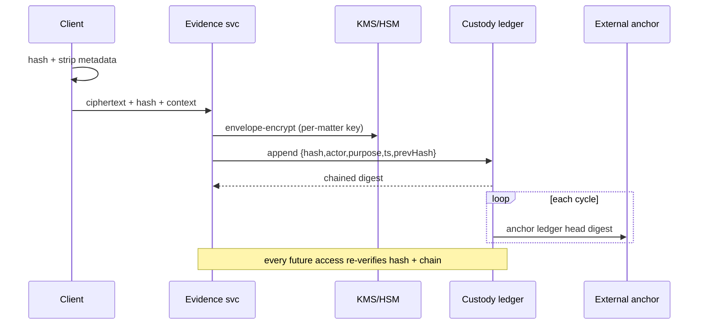

# Design 02 — Data Architecture

**Implements:** D-02, D-05, D-06, D-10 · **Inputs:** ERA `01`, Domain `../06`, Threat `../08`.

> How data is owned, stored, minimized, protected, retained, erased, made tamper-evident
> (**Digital Chain of Custody**), and turned into **Justice Analytics** — all under the
> three-zone Constitutional Architecture. The governing rule (D-02): **the system does not hold
> reporter identity**, so it cannot disclose it; retention is the minimum the mission requires.

---

## 1. Zone-isolated data ownership (D-06)

### DDR-04 — Zone-isolated polyglot persistence, no shared database
| Field | Content |
|-------|---------|
| **Context** | Three constitutional zones; operator in threat model; over-integration is itself a risk. |
| **Decision** | Each zone owns **separate database instances, separate KMS key hierarchies, separate admin credentials, separate backups**. No cross-zone DB connections. Cross-zone data only via audited events/APIs (`03`). Polyglot per need: relational (cases, custody), object store (evidence ciphertext), append-only log store (audit), aggregate store (analytics). |
| **Alternatives** | Shared multi-tenant DB with row security — rejected: one DBA/root can read all zones (I-6, E-1). Single data lake — rejected: honeypot. |
| **Threats mitigated** | I-6, I-4, E-1, E-3 |
| **Privacy implications** | Blast radius of any store/admin compromise is one zone. |
| **Trade-offs** | ⚠️ COST: duplicated infra, no easy cross-zone JOINs (by design — use governed aggregates). |
| **Future review trigger** | New zone; regulatory change. |

**Data-store map**

| Zone | Stores | Contents |
|------|--------|----------|
| 🟢 Independent | Reporting DB · Governance DB · Audit log store · Analytics (aggregate) | Anonymous reports (no PII), case codes, governance decisions, anchored audit, aggregates |
| 🔴 Executive | Investigation DB · Prosecution DB · Corrections DB | Investigations, prosecution matters, custody status |
| 🔵 Judiciary | Case DB · Court-Admin DB · Digital Archive | Cases, hearings, orders, judgments, sealed records |
| Shared (zone-scoped) | Evidence object store + Custody ledger | Evidence ciphertext (keys per zone/matter) + hash-chained custody |

## 2. Data classification & per-field policy (D-02)

Every stored field carries a **policy tuple** enforced in schema metadata + code + IAM:
`{purpose, legalBasis, sensitivity, zone, encryption, accessPolicy, retention, deletionMethod}`.

| Class | Examples | Encryption | Default retention | Deletion |
|-------|----------|-----------|-------------------|----------|
| **C0 Reporter-identifying** | *None collected by design (D-02)* | N/A — **does not exist** | N/A | N/A |
| **C1 Anonymous report content** | Report text, evidence refs | Field/envelope, zone key | Minimal; purpose-bound; erasable | Crypto-erase (drop key) |
| **C2 Case/official data (PII)** | Party details, case records | Envelope, zone key | Per statute/retention schedule | Crypto-erase + record |
| **C3 Evidence** | Files + custody | Envelope, per-matter key | Case lifecycle + legal hold | Governed (legal hold aware) |
| **C4 Audit** | Who-did-what | Append-only, integrity-keyed | Long (accountability) | Never silently; governed |
| **C5 Aggregate/analytics** | Counts, trends | At rest | Long | Recompute |

### DDR-05 — Data minimization + purpose-bound fields + cryptographic erasure
| Field | Content |
|-------|---------|
| **Context** | Data held = data compellable (I-1) / breachable (I-4) / leakable. Reporter safety demands holding almost nothing identifying. |
| **Decision** | Collect no reporter identity (D-02). Every field justified by a purpose + legal basis or it is not stored. Sensitive data **envelope-encrypted with per-zone/per-matter keys**; deletion is **cryptographic erasure** (destroy the key) enabling verifiable, fast, distributed erasure. Retention enforced by automated jobs; legal-hold overrides deletion with an audited flag. |
| **Alternatives** | Collect-now-decide-later — rejected (DD-1). Soft-delete flags — rejected (data persists, compellable). |
| **Threats mitigated** | I-1, ID-1, DD-1, NC-2, I-4 |
| **Privacy implications** | Compelled disclosure bounded to legitimately-retained, minimized data; identity simply absent. |
| **Legal implications** | Retention schedules need Botswana legal + records-authority sign-off (A-LEG-05, A-JUS-07). Crypto-erase vs evidence/legal-hold tension adjudicated per matter. 🔒 |
| **Trade-offs** | ⚠️ COST: key-management complexity for per-object erasure; irreversible erasure risk (mitigated by governed legal hold + backups policy). |
| **Future review trigger** | New data field proposed; retention law change; new domain. |

## 3. Digital Chain of Custody (D-10)

### DDR-06 — Hash-chained custody ledger with external anchoring
| Field | Content |
|-------|---------|
| **Context** | Evidence and consequential records (orders, disclosures) must be provably untampered and admissible (P3, A-LEG-05). |
| **Decision** | On ingest: compute content hash (SHA-256/‑3), strip metadata client-side, envelope-encrypt. Append a **custody event** `{objectHash, actor, role, purpose, timestamp(trusted), prevEventHash}` to a **per-zone append-only, hash-chained ledger**. Periodically **anchor** the ledger head digest to an independent transparency log / external notary (multi-party). **Re-verify integrity on every access.** |
| **Alternatives** | DB audit columns — rejected: mutable by DBA (T-2). Full public blockchain — rejected: cost, privacy, throughput; only the *digest* is externally anchored. |
| **Threats mitigated** | T-1, T-2, T-5, R-3 |
| **Privacy implications** | Ledger stores hashes + minimal actor refs, not content; anchoring exposes only digests. |
| **Legal implications** | Chain-of-custody format aligned to admissibility; **forensics + legal review required.** 🔒 |
| **Trade-offs** | ⚠️ COST: trusted-timestamp/anchor infra; strict operational discipline. |
| **Future review trigger** | Admissibility ruling; hash-algorithm deprecation (crypto-agility, `04`). |

**Custody sequence** (see also `../05` J3):


## 4. Justice Analytics (D-10) — privacy-preserving

### Data flow: raw → aggregate (one-way)
- Zone services emit **minimized events** (`03`); an **analytics projector** in the Independent
  zone computes aggregates only. **No raw records cross into analytics.**
- **Disclosure control** on every published metric: **k-anonymity minimum cell size**,
  small-cell suppression, and differential-privacy-style noise for sensitive breakdowns.
- **Purpose limitation** enforced: analytics serve oversight/policy + the Public Trust Index
  (`06`); new uses require DPIA + governance approval (DD-2/DD-3).

| Threat | Control |
|--------|---------|
| I-8 / L-1 re-identification | min cell size, suppression, DP noise, governance sign-off per dataset |
| DD-2/DD-3 function creep | purpose registry, approval gate, audit of every query class |

> **⚠️ HONESTY:** aggregation reduces but never fully removes re-identification risk against an
> adversary with rich auxiliary data. Published thresholds and methodology are the mitigation,
> not a guarantee.

## 5. Reference schema sketches (illustrative; full DDL in engineering phase)

```
report            (case_code PK[high-entropy], category, created_at_coarse,
                   content_cipher, content_key_ref, status, zone='independent')
                   -- NO reporter identity columns exist (D-02)
evidence_object   (evidence_id PK, content_hash, cipher_ref, matter_ref, zone,
                   key_ref, created_at)
custody_event     (event_id PK, object_hash, actor_ref, role, purpose,
                   ts_trusted, prev_event_hash)   -- append-only
case              (case_id PK, state, seal_status, court_ref, zone='judiciary')  -- Judiciary only
audit_record      (rec_id PK, actor_ref, action, purpose, ts, prev_hash)         -- append-only
field_policy      (table, column, purpose, legal_basis, sensitivity, zone,
                   encryption, retention, deletion_method)                        -- governs all above
```

## 6. Backup, retention & residency

- **Per-zone independent backups**, encrypted with zone keys; a backup admin for one zone cannot
  restore another's data.
- **Residency (DDR-02):** judiciary/PII/evidence backups **in-country**; ciphertext-only DR
  copies may be offshore for resilience; **key shares never co-located with the ciphertext they
  unlock.**
- Retention jobs enforce schedules; **legal hold** suspends deletion with an audited reason.

## 7. Quality gate

- **Threats mapped:** I-1, I-4, I-6, I-8, ID-1, DD-1/2/3, T-1, T-2, T-5, NC-2.
- **Residual risks:** crypto-erase vs legal-hold tension (governed, not eliminated);
  re-identification from aggregates (RK-11); per-object key-mgmt complexity.
- **Trade-offs:** per DDRs (isolation/erase complexity vs safety).
- **Success criteria:** no C0 identity field exists in any schema (CI check); every column has a
  `field_policy` row (CI check); crypto-erase verified (key destroyed ⇒ ciphertext unrecoverable);
  no published aggregate below k threshold; zone backups independently restorable.
- **Specialist review:** 🔒 privacy engineer (minimization, analytics), cryptographer (erasure,
  custody), forensics + Botswana legal (custody admissibility, retention).

*Next: `03-integration-architecture.md`.*
