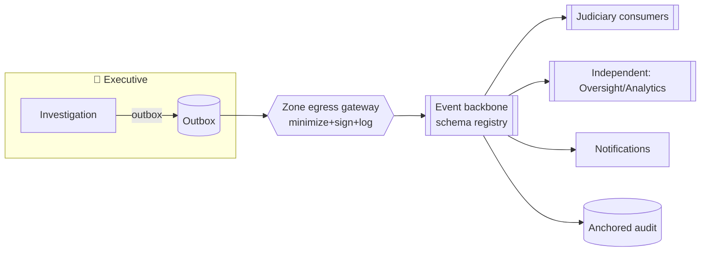

# Design 03 — Integration Architecture

**Implements:** D-06, D-07, D-10 · **Inputs:** ERA `01`, Data `02`, Domain `../06`.

> Two integration surfaces: **internal** (event-driven backbone between our own bounded
> contexts, respecting the three zones) and **external** (standards-based APIs to existing
> justice-sector systems — D-07 — without collapsing zones or importing legacy models). The
> **Interoperability Standards** capability (D-10) is defined here.

---

## 1. Internal integration — event-driven backbone

### DDR-07 — Event-driven backbone with transactional outbox, schema registry, PII-free events
| Field | Content |
|-------|---------|
| **Context** | Loose coupling across contexts/zones; must not leak PII or allow cross-zone raw reads (I-6, DD-1). |
| **Decision** | Asynchronous **domain events** over a durable broker; producers use the **transactional outbox** pattern (atomic write+publish); a **schema registry** enforces versioned, PII-free event contracts (`../06 §6.4`). Cross-zone events pass through a **zone egress gateway** that validates payloads against a minimization policy and signs+logs them. Idempotent consumers; dead-letter queues; replay from event log for read-model rebuilds (CQRS). |
| **Alternatives** | Synchronous cross-service calls everywhere — rejected: tight coupling, cascading failure, harder audit. Shared DB integration — rejected (DDR-04). |
| **Threats mitigated** | I-6 (no cross-zone raw reads), DD-1 (minimized payloads), L-2 (governed cross-context linkage), D-4 (async resilience) |
| **Privacy implications** | Identity never on the bus; each event carries only purpose-bound fields; egress policy is machine-enforced. |
| **Trade-offs** | ⚠️ eventual consistency; operational complexity of a broker + registry + outbox. |
| **Future review trigger** | New event type; new zone; schema-registry policy change. |

**Backbone properties:** at-least-once delivery + idempotency; ordered per aggregate; encrypted
in transit and at rest; per-zone topics with explicit, audited cross-zone subscriptions only.

## 2. CQRS & read models

- Write models live in each zone and enforce invariants; **read models** (party-scoped case
  status, oversight dashboards, transparency aggregates) are **projections** built from events —
  keeping scoped projections out of authoritative aggregates (mitigates I-5/DD-1).
- Read models are rebuildable by event replay (supports recovery + schema evolution).

## 3. External integration — standards-based, ACL-fronted (D-07)

### DDR-08 — Standards-based external integration via per-system anti-corruption gateways
| Field | Content |
|-------|---------|
| **Context** | Existing court/police/DPP systems range paper→partial-digital (A-JUS-02); we integrate, not replace (D-07). |
| **Decision** | Each external system integrates through a dedicated **Anti-Corruption Layer (ACL) gateway** exposing our **Interoperability Standards** profile (below). The ACL translates external↔internal models, enforces authN/authZ, rate limits, validates schemas, and logs every exchange. External systems never touch our stores directly; they see only the standards API. Support async (events/webhooks) and sync (REST) with the same contracts. |
| **Alternatives** | Point-to-point custom integrations — rejected: N² coupling, legacy models leak in, unauditable. Rip-and-replace — rejected (D-07, RK-20). |
| **Threats mitigated** | I-6, T-4 (routing integrity), RK-20 (integration risk), supply-chain via a controlled surface |
| **Privacy implications** | ACL enforces minimization on egress to external systems; zone rules still apply. |
| **Legal implications** | Data-sharing agreements per external system; some exchanges need legal basis (A-JUS-08). 🔒 |
| **Trade-offs** | ⚠️ an ACL per system class is upfront effort; worth it for isolation + auditability. |
| **Future review trigger** | New external system; standard version bump. |

## 4. Interoperability Standards profile (D-10)

A **published, versioned** profile so any conformant system can integrate:

| Layer | Standard/approach (proposed — validate w/ institutions) |
|-------|--------------------------------------------------------|
| **Transport/API** | HTTPS/TLS 1.3; REST + JSON (OpenAPI 3.1 contracts); async via CloudEvents-style envelopes |
| **Data model** | A justice canonical model (align with recognized justice/court data standards where they exist; publish a NJTIP schema otherwise) |
| **Identifiers** | Opaque, non-guessable IDs; no national-ID as a primary key on shared surfaces; per-context identifiers with governed linkage (L-2) |
| **Security** | OAuth2/OIDC client-credentials + mTLS for system-to-system; signed payloads; OAuth scopes + ABAC |
| **Events** | Versioned, PII-free event schemas in the registry; semantic versioning + deprecation policy |
| **Conformance** | A published **conformance test suite**; a system is "integrated" only when green |
| **Time/integrity** | Trusted timestamps; content hashes for exchanged documents (ties to Chain of Custody) |

**Governance:** the profile is versioned, backward-compatible within a major version, and
changes go through the governance change process (later phase). Published openly to enable an
ecosystem (Future Roadmap: open APIs).

## 5. API gateway & edge

- Single **API Gateway** per external-facing surface: authN handoff to IAM, ABAC enforcement,
  rate limiting, WAF, request validation, quota, and full audit.
- **Reporter intake is NOT behind the ordinary gateway** — it uses the metadata-resistant intake
  path (`04`) to avoid IP/metadata capture (I-2/ID-2). Kept architecturally separate.

## 6. Failure modes & resilience

| Failure | Handling |
|---------|----------|
| Broker outage | Producers buffer via outbox; consumers resume; DLQ for poison messages |
| External system down | ACL circuit-breaks; queues events; retries with backoff; alerts SecOps |
| Schema mismatch | Registry rejects at publish time; versioned consumers tolerate additive changes |
| Duplicate delivery | Idempotency keys; consumers dedupe |
| Cross-zone policy violation | Egress gateway blocks + alerts (constitutional invariant breach) |

## 7. Quality gate

- **Threats mapped:** I-6, I-5, T-4, DD-1, L-2, D-4, RK-20.
- **Residual risks:** external-system data quality (garbage-in); data-sharing legal gaps
  (A-JUS-08); eventual-consistency edge cases.
- **Trade-offs:** async complexity vs coupling/resilience; ACL effort vs isolation.
- **Success criteria:** 0 cross-zone raw-read paths (test); all events pass registry PII-policy
  (CI); every external system behind an ACL with green conformance suite; intake path bypasses
  IP-logging gateway (verified).
- **Specialist review:** integration architect; privacy (event payloads); Botswana legal
  (data-sharing agreements, A-JUS-08); institutional system owners.

*Next: `04-security-architecture.md`.*
