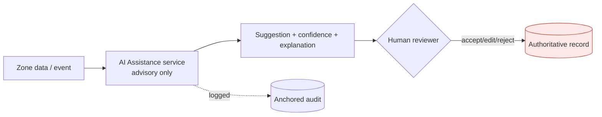

# Design 05 — AI Architecture

**Implements:** D-09, D-10 · **Inputs:** Assumptions `../01 §6c`, Threat `../08` (T-7), Trust `../09 §9.6`.

> AI is **assistive only** and **never in a decision write-path** (D-09). This document fixes
> *where* AI may run, *what* it may touch, how its outputs are governed, and how we prevent it
> from becoming a shadow decision-maker. The hard constraint (A-AI-01) is architectural, not a
> guideline.

---

## 1. Position in the architecture — an advisory sidecar

AI produces **suggestions**, never records. Every consequential outcome passes through a
**human** who accepts/edits/rejects. The authoritative write is performed by the human's action,
not the model. AI has **no write access** to any authoritative store.

### DDR-12 — AI as advisory sidecar; self-hosted for sensitive data; human-in-the-loop
| Field | Content |
|-------|---------|
| **Context** | AI can help with overload and language (P5/P10) but must never determine legal/judicial outcomes (D-09); sensitive data must not leak to third-party model endpoints (A-AI-02). |
| **Decision** | AI runs as a **stateless advisory sidecar**. **Sensitive-data tasks use self-hosted models** (no third-party API retention/leak). Outputs carry **confidence + explanation + model/version**; a human reviews anything consequential. AI has **read-only, purpose-scoped** access and **no path to authoritative writes**. All AI invocations are **logged** (input hash, model, version, output, reviewer decision). |
| **Alternatives** | Third-party LLM API for everything — rejected: data leakage/retention (I-*), sovereignty. AI auto-actioning low-risk items — rejected: scope-creep into decisions; start advisory-only. |
| **Threats mitigated** | T-7 (AI manipulation/bias), DD-2 (secondary use), I-* (data leakage to third parties) |
| **Privacy implications** | Sensitive inference stays in-zone/self-hosted; PII-redaction assists minimization. |
| **Legal implications** | AI outputs are advisory, contestable, and auditable; **not** evidence of fact. Legal/ethics review of use in any rights-affecting context. 🔒 |
| **Trade-offs** | ⚠️ COST: self-hosting + GPU vs cheap APIs; lower raw capability than frontier hosted models on some tasks. |
| **Future review trigger** | New AI task proposed; model swap; a task edges toward "decision." |

## 2. Permitted tasks (allow-list) vs prohibited (deny-list)

| ✅ Permitted (assistive) | ❌ Prohibited (hard) |
|-------------------------|----------------------|
| Translation EN↔Setswana & other languages | Determining guilt/innocence or liability |
| Summarization (with source links) | Predicting recidivism / risk-scoring people for decisions |
| Document classification / categorization | Recommending charge/sentence/bail as a decision |
| Duplicate/near-duplicate detection | Ranking cases in a way that decides outcomes |
| PII detection & redaction *suggestion* | Auto-routing that finalizes without human sign-off in sensitive cases |
| Workflow prioritization *suggestion* | Any autonomous action on an authoritative record |
| Stylometry/self-ID *warnings* to reporters | Identifying/deanonymizing anyone |

> Prioritization/triage suggestions are allowed but **advisory**; the queue order a human sees
> is explainable and overridable, and never silently drops a report.

## 3. Governance, evaluation & safety of the models

- **Explainability:** every output ships with a rationale and the evidence it used; reviewers can
  inspect and contest (ties to appeals, later phase).
- **Bias & quality evaluation:** pre-deployment and periodic evaluation, especially
  **Setswana/minority-language** quality (A-AI-03) — treated as **error-prone**, human-verified
  for anything consequential.
- **Versioning & pinning:** models and prompts are versioned, pinned, and change-controlled;
  outputs record the version (reproducibility + audit).
- **Human-in-the-loop enforcement:** the workflow engine will not commit a consequential record
  without a recorded human decision (technical control, not policy).
- **Data handling:** minimized inputs; no training on production sensitive data without explicit
  governance approval + DPIA; self-hosted inference for C1–C3 data (`02`).
- **Red-teaming:** adversarial testing for prompt-injection/manipulation (T-7), especially where
  AI reads externally-supplied content.

## 4. Deployment

- Self-hosted inference in an isolated workload (own network segment; no cross-zone data pooling
  — AI reads within a zone's purpose scope and returns suggestions to that zone).
- Autoscaling for batch tasks (translation/dedup); strict resource limits; no persistence of
  sensitive inputs beyond the request.

## 5. Quality gate

- **Threats mapped:** T-7, DD-2, I-* (leakage), A-AI-01/02/03.
- **Residual risks:** subtle advisory bias influencing humans (mitigated by explanation +
  evaluation, not eliminated); language-quality errors; automation bias in reviewers (mitigated
  by UX + training).
- **Trade-offs:** self-hosting cost/capability vs privacy/sovereignty (resolved for privacy).
- **Success criteria:** no AI write to any authoritative store (architecturally impossible +
  tested); 100% of consequential outcomes have a recorded human decision; every AI call logged
  with model/version; Setswana eval meets a published quality bar before use; prohibited-task
  list enforced (no endpoint exists for them).
- **Specialist review:** 🔒 AI systems engineer, ethics/human-rights advisor, privacy engineer,
  linguists (Setswana eval), legal (advisory-not-evidence posture).

*Next: `06-observability-architecture.md`.*
