# Design 07 — DevSecOps Architecture

**Implements:** D-05, D-07 · **Inputs:** Security `04`, ERA `01`, Threat `../08` (T-3), Risk `../10` (RK-12).

> The secure software supply chain and delivery system: SDLC, environments, IaC, CI/CD,
> provenance, and the guardrails that keep the anonymity-, crypto-, chain-of-custody-, metadata-,
> and AI-critical subsystems **out of any autonomous/auto-merged path** (the standing
> `🔒 HUMAN-EXPERT-REVIEW-REQUIRED` constraint). This is where "security by design" becomes
> mechanical and enforced.

---

## 1. Secure SDLC

- **Threat-model-driven:** every epic/story references the STRIDE/LINDDUN threats it touches
  (traceability to `../08`); security acceptance criteria are part of "done."
- **Two-track review:** normal changes get standard review; changes to
  **🔒 critical subsystems** (anonymity, cryptography, chain-of-custody, metadata handling, AI,
  IAM, key management, zone-egress) require **mandatory human expert review + security sign-off**
  and are **never auto-merged / never autonomously generated** (honesty/autonomy constraint).
- Least-privilege repo access; signed commits for critical paths; protected branches.

### DDR-15 — Secure supply chain: SLSA provenance, SBOM, reproducible builds, IaC, policy-as-code
| Field | Content |
|-------|---------|
| **Context** | A poisoned dependency or pipeline can de-anonymize at the source (T-3/RK-12); nation-state supply-chain risk (TA-6). |
| **Decision** | **Reproducible builds** with **SLSA-level provenance** and **signed artifacts**; **SBOM** generated + diffed every build; pinned dependencies with provenance; **minimal dependency surface** on the anonymity-critical path with **independent build verification** and **published fingerprints** (ties to S-1). **IaC** for all infra (immutable, reviewed, drift-detected); **policy-as-code** gates (OPA/Conftest-style) enforcing zone isolation, no-secret-in-image, and required controls in CI. |
| **Alternatives** | Trust-the-registry, manual deploys — rejected (unauditable, T-3). Vendor black-box CI — rejected for critical path. |
| **Threats mitigated** | T-3, RK-12, S-1 (verifiable client), E-2 (hardened images) |
| **Privacy implications** | Reproducibility lets third parties verify the client does what it claims (no hidden exfiltration). |
| **Trade-offs** | ⚠️ COST: reproducible builds + provenance are engineering effort; slower critical-path merges (accepted). |
| **Future review trigger** | Dependency incident; SLSA/standard update; new critical component. |

## 2. CI/CD pipeline (security-gated)

```mermaid
flowchart LR
  COMMIT[Signed commit] --> CI{CI}
  CI --> LINT[Lint + unit tests]
  LINT --> SAST[SAST + secret scan]
  SAST --> SCA[SCA + SBOM diff + provenance]
  SCA --> POLICY[Policy-as-code gates
zone isolation, no-secret, controls]
  POLICY --> DAST[DAST + integration tests]
  DAST --> ZONETEST[Constitutional invariant tests
no cross-zone DB path]
  ZONETEST --> HUMAN{🔒 critical path?}
  HUMAN -->|yes| EXPERT[Mandatory expert + security review]
  HUMAN -->|no| STAGE[Deploy to staging]
  EXPERT --> STAGE
  STAGE --> APPROVE[Change approval] --> PROD[Progressive deploy + rollback]
```

**Gates that block merge/deploy:** failing tests, SAST/DAST findings above threshold, secret
detected, SBOM introduces unvetted/unpinned dep, **any cross-zone DB path** (constitutional
invariant test), missing threat-mapping on a critical-path change, or absent expert sign-off on a
🔒 subsystem.

## 3. Environments

| Env | Data | Purpose |
|-----|------|---------|
| Dev | Synthetic only (never production sensitive data) | Development |
| Test/CI | Synthetic | Automated pipeline |
| Staging | Synthetic + shape-realistic; production-like topology & zones | Pre-prod validation, DR drills |
| Production | Real, zone-isolated | Live; break-glass access is JIT + dual-control + recorded |

- **No production sensitive data in lower environments** (enforced); test data is synthetic.
- **Break-glass**: emergency access is time-boxed, dual-authorized, session-recorded, and
  auto-audited (`06`).

## 4. Configuration, secrets & feature flags

- Config as code, per-zone; secrets only from the secrets manager (`04 §3`), never in repos/
  images/logs (CI-enforced).
- **Feature flags** for progressive rollout and fast kill-switch (e.g., disable a channel or an
  AI task without a redeploy); flag state audited.

## 5. Release, rollback & DR drills

- Progressive delivery (canary/blue-green) with automated rollback on SLO burn (`06`).
- Scheduled **DR restore drills** per zone; **build-verification drills** (independent rebuild
  matches published fingerprint); **incident game-days** including a de-anonymization tabletop.

## 6. Autonomy boundary (explicit)

- **May be AI-assisted / scaffolded:** non-critical UI, docs, glue code, tests, IaC scaffolding —
  always human-reviewed before merge.
- **Must NOT be autonomously built or auto-merged (🔒):** anonymity subsystem, cryptography & key
  management, digital chain of custody, metadata handling, zone-egress/ABAC policy, AI service
  boundaries. These require named human expert review and security sign-off. This boundary is
  enforced by the CI `HUMAN` gate above, not left to discretion.

## 7. Quality gate

- **Threats mapped:** T-3, RK-12, S-1, E-2, plus the enforcement of all prior DDRs' invariants in
  CI (zone isolation, no-secret, controls-present).
- **Residual risks:** sophisticated upstream/nation-state supply-chain attack (TA-6, reduced not
  removed); insider with pipeline access (mitigated: SoD, signing, provenance, audit); human-
  review fatigue on critical paths.
- **Trade-offs:** slower critical-path delivery vs supply-chain safety (resolved for safety).
- **Success criteria:** every build reproducible + provenanced + SBOM-diffed; CI blocks on any
  constitutional-invariant or secret violation; 0 production sensitive data in lower envs;
  independent rebuild matches published client fingerprint; critical-path changes cannot merge
  without expert sign-off (enforced).
- **Specialist review:** 🔒 DevSecOps lead, security architect, supply-chain security, SRE.

---

## ⛔ DESIGN APPROVAL GATE (ratified D-11)

The seven Design-phase architecture documents are complete:
**01 Enterprise Reference · 02 Data · 03 Integration · 04 Security · 05 AI · 06 Observability ·
07 DevSecOps**, plus 15 DDRs (DDR-01…DDR-15) mapped to STRIDE/LINDDUN and the ratified decisions.

**Per D-11, the blueprint pauses here for your approval before proceeding to:**
1. **Governance Framework** (governance as an operational subsystem — board, ethics, CoI,
   transparency reporting, audit framework, policy engine, appeals, accountability dashboards).
2. **Detailed implementation specifications** — per-bounded-context spec sheets
   (responsibilities · APIs/OpenAPI · owned data/schemas/migrations · events · security controls
   · trust boundaries · failure modes · monitoring), sequence diagrams, state machines,
   permission matrices.
3. **Engineering work items** — GitHub Epics · Features · Stories · Tasks with acceptance
   criteria and test plans, plus IaC modules, CI/CD pipeline definitions, and operational
   runbooks — MVP slice (D-05) first.

**Requested of you at this gate:**
- **Approve** the seven architecture documents as the basis for implementation, or
- **Flag changes** to any DDR (name the DDR and the concern), and/or
- **Confirm the next batch**: do you want **(a)** Governance Framework next, **(b)** the MVP
  per-context implementation specs + OpenAPI/schemas next, or **(c)** GitHub Epics/Stories for the
  MVP security-spine slice next so engineering can start in parallel?

*No implementation artifacts are generated until you approve — and the 🔒 subsystems remain
human-expert-review-required regardless of approval.*
