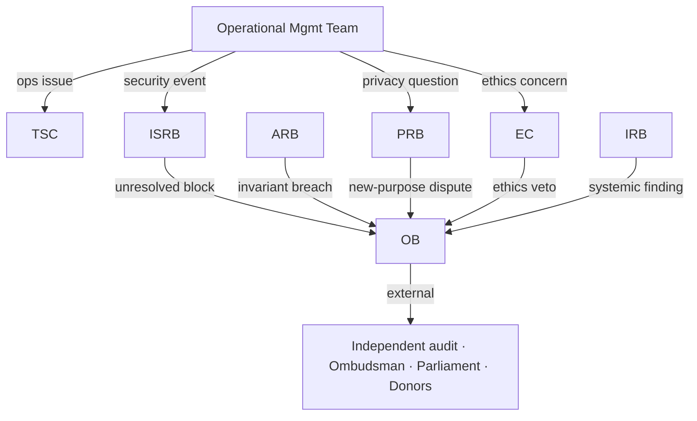

# Phase 2 · 01 — Governance System

**Implements:** D-01 (independent operator + oversight; operator in threat model) · **Inputs:**
Trust Model `../09`, Risk `../10` (RK-03), Ratified `../12`.

> Governance is designed as an **executable subsystem**, not a policy PDF: each body has defined
> authority, decision rights, quorum, voting, cadence, and escalation, and each is wired to
> technical controls (threshold key custody, policy engine, audit). The reason is RK-03: if the
> "independent" governance is capture­able or vague, the operator-in-threat-model and split-trust
> guarantees become theatre. 🔒 **Institutional governance topics here require governance/legal
> specialist validation before adoption (they are proposals, not enacted structures).**

---

## 1. Governance bodies (8) — authority & mechanics

| Body | Authority (decides) | Advises / recommends | Cadence | Quorum | Voting |
|------|---------------------|----------------------|---------|--------|--------|
| **Oversight Board (OB)** | Ultimate accountability; approves charter, budget, major policy, appointments to other bodies; declares major incidents/disasters | — | Quarterly + emergency | 2/3 of seats | Simple majority; **super-majority (2/3)** for charter/key-custody policy |
| **Technical Steering Committee (TSC)** | Technical direction, roadmap prioritization, release go/no-go (non-security-gated) | Recommends to OB on architecture-affecting spend | Monthly + release | Majority | Majority; ARB can veto on architecture grounds |
| **Independent Security Review Board (ISRB)** | Security sign-off gate for 🔒 subsystems; can **block** a release on security grounds | Recommends remediations, audit scope | Monthly + pre-release | 3 members incl. ≥1 external | Consensus; any member may escalate a "block" to OB |
| **Ethics Committee (EC)** | Ethics sign-off on AI use, vulnerable-person handling, research use; can pause a feature on ethics grounds | Recommends policy to OB | Monthly + on referral | Majority incl. human-rights advisor | Majority |
| **Privacy Review Board (PRB)** | DPIA approval; approves new data fields/purposes; disclosure-control thresholds | Recommends to OB; liaises with Data Protection Commissioner | Monthly + on new-purpose request | Majority incl. privacy engineer + legal | Majority |
| **Architecture Review Board (ARB)** | Enforces constitutional invariants & DDRs; approves/vetoes architecture-affecting changes | Recommends standards | Bi-weekly + on RFC | Majority incl. lead architect + security | Majority; **veto** on constitutional-invariant breach |
| **Incident Review Board (IRB)** | Post-incident findings, corrective actions; can mandate control changes | Recommends to OB | Per incident + quarterly review | 3 incl. security + ops | Consensus |
| **Operational Management Team (OMT)** | Day-to-day operations, SRE/SecOps, JIT-access approvals, runbook execution | Recommends ops changes | Continuous | Role-based | Manager + dual-control for sensitive ops |

**Independence & composition (RK-03 mitigations):**
- Members drawn from **independent constituencies** (judiciary-adjacent, Law Society, civil
  society, academia, faith/community leaders, independent security experts), with **term limits**,
  **staggered terms**, and **no majority from any single institution** — especially none from an
  institution subject to reporting.
- **Conflict-of-interest** rules (see `03`) bind every body; recusal is mandatory and audited.
- **Threshold custody** (DDR-10): governance custodians for de-anon-capable / safety-override keys
  are **M-of-N across independent members and ≥2 jurisdictions**; no single body or member holds
  enough. This is the technical embodiment of D-01.

## 2. Decision rights (RACI-style summary)

| Decision | OB | TSC | ISRB | EC | PRB | ARB | IRB | OMT |
|----------|----|----|------|----|----|-----|-----|-----|
| Charter / major policy | **A** | C | C | C | C | C | C | I |
| Roadmap priority | A | **R** | C | I | I | C | I | C |
| Release of 🔒 subsystem | A | R | **A(gate)** | C | C | C | I | R |
| New data field / purpose | A | C | C | C | **A** | C | I | I |
| Architecture change | A | C | C | I | I | **A** | I | I |
| Threshold key operation | **A(threshold)** | I | C | I | C | I | I | R(exec) |
| Incident corrective action | A | C | C | C | C | C | **A** | R |
| JIT privileged access | I | I | C | I | I | I | I | **A(dual)** |
| Disaster declaration | **A** | C | C | I | I | I | C | R |

**A**=Accountable/Approves · **R**=Responsible · **C**=Consulted · **I**=Informed.

## 3. Escalation paths

**Rule:** any body may escalate to the **Oversight Board**; the OB's external escalation
(independent audit, Ombudsman, Parliament, donors) is the backstop against **governance capture
(RK-03)** and **political pressure (RK-17)**. Escalations are logged to the anchored audit.

## 4. Wiring governance to technical controls (executable governance)

| Governance act | Technical enforcement |
|----------------|----------------------|
| Approve policy | Published to **Policy Engine** (`02`) as versioned policy-as-code; enforced at runtime |
| Approve new data field/purpose | `field_policy` row created (`../design/02`); PRB signature required or write is rejected |
| Authorize threshold operation | M-of-N HSM approval (DDR-10); no software path without it |
| Sign recipient/routing directory | Governance-signed, versioned artifact (mitigates T-4) |
| Record decision | Non-repudiable entry in anchored audit (`../design/06`, DDR-13) |
| Release 🔒 subsystem | CI `HUMAN` gate requires ISRB sign-off token (`../design/07`) |

> Governance decisions are not memos — they are **signed inputs to the system** that the system
> enforces. This is what "governance as a subsystem" means concretely.

## 5. Transparency of governance itself

- Governance decisions, membership, conflicts, and meeting cadence are published (respecting
  member safety); **decision log** is public in aggregate with methodology.
- **Accountability dashboards** (Trust Index inputs, `09`) show cadence adherence, audit
  completion, incident metrics — non-attributable.

## 6. Quality gate

- **Traces to:** D-01 (operator/oversight), DDR-10 (threshold), DDR-13 (audit); RK-03, RK-17.
- **Threats mitigated:** E-1/E-3 (single-actor abuse → threshold + SoD), T-4 (routing → signed
  directory), R-2/R-3 (repudiation → audited decisions).
- **Residual risks:** governance capture (RK-03) reduced (independence, threshold, external
  escalation) but **not eliminated** — the largest residual trust risk; political pressure
  (RK-17).
- **Trade-offs:** ⚠️ threshold + multi-body process slows decisions and operations — accepted for
  independence and reporter safety.
- **Success criteria:** every de-anon-capable op requires M distinct custodians (tested); no body
  has a single-institution majority; all governance decisions appear in the anchored audit;
  escalation drills executed.
- **🔒 Required review:** governance specialists, Botswana legal (institutional governance,
  charter legality), constitutional advisor (independence vs constitutional bodies).

*Next: `02-policy-engine.md`.*
