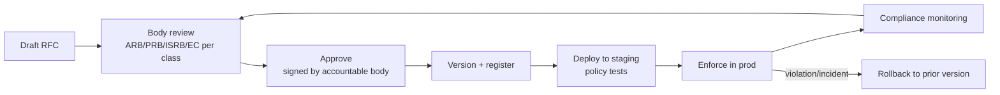

# Phase 2 · 02 — Policy Engine (Policy-as-Code)

**Implements:** D-06 (constitutional invariants), D-01/D-02, governance wiring (`01`) ·
**Inputs:** Security `../design/04`, Integration `../design/03`, DevSecOps `../design/07`.

> Governance approvals must be **enforced by machines, not trusted to memory**. The Policy Engine
> turns approved policies (access, zone-isolation, retention, disclosure control, routing) into
> **versioned, testable, automatically-enforced** artifacts, with a controlled lifecycle and safe
> rollback. This is how "executable governance" (`01 §4`) is realized at runtime.

---

## 1. What is expressed as policy-as-code

| Policy class | Examples | Enforcement point |
|--------------|----------|-------------------|
| **Access (ABAC)** | `{principal, role, zone, matter, purpose, risk}` rules; zero standing privilege; SoD | IAM + API gateway + each service (`../design/04`) |
| **Constitutional invariants** | No cross-zone DB path; cross-zone only via signed audited events | CI tests + zone egress gateway + network policy (`../design/03`) |
| **Data policy** | Per-field `{purpose, legalBasis, retention, encryption, deletion}` | Data layer + retention jobs (`../design/02`) |
| **Disclosure control** | k-anonymity/min-cell/DP thresholds for published aggregates | Analytics + Trust Index pipeline (`09`,`10`) |
| **Routing** | Conflict-of-interest routing to authorized recipients | Reporting/Governance routing (signed directory) |
| **Release gates** | 🔒 subsystem requires ISRB sign-off | CI `HUMAN` gate (`../design/07`) |

**Engine:** a policy-decision layer (e.g., OPA/Rego-style) evaluated at enforcement points, plus
CI-time policy checks (Conftest-style). Policies are data; code asks the engine.

## 2. Policy lifecycle

| Stage | Control |
|-------|---------|
| Draft | RFC references DDRs/threats/risks it affects (traceability, `04`) |
| Review | The **accountable body** per `01 §2` reviews (e.g., data policy → PRB; access/invariants → ARB; security gate → ISRB) |
| Approve | Cryptographically **signed** by the body; unsigned policy cannot deploy |
| Version | Semantic version; immutable history; diff vs prior |
| Test | Policy unit/integration tests must pass in staging (deny/allow cases, invariant tests) |
| Enforce | Rolled out progressively; enforcement logged |
| Monitor | Continuous compliance checks + drift detection |
| Rollback | One-command revert to prior signed version; rollback is itself audited |

## 3. Versioning & approval workflow

- **Every policy is versioned and signed** by the accountable governance body (ties to `01`).
  A policy change is a governed act recorded in the anchored audit (DDR-13).
- **Backward compatibility:** access/invariant policies are fail-closed; a malformed or missing
  policy **denies by default** (never fails open).
- **Change classes:** *routine* (OMT+ARB), *sensitive* (adds PRB/ISRB), *constitutional* (OB
  super-majority — e.g., anything touching zone isolation or key custody).

## 4. Automated enforcement

- **Runtime:** enforcement points call the policy engine for every access/egress/disclosure
  decision; decisions are cached with short TTLs and fully logged.
- **CI/CD:** policy-as-code gates block merges that violate invariants (no cross-zone DB path,
  no secret in image, required controls present — `../design/07`).
- **Fail-closed default:** absence of an applicable allow policy = deny.

## 5. Rollback & exceptions

- **Rollback:** revert to the last-known-good signed policy version; enforcement points reload;
  event emitted; IRB notified if triggered by an incident.
- **Policy exceptions** (see `03 §5`): time-boxed, reason-coded, dual-approved, auto-expiring,
  and **loudly audited**; an exception can never silently weaken a constitutional invariant —
  those require OB super-majority, not an exception.

## 6. Compliance monitoring

- Continuous evaluation that runtime state matches approved policy (drift detection).
- Metrics feed the **Public Trust Index** (`09`): policy-compliance rate, exception count/age,
  time-to-rollback.
- Violations raise SIEM alerts (`../design/06`) and, if systemic, an IRB review.

## 7. Quality gate

- **Traces to:** D-01, D-02, D-06; DDR-04/05/09/13.
- **Threats mitigated:** I-6/E-3 (invariant enforcement), DD-1/DD-2 (data/purpose policy), I-8
  (disclosure thresholds), S-3/E-1 (access policy), T-4 (routing policy).
- **Residual risks:** policy mis-authoring (mitigated: tests, review, fail-closed); engine
  availability (mitigated: cached decisions + fail-closed); exception abuse (mitigated: dual
  approval + expiry + audit).
- **Trade-offs:** ⚠️ fail-closed can reduce availability on policy errors (accepted: safety over
  convenience); policy-as-code is engineering overhead.
- **Success criteria:** 100% of access/egress/disclosure decisions evaluated by the engine and
  logged; no unsigned policy deploys (CI-enforced); rollback ≤ target minutes in drill; zero
  fail-open paths (test).
- **🔒 Required review:** security architect, privacy (data/disclosure policy), ARB (invariants),
  legal (retention/disclosure legality).

*Next: `03-operational-governance.md`.*
