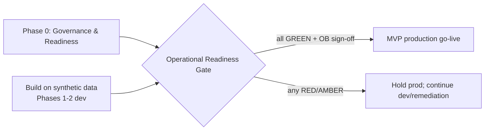

# Phase 2 · 05 — Operational Readiness Gate (ORG)

**Implements:** the Operational Readiness Gate mandate · **Inputs:** all Phase-2 + Design artifacts.

> A **formal, blocking gate**. No implementation work that puts real reporters or real case data
> at risk may proceed until every criterion is satisfied and signed off by the accountable
> governance body. This gate is the operational embodiment of "reporter safety over convenience":
> we do not go live on hope. The gate is itself an executable checklist (policy-as-code, `02`)
> whose status feeds the Public Trust Index (`09`).

---

## 1. Gate criteria (all must be GREEN)

| # | Criterion | Evidence required | Accountable body | 🔒 |
|---|-----------|-------------------|------------------|----|
| G1 | **Governance structures operational** | 8 bodies constituted (`01`); members appointed; CoI registers live; threshold custodians enrolled (M-of-N in HSM across ≥2 jurisdictions) | Oversight Board | 🔒 governance |
| G2 | **Legal reviews complete** | Botswana counsel sign-off on: whistleblower-statute reach (A-LEG-02), compelled-access posture / "technical inability" (NC-2), cross-border/residency (A-LEG-08), evidence admissibility (A-LEG-05), separation-of-powers zones (A-JUS-03) | OB + Legal | 🔒 legal |
| G3 | **Privacy reviews complete** | Approved DPIA; Data Protection Commissioner engaged; per-field policy complete; disclosure-control thresholds set | Privacy Review Board | 🔒 privacy |
| G4 | **Security reviews complete** | ISRB sign-off; independent penetration test + crypto review of 🔒 subsystems (anonymity, KMS/threshold, chain-of-custody, metadata intake) | Independent Security Review Board | 🔒 security |
| G5 | **Independent architecture review complete** | External review confirms constitutional invariants, DDR conformance, no cross-zone paths | Architecture Review Board + external | 🔒 |
| G6 | **Operational procedures documented** | Runbooks (`12`), on-call, break-glass, escalation (`03`) all published and drilled | Operational Management Team | — |
| G7 | **Incident response tested** | IR game-day executed incl. a **de-anonymization tabletop**; findings closed | Incident Review Board | — |
| G8 | **Disaster recovery tested** | DR drill meets RTO/RPO per zone; ciphertext-only offshore verified; key/ciphertext separation verified | OMT + ISRB | — |
| G9 | **Success metrics defined** | SLOs, Trust Index components, RTM metrics all instrumented and baselined | TSC + OB | — |
| G10 | **Institutional responsibilities assigned** | RACI signed; authorized-recipient MoUs for MVP routing; on-call ownership; funding confirmed for run-cost | OB | 🔒 institutional / funding |

## 2. Gate mechanics

- **Status:** each criterion is `RED / AMBER / GREEN` with linked evidence; the gate is a
  policy-as-code check (`02`) — the release pipeline (`../design/07`) **will not deploy MVP to
  production** while any criterion is not GREEN (fail-closed).
- **Sign-off:** the **Oversight Board** records a signed, non-repudiable gate-pass decision
  (anchored audit) naming the evidence version for each criterion.
- **Scope of the gate:** it governs **production go-live with real data**. Development against
  synthetic data (dev/test/staging, `../design/07 §3`) may proceed in parallel — that is how the
  MVP is *built* while the gate is being *satisfied*.
- **Partial go-live:** the MVP (D-05) may pass the gate for the confidential-reporting slice
  before later phases; each phase re-enters the gate for its scope.

## 3. Gate → phase relationship

## 4. What the gate deliberately does not allow to be skipped

- No "temporary" collection of reporter identity to "get started."
- No production launch before independent security + crypto review of 🔒 subsystems.
- No routing to an authorized recipient without a signed MoU and CoI controls live.
- No go-live without a tested de-anonymization incident response.

> These are non-negotiable because each maps to a Critical risk (RK-01/02/06/07). The gate is the
> place where the whole blueprint's honesty commitment becomes an enforced control.

## 5. Quality gate (meta)

- **Traces to:** every Critical/High risk (`../10`) and the 🔒 review topics.
- **Threats mitigated:** launch-time realization of I-1/I-2/E-1/U-1 (premature go-live).
- **Residual risks:** gate satisfied but a residual (device compromise, coercion, global
  adversary) still applies — the gate cannot certify those away; it certifies the platform's own
  controls, honestly.
- **Trade-offs:** ⚠️ the gate delays launch — accepted; a premature launch that harms a reporter
  is unrecoverable.
- **Success criteria:** gate is GREEN across G1–G10 with signed evidence before any production
  data flows; pipeline enforces the block (tested).
- **🔒 Required review:** OB (final), plus every body named per criterion.

*Next: `06-implementation-roadmap.md`.*
