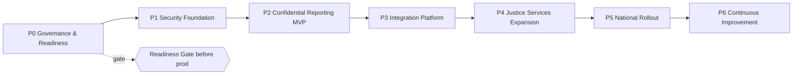

# Phase 2 · 06 — Implementation Roadmap

**Implements:** the phased-programme mandate · **Inputs:** Ratified `../12` (D-05 MVP-first),
Capability Map `../07`, Readiness Gate `05`, Risk `../10`.

> A phased programme, MVP-first (D-05). Each phase states objectives, scope, dependencies, risks,
> deliverables, staffing, **budget assumptions (BWP primary / USD secondary)**, and **exit
> criteria**. **All figures are planning-grade assumptions requiring finance validation and are
> not quotes** — they exist to size the programme, and are flagged `⟦validate⟧`. FX per A-FIN-03.

---

## 1. Phase overview & sequencing

Phases 1–2 constitute the **MVP** (D-05). Phases 3–5 depend on **institutional MoUs (A-JUS-05,
RK-04)** and re-enter the Readiness Gate for their scope. Budgets are indicative annual/phase
envelopes.

## 2. Phase details

### Phase 0 — Governance & Readiness
- **Objectives:** constitute governance (`01`); complete legal/privacy/security reviews; satisfy
  the Readiness Gate (`05`) for MVP.
- **Scope:** governance bodies, charters, CoI registers, threshold-custodian enrolment, DPIA,
  legal opinions, independent architecture review, MoUs for MVP recipients.
- **Dependencies:** funding (A-FIN-01); availability of independent members (A-GOV-01); Botswana
  legal counsel.
- **Risks:** RK-03 (capture), RK-10 (statute), RK-15/17 (funding/politics).
- **Deliverables:** signed charter; DPIA; legal opinions; ORG evidence pack; RTM baselined.
- **Staffing:** programme lead, governance/legal advisors, privacy + security leads, architect.
- **Budget `⟦validate⟧`:** ~**BWP 4–8M** / yr (governance, legal, reviews, PM). *(USD ~0.3–0.6M)*
- **Exit criteria:** ORG G1–G5, G9–G10 GREEN for MVP scope.

### Phase 1 — Security Foundation
- **Objectives:** build the security spine everything depends on (D-05).
- **Scope:** IAM (FIDO2/ABAC/zero-standing-privilege), KMS/HSM + **threshold custody**, tamper-
  evident anchored audit, SIEM/SecOps, DevSecOps pipeline (SLSA/SBOM/reproducible builds), IaC,
  DR foundation, **constitutional-invariant CI tests**.
- **Dependencies:** Phase 0 governance (custodians for threshold); HSM procurement 🔒.
- **Risks:** RK-06 (insider), RK-12 (supply chain), RK-18 (scarce expertise).
- **Deliverables:** running security foundation on synthetic data; independent security + crypto
  review booked; runbooks; audit anchoring live.
- **Staffing:** security architect, crypto engineer 🔒, DevSecOps, SRE, IAM engineer.
- **Budget `⟦validate⟧`:** ~**BWP 12–22M** (HSM/infra + engineering). *(USD ~0.9–1.7M)*
- **Exit criteria:** SR-001..005, PR-002 tests pass (`04`); ORG G4/G5/G8 evidence produced.

### Phase 2 — Confidential Reporting MVP
- **Objectives:** deliver the safety-critical reporting slice on the security foundation.
- **Scope:** PWA (offline drafting, honest risk UX), metadata-resistant intake enclave,
  Confidential Reporting service, Evidence + Chain of Custody, CoI-aware secure routing to
  authorized recipients, anonymous case tracking + secure follow-up, non-attributable
  responsiveness metric.
- **Dependencies:** Phase 1; MVP recipient MoUs; safety-UX research with target users (A-ORG-03).
- **Risks:** RK-01/02 (de-anon), RK-07 (false confidence), RK-21 (reach).
- **Deliverables:** MVP passing the Readiness Gate; pilot-ready.
- **Staffing:** + frontend/PWA, backend, privacy engineer, safety-UX writer 🔒, forensics 🔒.
- **Budget `⟦validate⟧`:** ~**BWP 10–18M**. *(USD ~0.8–1.4M)*
- **Exit criteria:** FR-001..009, NFR-001/002 pass; **ORG fully GREEN**; pilot launched.

### Phase 3 — Integration Platform
- **Objectives:** stand up the event backbone + standards-based external integration (D-07).
- **Scope:** event broker + schema registry + outbox; **Interoperability Standards** (`07`);
  first ACL gateways to external justice systems; Oversight Portal + responsiveness analytics.
- **Dependencies:** institutional MoUs (A-JUS-05); external-system access; data-sharing legal
  basis (A-JUS-08) 🔒.
- **Risks:** RK-04 (non-participation), RK-20 (integration complexity), RK-09 (cross-arm).
- **Deliverables:** conformance-tested integrations; oversight accountability metrics live.
- **Budget `⟦validate⟧`:** ~**BWP 15–28M**. *(USD ~1.1–2.2M)*
- **Exit criteria:** ≥1 external integration green on conformance suite; zone-egress audited.

### Phase 4 — Justice Services Expansion
- **Objectives:** add Zone-O workflows behind MoUs.
- **Scope (phased):** case management, prosecutor & public-defender workspaces, court admin/
  scheduling, transparency dashboard, AI assistance (bounded), digital archive; customary-justice
  **build** begins only with governance + stakeholder engagement (D-08).
- **Dependencies:** Phase 3; per-institution MoUs; judicial validation 🔒.
- **Risks:** RK-04, RK-09, RK-23 (customary), RK-11 (transparency re-id).
- **Deliverables:** adjudication-support + transparency capabilities per institution onboarded.
- **Budget `⟦validate⟧`:** ~**BWP 30–60M** (multi-institution, multi-year). *(USD ~2.3–4.6M)*
- **Exit criteria:** each service re-passes the Readiness Gate for its scope.

### Phase 5 — National Rollout
- **Objectives:** scale nationally incl. low-end channels (D-04 re-evaluated).
- **Scope:** capacity scaling; add USSD/SMS/voice if evaluation supports (DT-1 trade-off);
  accessibility + language expansion; nationwide adoption programme.
- **Dependencies:** Phases 1–4; connectivity/zero-rating negotiations (A-FIN-04) 🔒.
- **Risks:** RK-13 (scale/DDoS), RK-21 (equity), RK-16 (FX/cost).
- **Deliverables:** national availability; channel expansion decision recorded.
- **Budget `⟦validate⟧`:** ~**BWP 25–50M** / yr run + scale. *(USD ~1.9–3.8M)*
- **Exit criteria:** SLOs met at national scale; equity metrics acceptable.

### Phase 6 — Continuous Improvement
- **Objectives:** sustain, audit, evolve; expand to new transparency domains under governance.
- **Scope:** ongoing independent audits, Trust Index publication, threat-model refresh, crypto-
  agility/PQC migration, new-domain DPIAs (DD-2/DD-3).
- **Risks:** RK-15 (sustainability), RK-03 (capture over time).
- **Deliverables:** annual audits, transparency reports, roadmap refresh.
- **Budget `⟦validate⟧`:** ~**BWP 20–40M** / yr steady-state. *(USD ~1.5–3.1M)*
- **Exit criteria:** continuous — governed by OB review.

## 3. Cross-phase staffing model (A-OPS-01)

Scarce local security/crypto expertise → blend of in-country hires + **regional/remote
specialists under operator-in-threat-model controls** (JIT, dual control, audit) + a **training
pipeline** to build local capacity over time. Independent auditors and crypto reviewers are
procured externally (🔒 procurement).

## 4. Budget assumptions & honesty

- All BWP figures are **planning envelopes `⟦validate⟧`**, not quotes; drivers: HSM/infra,
  offshore DR, telecom/data (A-FIN-04), foreign specialists (FX, A-FIN-03), independent audits.
- **Sustainability (RK-15):** favor open standards, portability, low idle-cost (D-11 architecture)
  to survive funder changes; avoid lock-in.
- ⚠️ HONESTY: independence has a cost — the cheapest funder is often the institution being
  scrutinized; the budget assumes **independent** funding (A-FIN-01) and flags the risk if not.

## 5. Quality gate

- **Traces to:** D-05 (MVP-first), D-07/D-08; RK-04/15/17/18/20.
- **Threats/risks:** each phase lists its dominant risks + mitigations.
- **Residual risks:** funding/adoption/politics (non-technical) can still stall the programme.
- **Trade-offs:** ⚠️ MVP-first delays broad justice-services value to sequence safety + reduce
  adoption risk — accepted.
- **Success criteria:** each phase has objectives, deps, risks, deliverables, staffing, budget,
  and **exit criteria**; no phase goes to production without the Readiness Gate.
- **🔒 Required review:** finance/FX (budgets), procurement (HSM, auditors), legal (A-JUS-08,
  A-FIN-04), institutional sponsors (MoUs).

*Next: `07-interoperability-framework.md`.*
