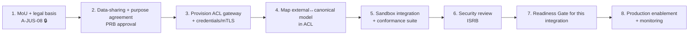

# Phase 2 · 07 — Interoperability Framework

**Implements:** D-07 (integrate not replace), D-10 (Interoperability Standards) · **Inputs:**
Integration Architecture `../design/03`, Domain `../06`.

> Operationalizes the **Interoperability Standards** capability: the concrete API/event standards,
> identity federation, versioning, schema governance, backward-compatibility, integration testing,
> and **onboarding procedure** for external justice-sector systems. This is what lets NJTIP
> integrate with existing systems (D-07) without collapsing the three zones or importing legacy
> models. 🔒 Standards choices need validation with each institution and any national e-gov
> standards body.

---

## 1. Standards profile (versioned, published)

| Layer | Standard (proposed — `⟦validate⟧` with institutions) |
|-------|------------------------------------------------------|
| **API** | REST + JSON over TLS 1.3; **OpenAPI 3.1** contracts; problem+json errors (RFC 9457) |
| **Events** | CloudEvents-style envelope; versioned, **PII-free** payloads (schema registry) |
| **Identity (system)** | OAuth2 client-credentials + **mTLS**; short-lived tokens; per-zone scopes |
| **Identity (federation)** | OIDC federation for human SSO **within a zone**; no cross-zone identity join |
| **Data model** | NJTIP canonical justice model; align to recognized justice/court data standards where they exist, else publish ours |
| **Identifiers** | Opaque, non-guessable; **no national-ID as shared primary key**; per-context IDs with governed linkage (L-2) |
| **Documents** | Content hashing + trusted timestamp (ties to Chain of Custody `08`) |
| **Time** | RFC 3161 / transparency-log timestamps; UTC |

## 2. Identity federation (zone-respecting)

- Human SSO is **federated within a zone** (e.g., judiciary IdP for judiciary users); **no
  identity provider spans zones** (separation of powers, D-06).
- System-to-system uses mTLS + client-credentials scoped to a zone + purpose.
- External systems federate **only** through their ACL gateway (`../design/03`, DDR-08); they
  never receive cross-zone tokens.

## 3. Versioning & backward compatibility

- **Semantic versioning** of API and event schemas; **major** = breaking, **minor** = additive.
- **Backward compatibility within a major version**: consumers tolerate unknown additive fields;
  producers never remove/repurpose fields in a minor.
- **Deprecation policy:** announce → dual-run → sunset window (published); no silent breaks.
- **Consumer-driven contract tests** guard against accidental breakage.

## 4. Schema governance

- All API/event schemas live in a **registry**; changes are RFCs reviewed by the **ARB** (and
  **PRB** if payload touches data classification) per `01`/`02`.
- **PII-free invariant**: the registry rejects any cross-zone event schema carrying identity/PII
  (machine-checked) — enforcing DD-1 and the constitutional boundary.
- Schemas are versioned, signed, and published.

## 5. Integration testing

- **Conformance test suite**: an external system is "integrated" only when it passes — auth,
  contract, error handling, event ordering/idempotency, and **zone-boundary** tests.
- **Sandbox** environment with synthetic data for partner integration (never production data).
- Contract + integration tests run in CI (`../design/07`); a failing conformance run blocks
  promotion.

## 6. Onboarding procedure for external justice-sector systems

| Step | Owner | Control |
|------|-------|---------|
| MoU + legal basis | OB + Legal 🔒 | Lawful basis for exchange (A-JUS-08) |
| Data-sharing/purpose | PRB | Purpose limitation; minimization on egress |
| ACL provisioning | OMT | Per-system isolation; no direct store access |
| Model mapping | Integration eng | ACL translates; legacy model contained |
| Sandbox + conformance | Partner + TSC | Green suite required |
| Security review | ISRB | Sign-off gate |
| Readiness Gate | OB | Per-integration ORG (`05`) |
| Production | OMT | Monitoring + audit of every exchange |

## 7. Quality gate

- **Traces to:** D-07, D-10; DDR-07/08; A-JUS-02/08.
- **Threats mitigated:** I-6 (no cross-zone identity/PII), T-4 (contract integrity), L-2 (governed
  linkage), RK-20 (integration risk).
- **Residual risks:** external-system data quality; legal-basis gaps (A-JUS-08); standard drift.
- **Trade-offs:** ⚠️ per-system ACL + conformance is upfront effort — bought for isolation/
  auditability and to avoid N² coupling.
- **Success criteria:** every external system behind an ACL with a **green conformance suite**;
  registry rejects PII in cross-zone schemas (test); no cross-zone identity federation exists.
- **🔒 Required review:** integration architect, privacy (schemas), legal (data-sharing, A-JUS-08),
  any national e-gov standards authority, institutional system owners.

*Next: `08-chain-of-custody-procedures.md`.*
