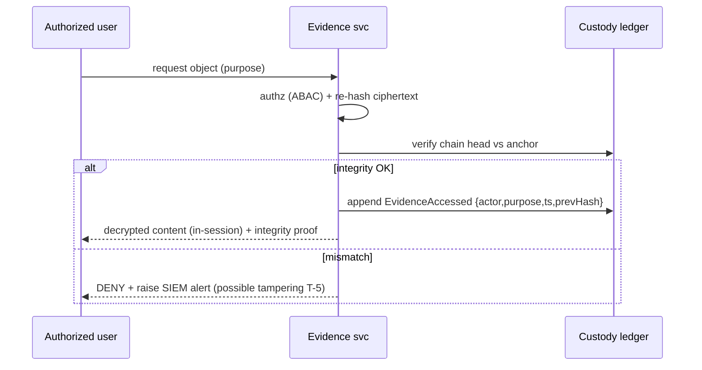

# Phase 2 · 08 — Digital Chain-of-Custody Procedures

**Implements:** D-10 (Digital Chain of Custody), DDR-06 · **Inputs:** Data `../design/02`,
Security `../design/04`, Evidence journey `../05` (J3).

> The **operational SOPs** that make evidence (and consequential records) provably untampered and
> defensible — turning DDR-06 into repeatable procedure. Covers ingest → verify → hash →
> timestamp → retain → archive → delete → audit, each with owner, control, and audit point.
> 🔒 **Evidentiary admissibility and deletion-under-legal-hold require Botswana legal/judicial +
> forensics validation before implementation — the procedures below are engineering-ready but
> legally provisional.**

---

## 1. Custody principles

- **Integrity from the earliest point:** hash + metadata-strip **client-side**, before transport.
- **Immutability:** evidence content is write-once; changes are new versions, never overwrites.
- **Append-only custody:** every touch is a new, hash-chained custody event (DDR-06).
- **Verify on every access:** integrity re-checked whenever an object is read.
- **Separation of duties:** custodian-of-record ≠ system admin ≠ auditor.
- **Least privilege + purpose:** every access is authorized, purpose-tagged, and audited.

## 2. Lifecycle SOPs

| Stage | Procedure | Owner | Control / artifact | Audit point | 🔒 |
|-------|-----------|-------|--------------------|-------------|----|
| **1 Ingest** | Client hashes (SHA-256 + SHA-3), strips metadata (EXIF etc.), envelope-encrypts, uploads ciphertext + hash + declared context | Submitter/client | Content hash; declared-context record | `EvidenceIngested` | — |
| **2 Verify** | Server recomputes hash on received ciphertext boundary; validates format/size; sandboxed scan | Evidence svc | Verification record | custody event | — |
| **3 Hash/seal** | Assign evidence ID; bind hash; envelope-encrypt with per-matter key (KMS/HSM) | Evidence svc + KMS | Sealed object + key ref | custody event | 🔒 crypto |
| **4 Timestamp** | Attach **trusted timestamp** (RFC 3161 / transparency-log) | Evidence svc + TSA | Timestamp token | custody event | — |
| **5 Custody events** | Every access/transfer appends `{objectHash, actor, role, purpose, ts, prevHash}` to append-only ledger; **anchor** ledger head externally each cycle | Evidence svc + ledger | Hash-chained ledger; external anchor | `EvidenceAccessed` | — |
| **6 Retain** | Apply retention per `field_policy` (C3) + **legal hold** overrides | Records owner + PRB | Retention record; legal-hold flag | custody event | 🔒 legal |
| **7 Archive** | Move to Digital Archive (registrar-controlled) with sealing/redaction as required | Registrar (Judiciary zone) | Archive record | custody event | 🔒 judicial |
| **8 Delete** | On retention expiry (no hold): **cryptographic erasure** (destroy key) + tombstone record | Records owner (dual-approve) | Erasure certificate; tombstone | custody event | 🔒 legal |
| **9 Audit** | Continuous integrity verification + scheduled independent audit of the chain | Auditors (independent) | Audit report | anchored audit | — |

## 3. Evidentiary integrity — reconstructability

At any time, for any object, the system can produce:
- the **content hash** and proof it matches stored ciphertext (integrity),
- the **full custody chain** (who/role/purpose/when, hash-linked, tamper-evident),
- the **trusted timestamp(s)** and **external anchor** proof (the chain existed at time T and
  hasn't been rewritten),
- the **access log** (every read, authorized and purpose-tagged).

This package is designed to support admissibility — **but admissibility is a legal determination**
(A-LEG-05) and must be confirmed by Botswana courts/counsel + forensics 🔒.

## 4. Verification sequence (operational)

## 5. Deletion vs legal hold (the hard tension)

- **Default:** retention expiry → cryptographic erasure (fast, verifiable, distributed).
- **Legal hold:** an audited flag **suspends** deletion; erasure is blocked while held.
- **Conflict:** minimization (DD-1) wants deletion; evidence/justice wants retention. Resolved
  **per matter** by the records owner + PRB, within a legally-reviewed retention schedule.
  ⚠️ HONESTY: cryptographic erasure is **irreversible** — a wrongful erase is unrecoverable, so
  erasure is **dual-approved** and hold-checked. 🔒 legal.

## 6. Failure modes

| Failure | Handling |
|---------|----------|
| Hash mismatch on access | Deny + alert (T-5); preserve for investigation |
| Timestamp authority down | Queue + retry; do not accept unstamped as final |
| Ledger anchor failure | Alert; retry; anchoring gap recorded and reviewed |
| Key destroyed prematurely | Prevented by dual-approve + hold-check; if it occurs → incident (IRB) |
| Sandbox scan detects malware in evidence | Quarantine ciphertext; record; controlled handling |

## 7. Quality gate

- **Traces to:** D-10, DDR-06; A-LEG-05, A-JUS-07; P3.
- **Threats mitigated:** T-1, T-2, T-5, R-3 (tamper/repudiation of records).
- **Residual risks:** garbage-in (submitted evidence itself authentic?) is out of platform
  control; admissibility is a legal ruling; irreversible-erasure risk (mitigated by dual-approve).
- **Trade-offs:** ⚠️ trusted-timestamp + anchoring + append-only discipline add cost/latency —
  accepted for defensibility.
- **Success criteria:** any object's custody reconstructable end-to-end; tamper detectable within
  one audit cycle; 100% integrity-verify on access; erasure produces a verifiable certificate.
- **🔒 Required review:** digital forensics + Botswana legal/judicial (admissibility, retention,
  legal hold), cryptographer (hashing/timestamp/erasure), registrar (archival/sealing).

*Next: `09-public-trust-index.md`.*
