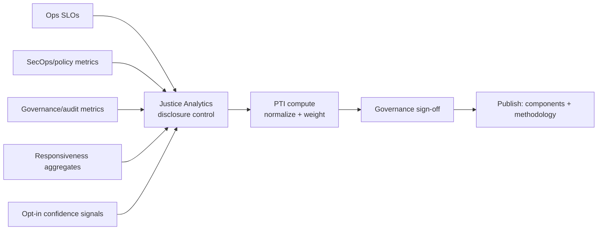

# Phase 2 · 09 — Public Trust Index (PTI)

**Implements:** D-10 (Public Trust Index), DDR-14 · **Inputs:** Observability `../design/06`,
Analytics `10`, Governance `01`/`03`.

> Operationalizes the PTI: the **indicators**, their **data sources**, **calculation**,
> **publication frequency**, **governance controls**, and **privacy protections**. The PTI makes
> the platform's own trustworthiness *measurable and honest* — it is a check on the platform, not
> a marketing number. It is computed only from privacy-preserving aggregates (`10`) and never
> exposes individuals. 🔒 Index composition/weighting requires oversight + stakeholder validation.

---

## 1. Indicators (nine, per brief)

| Indicator | What it measures | Data source | Direction |
|-----------|------------------|-------------|-----------|
| **Transparency** | Transparency-report cadence met; methodology published | Governance (`03`) | ↑ better |
| **Accessibility** | Multi-channel reach, language coverage, WCAG conformance, offline success | PWA/ops telemetry (aggregate) | ↑ better |
| **Responsiveness** | Intake→action latency (non-attributable); appeal turnaround | Oversight/Analytics | ↓ latency better |
| **Procedural fairness** | Appeal availability & overturn handling; disclosure timeliness (Zone O) | Governance/case aggregates | context |
| **Security posture** | Open-exception count/age; patch SLA; incident MTTR; pen-test findings closed | SecOps/policy engine | ↑ better |
| **Privacy compliance** | DPIA currency; policy-compliance rate; disclosure-control adherence | PRB/policy engine | ↑ better |
| **Audit completion** | Scheduled internal + independent audits completed; findings closed | Audit/ISRB | ↑ better |
| **Service availability** | SLO adherence (uptime, intake availability) | Observability SLOs | ↑ better |
| **User confidence** | Opt-in, privacy-preserving sentiment/trust signals (aggregate) | Surveys/aggregate | ↑ better |

## 2. Calculation method

- Each indicator is **normalized** to a 0–100 sub-score against a **published target/baseline**.
- The PTI is a **transparent composite**: published as **both the component sub-scores and** any
  headline roll-up (governance sets weights, published). We **never** publish only a single opaque
  number — that would be gameable and dishonest (DDR-14 trade-off).
- Inputs come **only** from the Justice Analytics pipeline (`10`) with disclosure control applied
  (k-anonymity/min-cell/DP); no raw records touch the PTI.
- Trend over time is shown; methodology + input definitions are public and versioned.

## 3. Data sources & pipeline

## 4. Publication frequency & governance controls

- **Frequency:** headline PTI + components published on a fixed cadence (e.g., quarterly),
  aligned with transparency reports (`03`); security-posture sub-metrics may update more often.
- **Governance:** each publication is **signed off by the Oversight Board + PRB** (disclosure
  control verified); methodology changes go through the policy lifecycle (`02`).
- **Gaming controls:** components are independently verifiable (audit inputs, SLO data);
  weighting is fixed and published; anomalies trigger review (`03 §6`).

## 5. Privacy protections

- **Aggregate-only, non-attributable**; every published cell passes k-anonymity/min-cell +
  suppression + DP-style noise where needed (mitigates I-8/L-1).
- **Purpose limitation**: PTI inputs are used for the PTI + oversight; new uses need PRB approval
  (DD-2/DD-3).
- **No individual, no case, no reporter** is ever identifiable from the PTI or its drill-downs.

## 6. Quality gate

- **Traces to:** D-10, DDR-14; P6; RK-11 (re-id), R-1 (responsiveness/black hole).
- **Threats mitigated:** I-8, L-1 (via disclosure control), DD-2 (purpose limitation), R-1
  (responsiveness exposed).
- **Residual risks:** composite indices can mislead (mitigated: publish components + methodology);
  gaming (mitigated: fixed weights, independent inputs); auxiliary-data re-id (RK-11 residual).
- **Trade-offs:** ⚠️ transparency of methodology vs simplicity of a headline — resolved for
  honesty (publish both).
- **Success criteria:** PTI published on cadence with public methodology; no sub-threshold cell
  ever published; every publication governance-signed; components independently verifiable.
- **🔒 Required review:** oversight bodies + stakeholders (composition/weighting), privacy +
  statistics (disclosure control), governance (sign-off process).

*Next: `10-justice-analytics.md`.*
