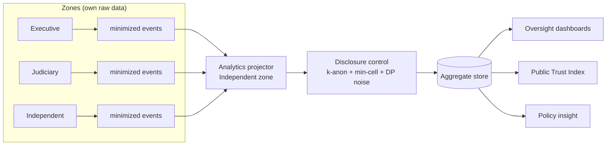

# Phase 2 · 10 — Justice Analytics (Privacy-Preserving)

**Implements:** D-10 (Justice Analytics), DDR-14 · **Inputs:** Data `../design/02 §4`,
Observability `../design/06`, Trust Model `../09`.

> Privacy-preserving analytics for oversight and policy — and the engine behind the Public Trust
> Index (`09`). The hard rule: **analytics can never expose confidential or personally identifying
> information**, and never crosses the constitutional zones as raw data. Analytics operate on
> **minimized events and governed aggregates only** (`../design/03`). 🔒 Any analytic touching
> case-level patterns needs privacy + legal review before publication.

---

## 1. Analytic domains (per brief) & what each answers

| Domain | Question (aggregate) | Zone-safe source |
|--------|----------------------|------------------|
| **Case progression** | How long do matters take by stage/court type? | Judiciary aggregates (events) |
| **Service responsiveness** | Intake→action latency; time-to-hearing | Oversight aggregates |
| **Operational efficiency** | Throughput, bottlenecks, backlog trends | Per-zone aggregates |
| **Workload distribution** | Load across courts/units (no individuals) | Aggregates |
| **Conflict-of-interest trends** | CoI/recusal rates over time | Governance aggregates |
| **Institutional performance** | Non-attributable performance indicators | Aggregates |
| **Policy effectiveness** | Outcome/trend shifts after a policy change | Aggregates |

> All framed at **institution/stage/time** granularity — **never** person- or case-identifying.

## 2. Privacy-preserving architecture

- **One-way flow:** raw records **never** leave their zone; only **minimized events** feed the
  projector (mitigates I-6, DD-1).
- **Disclosure control** on **every** output: minimum cell size (k-anonymity), small-cell
  suppression, and differential-privacy-style noise for sensitive breakdowns (mitigates I-8/L-1).
- **Purpose limitation:** a **purpose registry** governs which analytics exist; new analytics
  require **PRB approval + DPIA** (DD-2/DD-3).

## 3. Controls that prevent exposure

| Risk | Control |
|------|---------|
| Re-identification from small cells (I-8, L-1) | k-anonymity threshold + suppression + DP noise; governance sign-off per dataset |
| Raw PII crossing zones (I-6) | Only minimized, PII-free events feed analytics; registry-enforced |
| Function creep (DD-2/DD-3) | Purpose registry + PRB approval gate + audit of every query class |
| Linking a person across arms (L-2) | No cross-zone identifiers in analytics; per-context IDs only |
| Inference of sensitive attributes (DT-2) | Aggregation floors; sensitive breakdowns require higher thresholds/noise |

## 4. Access & governance

- Analytics outputs are **role-scoped** (oversight, policy, public via PTI); raw projector
  internals are restricted and audited.
- Every published or shared analytic is **governance-signed** (PRB + OB for public), with
  methodology recorded.
- Analytics **cannot** be used to make decisions about individuals (that would breach D-09/
  purpose limitation) — they inform policy and oversight only.

## 5. Honesty on limits

⚠️ Aggregation reduces but does not *eliminate* re-identification risk against an adversary with
rich auxiliary data (RK-11). The mitigations are **published thresholds, suppression, noise, and
governance sign-off** — a risk management posture, not a guarantee. This is stated openly in the
methodology.

## 6. Quality gate

- **Traces to:** D-10, DDR-14; P6/P10; RK-11.
- **Threats mitigated:** I-6, I-8, L-1, L-2, DD-2, DD-3, DT-2.
- **Residual risks:** auxiliary-data re-identification (RK-11); utility-vs-privacy tension (more
  noise = less useful) — tuned per dataset under governance.
- **Trade-offs:** ⚠️ disclosure control reduces analytic precision — accepted for privacy.
- **Success criteria:** no raw record crosses a zone (test); no published cell below k threshold
  (test); every analytic has a registered purpose + PRB approval; no individual decision derives
  from analytics (policy-enforced).
- **🔒 Required review:** privacy engineer + statistician (disclosure control), legal (publication),
  oversight (dashboard needs).

*Next: `11-github-work-items.md`.*
