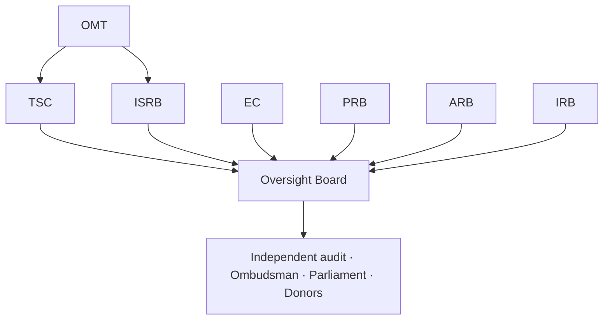

# Phase 3 · WS1 — Governance Maturation

**Operationalizes:** `../phase2/01` (Governance System) · **Traces:** D-01, RK-03, RK-17.

> Expands the eight governing bodies from structure (`../phase2/01`) into **implementation-ready
> charters** — mandate, membership, eligibility, appointment, term limits, voting, quorum,
> escalation, reporting, cadence, review responsibilities — plus consolidated **RACI**. This is a
> **governance manual**, not new governance design. 🔒 **All institutional-governance content
> requires governance/legal validation and formal constitution before it is operative** — it is
> proposed structure, not enacted authority.

---

## 1. Common charter template (applied to all bodies)

Each body's charter has: *Mandate · Authority · Membership & Eligibility · Appointment ·
Term/Rotation · Quorum · Voting · Escalation (in/out) · Reporting obligations · Cadence · Review
responsibilities · Conflict-of-interest rules · Sunset/Review trigger.* Independence controls
(RK-03) apply to all: **no single institution holds a majority on any body; members subject to
reporting are ineligible for case-affecting roles; staggered, term-limited appointments; recusal
mandatory and audited.**

## 2. Body charters (summary form)

### Oversight Board (OB)
- **Mandate/Authority:** ultimate accountability; approves charter, budget, major policy,
  appointments, disaster/go-live declarations; holds threshold-custody authority (with others).
- **Membership/Eligibility:** 7–11 independent members from distinct constituencies (judiciary-
  adjacent, Law Society, civil society, academia, community/faith, independent security/privacy
  experts); no institution-under-reporting majority. 🔒 appointment legality.
- **Appointment:** nominated by constituencies, vetted for CoI, appointed per the founding
  charter; **staggered 3-year terms, max 2**.
- **Quorum:** 2/3 of seats. **Voting:** simple majority; **2/3 super-majority** for charter,
  key-custody policy, constitutional-invariant change.
- **Escalation out:** independent audit · Ombudsman · Parliament · donors (backstop vs RK-03/17).
- **Reporting:** publishes governance transparency report each cycle. **Cadence:** quarterly +
  emergency.

### Technical Steering Committee (TSC)
- **Mandate:** technical direction, roadmap prioritization, non-security release go/no-go.
- **Membership:** lead architect, engineering leads, SRE, product; advisory ISRB/PRB liaisons.
- **Quorum/Voting:** majority; **ARB veto on architecture grounds**. **Cadence:** monthly + release.
- **Escalation:** to OB on architecture-affecting spend/scope.

### Independent Security Review Board (ISRB)
- **Mandate/Authority:** security sign-off **gate** for 🔒 subsystems; may **block** any release.
- **Membership:** ≥3 incl. ≥1 external independent security expert; crypto reviewer co-opted for
  key-custody matters. 🔒 procurement of external experts.
- **Quorum/Voting:** 3 incl. external; consensus; any member may escalate a block to OB.
- **Cadence:** monthly + pre-release + on incident.

### Ethics Committee (EC)
- **Mandate:** ethics sign-off on AI use, vulnerable-person handling, research use; may pause a
  feature on ethics grounds. **Membership:** incl. human-rights advisor, community rep, ethicist.
- **Quorum/Voting:** majority incl. human-rights advisor. **Cadence:** monthly + on referral.

### Privacy Review Board (PRB)
- **Mandate/Authority:** DPIA approval; approves new data fields/purposes; sets disclosure-control
  thresholds; liaises with the Data Protection Commissioner. 🔒 privacy regulation.
- **Membership:** privacy engineer + legal + data steward. **Quorum/Voting:** majority.
  **Cadence:** monthly + on new-purpose request.

### Architecture Review Board (ARB)
- **Mandate/Authority:** enforces constitutional invariants & DDRs; **veto** on invariant breach.
- **Membership:** lead architect + security + data + integration leads. **Cadence:** bi-weekly + RFC.

### Incident Review Board (IRB)
- **Mandate/Authority:** post-incident findings; can mandate control changes. **Membership:**
  security + ops + relevant domain lead + (for reporter-safety incidents) EC/legal.
- **Quorum/Voting:** 3 incl. security + ops; consensus. **Cadence:** per incident + quarterly review.

### Operational Management Team (OMT)
- **Mandate:** day-to-day operations, SRE/SecOps, JIT-access approvals, runbook execution.
- **Authority:** dual-control for sensitive ops; **no standing privilege**. **Cadence:** continuous.

## 3. Reporting structure

## 4. Consolidated RACI (programme-level)

| Activity | OB | TSC | ISRB | EC | PRB | ARB | IRB | OMT |
|----------|----|----|------|----|----|-----|-----|-----|
| Charter / major policy | **A** | C | C | C | C | C | C | I |
| Appointments to bodies | **A** | I | C | C | C | I | I | I |
| Roadmap priority | A | **R/A** | C | I | I | C | I | C |
| Release of 🔒 subsystem | A | R | **A** | C | C | C | I | R |
| New data field / purpose | A | C | I | C | **A** | C | I | I |
| Architecture change | A | C | C | I | I | **A** | I | I |
| Threshold key operation | **A** | I | C | I | C | I | I | R |
| Go-live decision (`08`) | **A** | C | C | C | C | C | C | R |
| Incident corrective action | A | C | C | C | C | C | **A** | R |
| JIT privileged access | I | I | C | I | I | I | I | **A** |
| Disaster declaration | **A** | C | C | I | I | I | C | R |
| Transparency report | **A** | I | I | C | C | I | I | R |
| Independent audit scheduling | A | I | **A** | I | C | I | C | R |

**A**=Accountable · **R**=Responsible · **C**=Consulted · **I**=Informed.

## 5. Quality gate

- **Traces to:** D-01; `../phase2/01-03`; RK-03, RK-17; stakeholder "governance body" (`../03`).
- **Threats/risks mitigated:** E-1/E-3 (single-actor abuse → threshold + SoD), RK-03 (capture →
  independence, term limits, external escalation), R-2/R-3 (repudiation → audited decisions).
- **Residual risks:** governance capture reduced not eliminated; member availability for
  threshold ops; recruitment of independent experts (RK-18).
- **Dependencies:** funding (A-FIN-01), independent members (A-GOV-01), legal constitution.
- **Trade-offs:** ⚠️ multi-body + super-majority + threshold slows decisions — accepted for
  independence.
- **Measurable outcomes:** all 8 bodies constituted with signed charters; no single-institution
  majority (verified); RACI adopted; escalation drill executed; threshold custodians enrolled.
- **🔒 Required review:** governance specialists, Botswana legal (charter legality/appointment),
  constitutional advisor (independence vs constitutional bodies), procurement (external experts).

*Next: `02-data-governance-framework.md`.*
