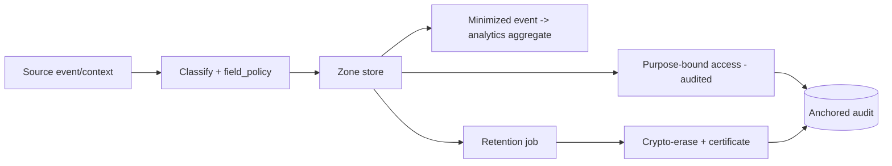

# Phase 3 · WS2 — Data Governance Framework

**Operationalizes:** Data Architecture `../design/02`, Justice Analytics `../phase2/10` ·
**Traces:** D-02, D-06, DDR-04/05/06; DD-1/2/3, I-6, I-8, RK-01/11/22.

> Roles, lifecycle, lineage, and quality controls for data — under the three-zone Constitutional
> Architecture and the "hold almost nothing identifying" rule (D-02). This is **data governance
> operations**, not new data design. 🔒 Retention/disposal legality and privacy-regulation
> aspects require legal + Data Protection Commissioner validation.

---

## 1. Data ownership model (roles, zone-scoped)

| Role | Responsibility | Who (per zone) |
|------|----------------|----------------|
| **Data Owner** | Accountable for a data domain's purpose, legal basis, retention, disclosure; approves access policy | Judiciary owns adjudication data; Executive owns investigation data; Independent owns reporting/governance data (D-06) |
| **Data Custodian** | Operates storage/encryption/backup per owner's policy; no authority to repurpose | OMT/SRE within a zone (zero standing privilege) |
| **Data Steward** | Day-to-day quality, classification, lineage, metadata; enforces `field_policy` | Per-domain steward + PRB liaison |
| **Data Consumer** | Uses data within granted, purpose-bound scope; cannot re-share | Investigators, courts, oversight, analytics (aggregate-only) |

**Separation-of-powers rule:** an owner in one zone cannot be custodian/consumer of another
zone's raw data (mitigates I-6). Cross-zone use is aggregate-only via governed analytics
(`../phase2/10`).

## 2. Data lifecycle per class (from `../design/02 §2`)

| Class | Creation | Classification | Storage | Access | Retention | Archival | Disposal |
|-------|----------|----------------|---------|--------|-----------|----------|----------|
| **C0 Reporter identity** | **Never created** (D-02) | — | — | — | — | — | — |
| **C1 Anonymous report** | Client-encrypted at submit | Auto (category) | Independent zone, envelope-enc | Case-code only | Minimal, purpose-bound | Not archived w/ identity | **Crypto-erase** on expiry |
| **C2 Case/official PII** | On case events | On create per `field_policy` | Owning zone, envelope-enc | ABAC matter-scoped | Statutory schedule 🔒 | Registrar-controlled | Crypto-erase + record (hold-aware) |
| **C3 Evidence** | On ingest (`../phase2/08`) | On ingest | Object store, per-matter key | ABAC + purpose + audit | Case lifecycle + legal hold 🔒 | Digital Archive (sealed) | Dual-approved crypto-erase |
| **C4 Audit** | On every action | System | Append-only, anchored | Auditors read-only | Long (accountability) | Immutable | Governed, never silent |
| **C5 Aggregate** | On projection | System | Aggregate store | Role-scoped/public | Long | — | Recompute |

## 3. Data lineage (source → deletion)

- **Every data element carries provenance metadata**: origin (which event/context), transforms,
  zone, `field_policy` ref, and lifecycle state.
- **Event-sourced lineage:** because state derives from events (`../design/03`), lineage is
  reconstructable by replay; cross-zone lineage is visible only as the **minimized events** that
  crossed (PII-free), so lineage never becomes a back-door to raw cross-zone data.
- **Analytics lineage:** each published aggregate records its input event classes, aggregation
  spec, disclosure-control parameters, and governance sign-off (`../phase2/09/10`).
- **Deliverable:** a lineage register (machine-readable) enabling an auditor to trace any element
  source→deletion — including the crypto-erase certificate at end of life.

## 4. Data quality controls

| Control | What | Where |
|---------|------|-------|
| **Validation** | Schema/format/constraint checks at write; event-schema registry rejects invalid/PII-carrying cross-zone events | Services + registry (`../phase2/07`) |
| **Reconciliation** | Read-model vs event-log consistency; evidence hash vs stored ciphertext; cross-system reconciliation via ACL (no raw pooling) | CQRS projectors, Evidence svc |
| **Monitoring** | Data-quality metrics (completeness, timeliness, integrity-check pass rate); drift detection | Observability (`../design/06`) |
| **Remediation** | Governed correction workflow (audited, never silent edit of authoritative records; corrections are new versioned events); analytics re-publish on correction | Data steward + PRB |

## 5. Quality gate

- **Traces to:** D-02/D-06; DDR-04/05/06; DD-1/2/3, I-6, I-8; RK-01/11/22; `../phase2/09/10`.
- **Threats mitigated:** I-6 (owner/custodian separation), DD-1 (minimization lifecycle), I-8
  (analytics lineage + disclosure control), T-1/T-2 (integrity via reconciliation + audit).
- **Residual risks:** retention-vs-minimization tension (governed per matter); auxiliary-data
  re-identification (RK-11); statutory-schedule uncertainty (🔒 legal).
- **Dependencies:** `field_policy` complete (EP1-S12); legal retention schedule; Commissioner
  engagement.
- **Trade-offs:** ⚠️ strict lineage + reconciliation is overhead — bought for auditability and
  erasure verifiability.
- **Measurable outcomes:** every element has provenance + `field_policy`; lineage traceable
  source→deletion; crypto-erase produces certificate; 0 PII in cross-zone events (test);
  data-quality metrics baselined.
- **🔒 Required review:** privacy engineer + legal (retention/disposal legality, Commissioner),
  records authority (archival/sealing), data-governance specialist.

*Next: `03-security-validation-programme.md`.*
