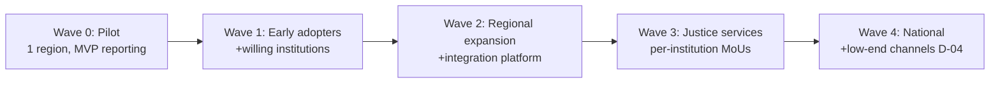

# Phase 3 · WS5 — Change Management & National Adoption

**Operationalizes:** Stakeholders `../03`, Roadmap `../phase2/06`, Botswana Adaptation (Discovery
scope) · **Traces:** P5 (access), A-JUS-05/06, A-ORG-03, RK-04/21/23.

> A national adoption strategy. Adoption is the **top non-technical risk** (RK-04): a perfectly
> engineered platform that no citizen trusts and no institution uses fails. This covers
> stakeholder engagement, communication, training, institutional readiness, adoption metrics,
> resistance management, sponsorship, a change-champion network, and **rollout waves**. 🔒
> Institutional-participation commitments (MoUs) and any customary-justice engagement require
> governance/institutional + Kgosi validation.

---

## 1. Guiding principles

- **Trust is earned, not announced** — honesty about what the platform does and does not protect
  (U-1) is the core of the adoption message; over-promising would be both unethical and
  self-defeating.
- **Institution-by-institution** — Zone-O adoption follows MoUs (A-JUS-05); no institution is
  onboarded before its data-sharing/CoI controls are live.
- **Inclusion first** — Setswana-first, low-literacy, accessible, offline-capable (P5, A-ORG-03).

## 2. Stakeholder engagement & sponsorship

| Group | Engagement | Sponsor/Champion |
|-------|-----------|------------------|
| Citizens/CSOs | Community outreach, trusted intermediaries, CSO partnerships | CSO champions |
| Judiciary | Judicial-independence-respecting co-design; opt-in workspaces | Senior judicial sponsor 🔒 |
| Police/DCEC/DPP | MoU-based onboarding; CoI assurances | Institutional executive sponsors 🔒 |
| Kgosis/customary | Respectful, co-design engagement (design-for, build-later, D-08) | Traditional-leadership liaison 🔒 |
| Oversight/CSOs/media | Transparency-report + Trust Index briefings | OB |
| Legal aid/defenders | Workspace onboarding | Law Society liaison |

**Executive sponsorship:** a visible, credible independent sponsor (via OB) is essential vs
political-pressure risk (RK-17); sponsorship is broad-coalition, not tied to one institution.

## 3. Communication planning

- Layered, multilingual (Setswana/English +), plain-language and iconographic messaging.
- **Honesty-first**: every citizen-facing message states protections *and* limits (no false
  confidence). Reviewed by EC + safety-UX (RK-07).
- Channels: community radio, kgotla meetings, CSO networks, SMS info (not for reporting content),
  and the public transparency site.

## 4. Training programmes

| Audience | Training | Owner |
|----------|----------|-------|
| Citizens | How to report safely; understanding risk; verifying authenticity (S-1) | CSO + comms |
| Investigators/prosecutors/defenders/courts | Workspace use; CoI; evidence handling; least privilege | Institutional trainers |
| Operators/SecOps | Runbooks, break-glass, incident response, threshold ops | OMT/ISRB |
| Governance members | Charters, RACI, CoI, decision tooling | Governance office |

## 5. Institutional readiness

Per institution before onboarding (feeds readiness scorecard `07`): signed MoU + legal basis
(A-JUS-08 🔒), CoI controls live, ACL integration conformance-green (`../phase2/07`), trained
staff, named process owners, and a re-pass of the Operational Readiness Gate for that scope.

## 6. Adoption metrics & resistance management

- **Adoption metrics (privacy-preserving, aggregate):** reach by channel/language, report intake
  trend, institutional onboarding count, responsiveness (feeds Trust Index).
- **Resistance management:** identify sources (fear of exposure among the scrutinized; skepticism;
  low digital literacy); respond with transparency, quick wins, champion advocacy, and honest
  handling of concerns — **never by weakening safety controls**.
- **Change-champion network:** trained advocates in CSOs, institutions, and communities.

## 7. Rollout waves

| Wave | Scope | Entry | Gate |
|------|-------|-------|------|
| W0 Pilot | MVP reporting, one region | ORG GREEN for MVP | Pilot success metrics + hypercare (`08`) |
| W1 Early adopters | + willing institutions | W0 review passed | Per-institution readiness |
| W2 Regional | + integration platform | Phase 3 platform ready | Re-pass ORG for scope |
| W3 Justice services | Zone-O workspaces | MoUs + judicial validation 🔒 | Per-service ORG |
| W4 National | Scale + USSD/SMS/voice (D-04 re-eval) | Capacity + equity metrics | Go-live gate per scope |

## 8. Quality gate

- **Traces to:** P5; A-JUS-05/06/08, A-ORG-03; RK-04/17/21/23; `../phase2/06/09`.
- **Threats/risks mitigated:** RK-04 (non-participation → MoU-based waves + sponsorship), RK-21
  (equity → inclusion-first), RK-07 (false confidence → honesty-first comms), RK-17 (politics →
  broad coalition).
- **Residual risks:** institutional non-participation persists despite engagement; political
  headwinds; digital-exclusion tail requires intermediated access.
- **Dependencies:** MoUs, sponsors, funding for outreach/training, EC review of messaging.
- **Trade-offs:** ⚠️ honesty-first messaging may dampen headline adoption vs over-selling —
  accepted (trust > vanity metrics).
- **Measurable outcomes:** wave entry/exit criteria met; adoption + responsiveness metrics
  trending; champion network active; no safety control weakened for adoption.
- **🔒 Required review:** change-management + comms, EC (messaging ethics), institutional sponsors,
  Kgosi/traditional-leadership liaison, legal (MoU/data-sharing).

*Next: `06-enterprise-service-management.md`.*
