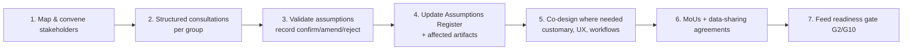

# Phase 4 · 05 — Botswana Adaptation Strategy

**Traces:** Assumptions `../01` (A-JUS-*, A-TEC-*, A-ORG-03), Problem `../02`, Stakeholders `../03`,
Change Mgmt `../phase3/05`. **Premise:** the blueprint contains many Botswana-specific assumptions
that are **hypotheses, not facts**; this document lists them and gives an **engagement & validation
plan** to confirm them with the right people before implementation. **No Botswana facts are
invented here.**

---

## 1. Adaptation dimensions (design already accommodates; specifics to validate)

| Dimension | Design provision | To validate `⟦validate⟧` |
|-----------|------------------|--------------------------|
| Language | Setswana + English default; multilingual UX | Additional languages; translation quality (A-AI-03) |
| Connectivity/devices | PWA-first, offline drafting, low-bandwidth (D-04) | Actual coverage/cost; USSD/SMS/voice need (A-TEC-01/02) |
| Digital literacy | Plain-language, iconographic, assisted access (A-ORG-03) | Literacy profile of target users |
| Institutions | Three-zone model per separation of powers (A-JUS-01/03) | Actual institutional map, mandates, data ownership |
| Customary justice | First-class extension point, build-later (D-08) | Role of dikgotla/Kgosis; appropriate interface |
| Legal environment | Assumption-tagged throughout (A-LEG-*) | DPA, whistleblower, evidence, interception law |
| Hosting | Hybrid (D-03) | In-country DC capability; cross-border legality (A-LEG-08) |

## 2. Assumptions requiring validation (consolidated, by validator)

| Validate with | Key assumptions |
|---------------|-----------------|
| **Justice-sector institutions** (police, DCEC, DPP, courts, prisons, Ombudsman) | A-JUS-01/02/05/07/08 — institutional map, existing systems, participation, evidence integration, data-sharing basis |
| **Legal experts / counsel** 🔒 | A-LEG-01..08 — DPA, whistleblower reach, compelled access, admissibility, cross-border |
| **Judiciary / constitutional advisors** 🔒 | A-JUS-03 (independence), A-JUS-04 (open-justice exceptions) |
| **Traditional leadership (Kgosis)** 🔒 | A-JUS-06 — customary justice interface, cultural fit |
| **Civil society / CSOs / media** | A-ORG-03, P1 — reporting barriers, trust, accessibility, watchdog needs |
| **Technical/telecom stakeholders (BOCRA, carriers)** | A-TEC-01/02/03/04 — coverage, cost, hosting, censorship risk |
| **Finance / funders** 🔒 | A-FIN-01..04 — funding, sustainability, FX, telecom cost |

## 3. Institutional engagement & validation plan

| Step | Method | Owner | Output |
|------|--------|-------|--------|
| Map & convene | Stakeholder register; invitations | PMO | Engagement plan |
| Consultations | Workshops, interviews, kgotla engagement (respectful) | Change lead + domain leads | Findings log |
| Validate assumptions | Confirm/amend/reject each `⟦validate⟧` item | Owners per §2 | Updated `../01` |
| Update artifacts | Write-backs to threat model/scope where changed | Architects | Revised artifacts |
| Co-design | Customary interface, safety UX, workspaces | Design + institutions/Kgosis 🔒 | Co-designed specs |
| MoUs | Data-sharing + participation + CoI | OB + Legal 🔒 | Signed MoUs |
| Feed gates | Evidence into readiness | PMO | G2/G10 evidence |

## 4. Principles for engagement

- **Consultative, not extractive** — especially with communities and traditional leadership;
  co-design, don't impose formal-court models on customary structures (RK-23).
- **Honest** — communicate limits as well as benefits (RK-07).
- **Independence-preserving** — engagement must not create dependence on, or capture by, any
  institution under scrutiny (RK-03).

## 5. Quality gate

- **Traces to:** all A-JUS-*/A-TEC-*/A-LEG-*/A-FIN-*/A-ORG-03; `../02/03`, `../phase3/05`.
- **Threats/risks:** RK-04 (participation), RK-23 (customary), RK-21 (equity), RK-10 (statute).
- **Residual risks:** consultation may reveal invalid assumptions requiring rework (that is the
  point — better before build than after); engagement fatigue.
- **Trade-offs:** ⚠️ thorough consultation is slow — accepted; skipping it risks building the wrong
  thing.
- **Acceptance criteria:** every `⟦validate⟧` assumption has a named validator + a
  confirm/amend/reject outcome recorded in `../01` before dependent build begins.
- **🔒 Required review:** legal, judicial, traditional leadership, institutional sponsors, CSOs,
  finance.

*Next: `06-technology-strategy.md`.*
