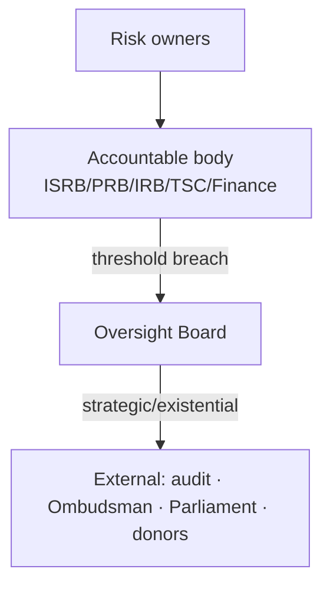

# Phase 4 · 09 — Enterprise Risk Management (ERM)

**Extends:** the technical Risk Register `../10` into an enterprise-programme view. **Traces:** all
risks RK-01..24 + new strategic/organizational risks. Ratings per `../10 §2.4` (L×I → Low/Med/High/
Critical). 🔒 legal/procurement/funding risks require human owners.

---

## 1. ERM structure

The technical/security/privacy risks (`../10`, RK-01..24) remain the operational register. ERM adds
**enterprise categories** — strategic, legal, operational, financial, procurement, reputational,
organizational — each with owner, review frequency, escalation threshold, mitigation, residual.
Escalation runs through the governance bodies (`../phase3/01`) to the Oversight Board and its
external backstop.

## 2. Enterprise risk register (additions to `../10`)

| ID | Risk | Category | Owner | Review | Escalation threshold | Mitigation | Residual |
|----|------|----------|-------|--------|----------------------|------------|----------|
| ER-01 | Loss of political tolerance / hostile legislation | Strategic | OB 🔒 | Quarterly + on signal | Any credible legislative/legal threat | Independence; broad coalition; offshore governance continuity; transparency | Cannot fully prevent (RK-17) |
| ER-02 | Governance capture over time | Strategic/Org | OB 🔒 | Quarterly | Independence metric breach | Term limits, rotation, external audit, threshold custody | Reduced not removed (RK-03) |
| ER-03 | Whistleblower-statute gap exposes reporters legally | Legal | Legal 🔒 | On law change | Any statutory ambiguity confirmed | Counsel; honest UX; routing adjustment | Interpretation risk (RK-10) |
| ER-04 | Compelled-access / contempt exposure of operator | Legal | Legal + OB 🔒 | Semi-annual | Any order received | "Technical inability" design; legal defence; warrant canary | Unresolved legal tension (NC-2) |
| ER-05 | Cross-border data/key custody legality | Legal | Legal 🔒 | On hosting/law change | Adverse adequacy finding | Transfer analysis; jurisdiction choice | A-LEG-08 residual |
| ER-06 | Funding shortfall / strings compromising independence | Financial | OB + Finance 🔒 | Quarterly | Runway < threshold or conditional offer | Diversify; endowment; low idle-cost | Programme-ending if unmet (RK-15) |
| ER-07 | FX volatility inflating cost | Financial | Finance | Quarterly | Budget variance > threshold | FX contingency; in-region spend | RK-16 |
| ER-08 | Procurement failure / vendor lock-in / CoI | Procurement | OB 🔒 | Per procurement | Any CoI or single-source risk | Transparent, CoI-controlled procurement; portability | Residual vendor risk |
| ER-09 | Reputational harm from a (real or perceived) breach | Reputational | OB | Continuous | Any credible incident/claim | Security assurance; honest comms; rapid IR; PIR | A single credible de-anon ends adoption |
| ER-10 | Institutional non-participation stalls value | Strategic/Org | Programme sponsor | Quarterly | MoU targets missed | MoU-based waves; incentives; sponsorship | RK-04 |
| ER-11 | Key-person / skills loss | Organizational | Ops lead | Quarterly | Critical-role vacancy | Cross-training, succession, docs, skills pipeline | RK-18 |
| ER-12 | Scope creep beyond mandate | Strategic | Product/OB | Per change | New-domain request | Purpose limitation; governance gate (DD-2/3) | RK-19 |
| ER-13 | Third-party/managed-service compromise | Operational | ISRB | Continuous | Vendor incident | Operator-in-threat controls on vendors; SOC 2 | A-OPS-01 residual |

## 3. Risk governance & escalation

- Each risk has a **named owner** and **review frequency**; breaches of **escalation thresholds**
  force escalation (no silent risk-holding).
- ERM is reviewed quarterly by the OB; the register is versioned in the Evidence Package (`13`).
- **Interpretation for decision-makers:** the *existential* risks are **non-technical** — political
  tolerance (ER-01), governance capture (ER-02), funding-with-strings (ER-06), and a single credible
  de-anonymization (ER-09/RK-01). Technical excellence is necessary but not sufficient.

## 4. Quality gate

- **Traces to:** `../10` (RK-01..24), governance `../phase3/01`, all approved artifacts.
- **Threats mitigated:** enterprise-level realization of RK-01/03/04/10/15/17/18.
- **Residual risks:** the strategic/political/funding risks cannot be eliminated by design — only
  owned, monitored, and escalated.
- **Trade-offs:** ⚠️ independence-first posture raises some enterprise risks (funding, political) to
  reduce the catastrophic one (de-anonymization) — a deliberate, stated choice.
- **Acceptance criteria:** every enterprise risk has owner/frequency/threshold/mitigation/residual;
  escalation paths tested; register versioned.
- **🔒 Required review:** OB, legal, finance, procurement, ISRB.

*Next: `10-national-dpi-alignment.md`.*
