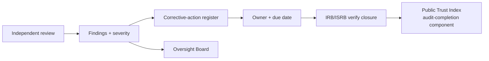

# Phase 4 · 12 — Independent Assurance Framework

**Extends:** Security Validation `../phase3/03`, Governance `../phase3/01`, Audit `../design/06`.
**Premise:** trust in a system that says "trust us less" must be **independently and recurrently
verified**. This framework defines the recurring independent reviews, their scope, reviewers,
reporting, and corrective-action tracking. 🔒 Reviewer procurement and some review domains require
human governance decisions.

---

## 1. Why independent assurance is load-bearing

The platform's core promise — *no single operator, including us, can de-anonymize a reporter* —
is only credible if **independent parties can verify it repeatedly**. Independent assurance is the
external counterpart to internal controls, and a primary mitigation for **governance capture
(RK-03)** and **reputational risk (ER-09)**.

## 2. Recurring independent reviews

| Domain | Scope | Frequency | Reviewer | Reporting |
|--------|-------|-----------|----------|-----------|
| **Governance** | Independence, CoI, decision integrity, threshold custody discipline | Annual | Independent governance auditor 🔒 | OB + public (aggregate) |
| **Architecture** | Constitutional invariants, DDR conformance, no cross-zone paths | Annual + major change | Independent architecture reviewer 🔒 | ARB→OB |
| **Cybersecurity** | Controls, pen test, red team, crypto review | Annual + pre-go-live | External security firm + cryptographer 🔒 | ISRB→OB |
| **Privacy** | Minimization, disclosure control, DPIA currency, no-identity verification | Annual | Independent privacy auditor 🔒 | PRB→OB + Commissioner |
| **Accessibility** | WCAG, low-literacy, language, offline, inclusion | Annual | Accessibility specialist | Change lead→OB |
| **Operational performance** | SLOs, incident/DR metrics, ESM effectiveness | Annual | Operational assurance reviewer | OMT→OB |
| **Programme effectiveness** | Benefits realization, adoption, value-for-money | Annual | Independent evaluator | OB + funders |

## 3. Assurance principles

- **Genuinely independent:** reviewers are not the teams they review, not funded in a way that
  compromises them, and rotated to prevent coziness (🔒 procurement, CoI-controlled).
- **Verifiable inputs:** reviewers get **independent, read-only, tamper-evident access** (anchored
  audit, DDR-13) — they can check the logs themselves, not just management's summary.
- **Published outcomes:** results (aggregate) feed the **Public Trust Index** (independence +
  security-posture components) and transparency reports — assurance is itself transparent.
- **Adversarial where it matters:** the security/red-team review explicitly tries to break the
  anonymity guarantee (`../phase3/03 A2`).

## 4. Reporting & corrective-action tracking

- Findings enter a **corrective-action register** with owner, severity, and due date; closure is
  **independently verified** (no self-marking) by IRB/ISRB.
- **Critical/High findings block go-live** and can trigger rollback post-launch (`../phase3/08`).
- **Audit-completion + finding-closure rate** are published (Trust Index).

## 5. Assurance calendar (illustrative)

| Cadence | Activities |
|---------|-----------|
| Continuous | Automated control monitoring (`../phase2/02 §6`), vuln mgmt, SIEM |
| Pre-go-live | Pen test, red team, crypto review, architecture + privacy review, DR drill |
| Annual | All domain reviews in §2; threat-model refresh; ISO/SOC audits (if pursued) |
| Event-driven | On major change, incident, or law change |

## 6. Quality gate

- **Traces to:** `../phase3/01/03`, `../design/06`; RK-03, ER-09; DDR-13.
- **Threats mitigated:** RK-03 (capture — external verification), T-2 (via independent audit
  access), plus validation of all security/privacy controls.
- **Residual risks:** reviewer availability/independence in a small market; assurance verifies
  controls, cannot prove absence of all unknowns.
- **Trade-offs:** ⚠️ recurring independent assurance is a standing cost — accepted; it is the price of
  credible independence.
- **Acceptance criteria:** all §2 reviews scheduled with independent reviewers; corrective-action
  register live with verified closure; results feed Trust Index; no Critical/High open at go-live.
- **🔒 Required review:** OB, procurement (reviewer selection/independence), ISRB/PRB/ARB per domain.

*Next: `13-production-evidence-package.md`.*
