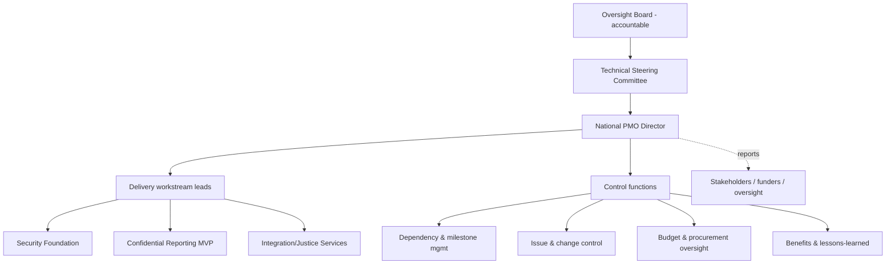

# Phase 5 · WS1 — National PMO Operating Model

**Traces:** Governance `../phase3/01`, Roadmap `../phase2/06`, ERM `../phase4/09`. **Note:** the PMO
**executes**; it does not govern the platform — governance authority stays with the eight bodies
(`../phase3/01`). The PMO coordinates delivery *within* that governance.

---

## 1. Purpose & relationship to governance

**[DECISION]** The PMO is a **permanent programme-coordination function**, accountable to the
Technical Steering Committee (delivery) and, for approvals, to the Oversight Board. **[REC]** It has
**no authority to waive readiness gates, security/privacy controls, or 🔒 human reviews** — it
surfaces status and drives work to the gates; the gates and bodies decide.

## 2. Programme organization

## 3. Roles & responsibilities

| Role | Responsibility | Reports to |
|------|----------------|-----------|
| PMO Director | Overall delivery coordination, gate-readiness driving | TSC/OB |
| Workstream leads | Deliver phase scope to exit criteria | PMO |
| Dependency/milestone manager | Cross-workstream sequencing, critical path | PMO |
| Issue/change manager | Issue log, change control board coordination | PMO |
| Budget/procurement officer | Spend tracking, procurement oversight (🔒 approvals stay with OB) | PMO + Finance |
| Benefits manager | Benefits tracking, corrective actions (`04`) | PMO + OB |
| Stakeholder/comms lead | Reporting, briefing packs (`07`), change mgmt (`09`) | PMO |
| PMO assurance liaison | Interface to Implementation Assurance (`08`) | PMO + ISRB |

## 4. Control functions (the PMO operating model)

| Function | How it works | Artifact |
|----------|--------------|----------|
| **Dependency management** | Maintain dependency map + critical path; flag cross-zone/institutional deps | Dependency map (`05`) |
| **Milestone management** | Track milestones vs plan (`03`); RAG status | Milestone dashboard (`05`) |
| **Issue management** | Log→triage→assign→resolve; escalate on threshold | Issue log (RAID, `05`) |
| **Change control** | RFC → CAB (TSC/ARB/ISRB per class, `../phase3/06`) → decision; **🔒/constitutional changes escalate** | Change register |
| **Budget management** | Track spend vs envelope (BWP); variance alerts (RK-16) | Investment tracker (`05`) |
| **Procurement oversight** | CoI-controlled, transparent; **approvals are OB decisions** 🔒 | Procurement status (`05`) |
| **Stakeholder reporting** | Cadenced, audience-specific (`07`) | Briefing packs |
| **Benefits realization** | Baseline→target tracking, corrective action (`04`) | Benefits tracker |
| **Lessons learned / PIR** | Capture per phase/wave; feed continuous improvement (`10`) | Lessons register |

## 5. Decision & escalation

**[REC]** PMO decisions are delivery-scoped; anything touching **architecture** (→ARB),
**security/🔒 subsystems** (→ISRB), **privacy/new purpose** (→PRB), **constitutional invariants or
key custody** (→OB super-majority), **procurement/funding** (→OB 🔒), or a **readiness gate** is
escalated to the accountable body. No PMO override of a gate exists — **[FACT]** consistent with the
fail-closed gate design (`../phase2/05`, `../phase3/08`).

## 6. Quality gate

- **Traces to:** `../phase3/01` (governance), `../phase2/06` (roadmap), `../phase4/09` (ERM).
- **Preserves:** governance authority (PMO cannot waive gates/controls) and traceability.
- **Threats/risks:** mitigates delivery-coordination failure; RK-04/16/19 surfaced via control
  functions; does not touch security/privacy controls (unchanged).
- **Residual risks:** PMO could become a bottleneck (mitigated: clear escalation, lean control set)
  or overreach (mitigated: explicit no-gate-waiver rule).
- **Trade-offs:** ⚠️ a permanent PMO is standing cost — justified for a multi-year national programme.
- **Acceptance criteria:** PMO constituted; control functions operating with named owners; no gate
  waiverable by PMO (verified in charter).
- **🔒 Required review:** OB (PMO charter), procurement/finance (oversight scope), TSC.

*Next: `02-final-recommendations.md`.*
