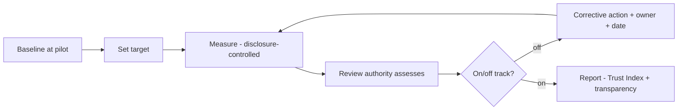

# Phase 5 · WS4 — Benefits Realization Programme

**Operationalizes:** the Benefits Realization Framework `../phase4/08` into a running programme with
**corrective actions and review authority**. All measures privacy-preserving (`../phase2/10`);
**reporter safety is a zero-incident guardrail, never a growth metric.**

---

## 1. Benefit operating cycle

## 2. Operational benefits register (with corrective actions)

| Benefit | Baseline | Target `⟦validate⟧` | Owner | Method | Freq | Corrective action if off-track | Review authority |
|---------|----------|---------------------|-------|--------|------|-------------------------------|------------------|
| Transparency | none | 100% report cadence | OB | cadence check | Qtr | Re-resource reporting; escalate | OB |
| Accessibility | pilot reach | rising reach + WCAG | Change lead | aggregate reach | Qtr | Add channels/intermediaries (RK-21) | OB + PRB |
| Responsiveness | pilot latency | ≤ target; 0 >SLA | Oversight | non-attributable latency | Mo | Escalate to recipients; Ombudsman path (R-1) | IRB/OB |
| Public trust (PTI) | pilot signal | rising PTI | OB | PTI composite | Qtr | Root-cause weak component; act | OB + public |
| Operational efficiency | pilot | reduced backlog | TSC | aggregate trends | Qtr | Capacity/process review | TSC |
| Governance effectiveness | — | full discipline | OB | audit/CoI/exception metrics | Qtr | Governance remediation | ISRB/OB |
| Service quality | SLOs | Tier-1 SLOs met | OMT | SLO adherence | Mo | Error-budget freeze; fix | ESM/OB |
| **Reporter safety (guardrail)** | 0 | **0 incidents** | ISRB/OB | incident metrics | Continuous | **Any >0 → Sev-1 review; consider halt** | IRB/OB |

## 3. Quantitative + qualitative measures

- **Quantitative:** the metrics above (all aggregate, disclosure-controlled).
- **Qualitative:** structured stakeholder feedback (citizens via CSOs, institutions, oversight),
  ethically gathered (EC), never identifying reporters; feeds continuous improvement (`10`).

## 4. Governance of benefits

- Review authority per benefit (above); **Oversight Board** owns the portfolio view.
- **[REC]** A benefit that cannot be measured **without** risking re-identification is **not
  published** — it is reported to oversight in a safe form or not at all (I-8/L-1 discipline).
- Underperformance triggers documented corrective actions tracked to closure (PMO `01`).

## 5. Quality gate

- **Traces to:** `../phase4/08`, `../phase2/09/10`; P1/P2/P6/P10; I-8/L-1, R-1.
- **Preserves:** privacy (disclosure control) and honesty (no vanity metrics).
- **Residual risks:** targets `⟦validate⟧` pre-baseline; outcome attribution imperfect; composite
  index can mislead (mitigated: publish components).
- **Trade-offs:** ⚠️ honest benefits may look slower than vanity metrics — accepted.
- **Acceptance criteria:** every benefit has baseline/target/owner/method/corrective-action/review
  authority; safety guardrail = 0; all measures privacy-preserving.
- **🔒 Required review:** OB, PRB, oversight bodies, statistics/EC (feedback ethics).

*Next: `05-enterprise-portfolio-management.md`.*
