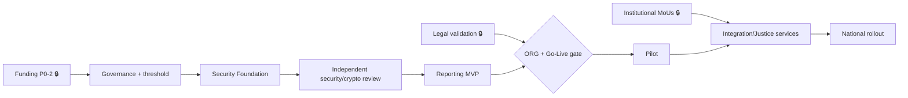

# Phase 5 · WS5 — Enterprise Portfolio Management

**Traces:** PMO `01`, Plan `03`, ERM `../phase4/09`, Readiness `../phase3/07`. Provides the
**dashboards, dependency map, and RAID log** the PMO runs the programme on. These are **templates +
structure** (populated during delivery), not live data.

---

## 1. Programme dashboard (structure)

| Panel | Contents | Source |
|-------|----------|--------|
| Phase status | P0–P6 RAG + % to exit criteria | `03` |
| Gate status | ORG G1–G10, Go-Live gate — GREEN/AMBER/RED | `../phase2/05`, `../phase3/07` |
| Critical recommendations | C1–C6 status | `02` |
| Risk heat | Critical/High counts (RK + ER) | `../phase4/09` |
| Benefits | On/off track per benefit | `04` |
| Budget | Spend vs envelope (BWP) + FX variance | `../phase4/07` |
| Assurance | Open independent-review findings | `08` |

## 2. Milestone dashboard (structure)

Milestones from `03` with: owner, due, status (RAG), dependency links, decision-point flag (DP-1..6).
**[REC]** Gate milestones (DP-3 go-live) are marked **hard** — they cannot be "amber-passed."

## 3. Dependency map (critical path)

**[FACT]** Critical path: Funding → Governance → Security Foundation → Independent review → MVP →
Gate → Pilot. **Institutional MoUs** are a parallel long-lead dependency for all Zone-O scope.

## 4. RAID log (structure + seed)

| Type | ID | Item | Owner | Status | Action |
|------|----|------|-------|--------|--------|
| **Risk** | R-… | (from `../10`/`../phase4/09`, e.g., RK-01 de-anon, RK-03 capture, RK-15 funding) | per register | open | mitigation tracked |
| **Assumption** | A-… | (from `../01`, e.g., A-LEG-02 whistleblower reach) `⟦validate⟧` | validator | open | validation plan (`../phase4/05`) |
| **Issue** | I-… | (delivery issues as they arise) | PMO | — | triage→resolve |
| **Dependency** | D-… | (funding, HSM, MoUs, external reviewers) | PMO | — | track long-leads |

The RAID log is the single operational register the PMO reviews each cycle; Risks/Assumptions link
back to the authoritative registers (no duplication of truth — pointers).

## 5. Tracking views

| Tracker | Purpose | 🔒 |
|---------|---------|----|
| Investment tracking | Spend vs BWP envelope; FX; burn rate | funding decisions 🔒 |
| Procurement status | RFQ→award→contract; CoI-controlled | approvals 🔒 |
| Governance status | Bodies constituted; decisions; audit completion | — |
| Readiness status | Scorecard domains GREEN/AMBER/RED | — |
| Benefits tracking | Baseline→target per benefit | — |

## 6. Quality gate

- **Traces to:** `01`, `03`, `../phase4/09`, `../phase3/07`; all registers.
- **Preserves:** single source of truth (RAID points to authoritative registers, does not fork them).
- **Residual risks:** dashboard accuracy depends on discipline (mitigated: PMO cadence, automation
  where possible); over-reporting burden (mitigated: lean panels).
- **Trade-offs:** ⚠️ portfolio overhead vs visibility — justified at national scale.
- **Acceptance criteria:** dashboards + RAID live with owners; gate milestones marked hard;
  Risks/Assumptions traceable to registers.
- **🔒 Required review:** OB (portfolio), finance/procurement (trackers).

*Next: `06-readiness-evidence-catalogue.md`.*
