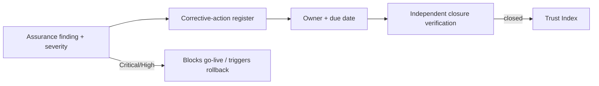

# Phase 5 · WS8 — Implementation Assurance (Continual)

**Extends:** Independent Assurance `../phase4/12`, Security Validation `../phase3/03`. **Focus:**
continual assurance **during delivery** (not just pre-go-live) that the programme is actually
building what was approved — architecture conformance, governance effectiveness, and the rest — with
independent reviewers and enforced corrective-action management.

---

## 1. Assurance domains (during implementation)

| Domain | What is assured | Frequency | Reviewer | Escalation |
|--------|-----------------|-----------|----------|-----------|
| Architecture conformance | Built system matches approved architecture + DDRs; constitutional invariants hold | Per release + quarterly | ARB + independent 🔒 | ARB→OB |
| Governance effectiveness | Bodies functioning; decisions audited; CoI/threshold discipline | Quarterly | Independent governance reviewer 🔒 | OB |
| Cybersecurity maturity | Controls implemented + improving; pen/red-team results | Continuous + annual | ISRB + external 🔒 | ISRB→OB |
| Privacy compliance | Minimization, disclosure control, DPIA currency, no-identity | Continuous + annual | PRB + independent 🔒 | PRB→OB |
| Operational performance | SLOs, incident/DR metrics, ESM | Continuous | Operational assurance | OMT→OB |
| Accessibility | WCAG, language, low-literacy, offline | Per release + annual | Accessibility specialist | Change lead→OB |
| Procurement compliance | CoI-controlled, transparent, value-for-money | Per procurement | Independent procurement reviewer 🔒 | OB |
| Benefits realization | On-track vs targets; honest measurement | Quarterly | Benefits reviewer | OB |

## 2. How assurance stays honest & independent

- **Independent of delivery:** assurance reviewers are not the teams they review; rotated;
  CoI-controlled (🔒 procurement).
- **Verifiable inputs:** independent, read-only, tamper-evident access (DDR-13) — reviewers check
  the anchored audit themselves.
- **Conformance-by-construction where possible:** CI invariant tests (zone isolation, no-secret,
  no-identity) mean some conformance is *continuously* proven, not periodically sampled
  (`../phase2/12 §5`).
- **Published outcomes** feed the Public Trust Index (independence + security components).

## 3. Corrective-action management

- All findings → register; **Critical/High block go-live** and can trigger rollback post-launch
  (`../phase3/08`); closure is **independently verified** (no self-marking).
- The register is a portfolio tracker (`05`) and part of the evidence catalogue (`06`, EV-05/06).

## 4. Assurance calendar

| Cadence | Activity |
|---------|----------|
| Continuous | CI conformance tests, vuln mgmt, SIEM, SLO monitoring |
| Per release | Architecture conformance, accessibility, testing evidence |
| Quarterly | Governance, benefits, portfolio assurance review |
| Pre-go-live | Pen/red team, crypto, privacy, architecture, DR |
| Annual | All domains; threat-model refresh; ISO/SOC (if pursued) |

## 5. Quality gate

- **Traces to:** `../phase4/12`, `../phase3/03`; RK-03, DDR-13; all controls.
- **Preserves:** independence + verifiability; conformance to approved architecture/governance.
- **Residual risks:** reviewer scarcity/independence in a small market; assurance verifies, cannot
  prove absence of all unknowns; corrective-action fatigue.
- **Trade-offs:** ⚠️ continual assurance is standing cost — the price of credible independence.
- **Acceptance criteria:** all 8 domains under scheduled independent review; corrective-action
  register with verified closure; Critical/High block go-live; results feed Trust Index.
- **🔒 Required review:** OB, procurement (reviewer independence), ISRB/PRB/ARB per domain.

*Next: `09-national-rollout-strategy.md`.*
