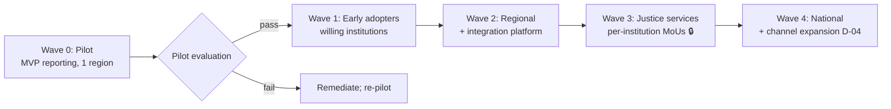

# Phase 5 · WS9 — National Rollout Strategy

**Operationalizes:** Change Management `../phase3/05` (waves), Roadmap `../phase2/06`, Readiness
`../phase3/07`. **Rule:** **production rollout occurs only after all readiness gates are satisfied**
for each scope; safety-critical intake availability is protected throughout.

---

## 1. Rollout model (staged, gate-controlled)

## 2. Pilot implementation (Wave 0)

- **Scope:** Confidential Reporting MVP in one region; operator-controlled; limited authorized
  recipient(s) under MoU.
- **Entry:** ORG GREEN for MVP + Production Evidence Package signed (DP-3).
- **Support:** hypercare (`../phase3/08 §5`); daily incident review; close feedback loop (EC-ethical).

## 3. Evaluation criteria (gate to scale)

| Criterion | Threshold `⟦validate⟧` |
|-----------|------------------------|
| Reporter safety | **0 de-anonymization incidents** (hard) |
| Availability | Tier-1 intake SLO met |
| Responsiveness | Reports actioned within SLA; no black holes |
| Usability/comprehension | Risk-notice comprehension ≥ bar with real users |
| Integrity | 100% evidence integrity checks |
| Trust signal | Positive/stable early trust indicators |
| Operations | Runbooks/IR/DR performed as designed |

**[REC]** Any safety-incident or unmet hard criterion → **halt scaling**, remediate, re-evaluate.
Scaling is a privilege earned by evidence, not a schedule entitlement.

## 4. Staged expansion & institutional onboarding

- **Per institution (Waves 1–3):** signed MoU + data-sharing legal basis (A-JUS-08 🔒) → CoI controls
  live → ACL conformance-green (`../phase2/07`) → staff trained → **re-pass ORG for that scope** →
  onboard.
- **No institution onboarded** before its controls are live — participation never trades away safety.

## 5. Training, communications, change, operational support

- **Training** per audience (`../phase3/05 §4`); **communications** honesty-first, multilingual
  (RK-07); **change** via champion network + resistance management; **operational support** scales
  with ESM (`../phase3/06`) under zero standing privilege.

## 6. Post-deployment review

After each wave: PIR (`../phase3/08 §6`) → benefits check (`04`) → assurance findings (`08`) →
lessons → roadmap/Trust Index update. Results reported to OB and (aggregate) public.

## 7. Channel expansion (Wave 4, D-04)

**[DECISION]** PWA-first (D-04). **[REC]** Evaluate USSD/SMS/voice only at national scale, with the
honest metadata trade-off (DT-1/ID-2) assessed and disclosed — reach vs detection-resistance is a
governed decision, not an automatic add.

## 8. Quality gate

- **Traces to:** `../phase3/05/07/08`, `../phase2/06`; D-04/D-05; RK-04/07/13/21/23.
- **Preserves:** gate discipline (no prod scope without its gate); safety intake availability.
- **Residual risks:** institutional participation may lag (RK-04); digital-exclusion tail needs
  intermediation; channel expansion trade-offs.
- **Trade-offs:** ⚠️ staged, evidence-gated rollout is slower than big-bang — accepted for safety.
- **Acceptance criteria:** each wave has entry + evaluation + exit criteria; pilot safety = 0
  incidents before scaling; every institution gate-passed before onboarding.
- **🔒 Required review:** OB (scale decisions), legal (MoU/data-sharing), judicial (per-institution),
  Kgosi/traditional leadership (customary), procurement (channel/telecom).

*Next: `10-continuous-improvement.md`.*
