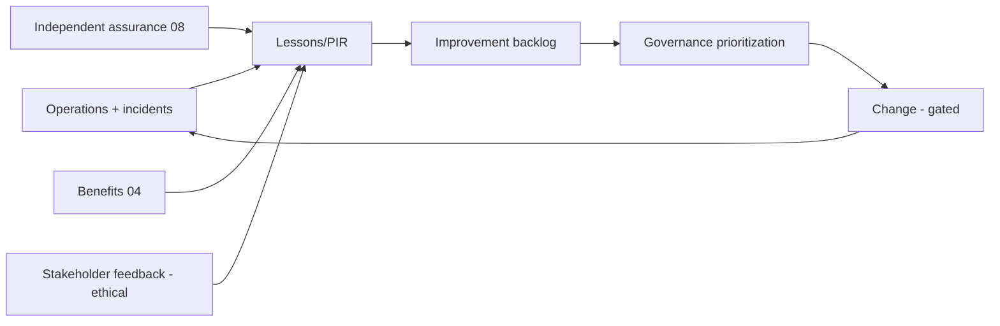

# Phase 5 · WS10 — Continuous Improvement Programme

**Operationalizes:** Phase 6 (Continuous Improvement) of the roadmap `../phase2/06`, Assurance `08`,
Threat-model refresh `../phase3/03 A7`. **Purpose:** keep NJTIP secure, lawful, effective, and
trusted **over its whole life** — a self-correcting programme, not a one-time build.

---

## 1. Improvement cycles (annual + event-driven)

| Review | Frequency | Owner | Feeds |
|--------|-----------|-------|-------|
| **Architecture review** | Annual + major change | ARB | conformance, refresh, DDR reassessment triggers |
| **Governance maturity assessment** | Annual | OB + independent 🔒 | governance improvements (RK-03) |
| **Security reassessment** | Annual + on threat change | ISRB 🔒 | threat-model refresh, control upgrades |
| **Privacy impact review** | Annual + new purpose | PRB 🔒 | DPIA updates, disclosure-control tuning |
| **Operational performance review** | Annual | OMT | SLO/ESM improvements |
| **Technology refresh planning** | Annual | TSC/ARB | lifecycle, crypto-agility/PQC (DDR-10) |
| **Policy review** | Annual + on law change | Governance + legal 🔒 | policy-as-code updates (`../phase2/02`) |
| **Stakeholder feedback** | Continuous | Change lead + EC | UX/accessibility/adoption improvements |
| **Lessons learned / PIR** | Per incident/wave | IRB/PMO | corrective actions, roadmap |
| **Roadmap update** | Annual | OB/TSC | re-prioritized backlog |

## 2. Feedback loops

**[FACT]** Every change re-enters the same discipline: RFC → review by the accountable body →
policy/architecture update → **gated release** (🔒 subsystems need ISRB) → assurance. Improvement
never bypasses the controls that protect reporters.

## 3. Standing improvement priorities

- **Crypto-agility / post-quantum** migration (DDR-10) — planned, not reactive.
- **Threat-model currency** — semi-annual refresh (`../phase3/03 A7`); new threats get RTM rows +
  mitigations before they are "accepted."
- **Governance anti-capture** — periodic independence assessment; rotation; external audit (RK-03).
- **Accessibility & inclusion** — continuous, driven by real-user feedback (RK-21).
- **Sustainability** — cost/efficiency review to protect independence (RK-15).

## 4. Improvement without control erosion (the discipline)

**[REC]** Improvements are subject to the **non-negotiable constraints**: they may not weaken
privacy, security, separation of powers, or reporter safety; a proposed "efficiency" that would do
so is rejected, not traded. New data uses/domains require DPIA + governance approval (DD-2/DD-3).

## 5. Quality gate

- **Traces to:** `../phase2/06` (Phase 6), `08`, `../phase3/03`; RK-03/11/15/21; DDR-10.
- **Preserves:** all controls through every change; gated releases.
- **Residual risks:** improvement fatigue/underfunding (RK-15); threat evolution outpacing refresh
  (mitigated: event-driven reviews); capture creeping over time (mitigated: independence assessment).
- **Trade-offs:** ⚠️ disciplined, gated improvement is slower than ad-hoc change — accepted; ad-hoc
  change is how safety guarantees erode.
- **Acceptance criteria:** all review cycles scheduled with owners; feedback loops feed a governed
  backlog; every change gated; no control-weakening improvement admitted.
- **🔒 Required review:** OB (governance maturity), ISRB (security), PRB (privacy), legal (policy/law).

*Next: `11-enterprise-traceability.md`.*
