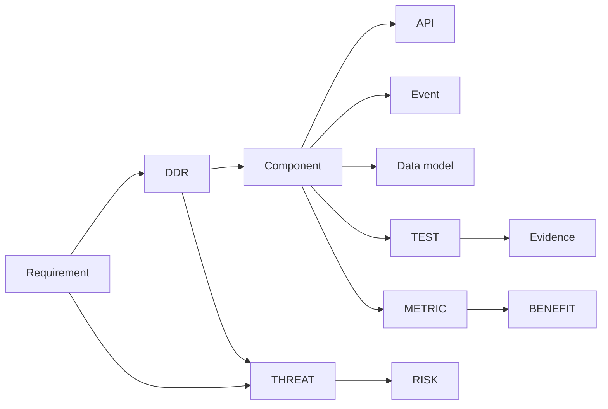

# Phase 6 · WS1 — Architecture Repository (Living, Traceable)

**Traces:** Enterprise Traceability `../phase5/11`, RTM `../phase2/04`, Domain `../06`, DDRs
`../design`. **Purpose:** a single, versioned, machine-checkable repository that links every
engineering artifact to its requirement, DDR, threat, risk, test, evidence, and metric — so
traceability is *enforced by tooling*, not hoped for.

---

## 1. What the repository contains

| Node type | Source of truth | Example ID |
|-----------|-----------------|-----------|
| Requirement | `../phase2/04` | FR-001, SR-005 |
| DDR | `../design/00` | DDR-10 |
| Component / context | `../06` | ctx:confidential-reporting |
| API / contract | `03` | api:reporting.submit |
| Event | `../06 §6.4`, `03` | evt:ReportRouted.v1 |
| Data model | `../design/02`, `03` | data:report |
| Threat | `../08` | ID-1, I-2 |
| Risk | `../10`, `../phase4/09` | RK-01, ER-06 |
| Test | `../phase3/04`, `06` | T-FR001 |
| Evidence | `../phase5/06` | EV-05 |
| Operational metric | `../phase2/09` | m:deanon-incidents |

## 2. Link model (the graph)



**[REC]** Represent as structured files in-repo (YAML/JSON front-matter per artifact + a generated
graph) so a CI job can assert completeness and render the traceability views.

## 3. Proposed repository layout (monorepo, synthetic-only)

```
njtip/
├─ architecture/              # this living repo: traceability graph + ADR/DDR records
│  ├─ ddr/DDR-01..15.md
│  ├─ requirements/*.yaml     # FR/NFR/SR/PR with links
│  └─ traceability.yaml       # the graph; CI-validated
├─ contexts/                  # one dir per bounded context (../06)
│  ├─ confidential-reporting/ # 🔒 spec + reviewed impl
│  ├─ evidence/               # 🔒
│  ├─ iam/                    # 🔒 (policy) + impl
│  ├─ governance/  investigation/  prosecution/  adjudication/ ...
├─ contracts/                 # OpenAPI, AsyncAPI, JSON Schema, event catalog (03)
├─ platform/                  # KMS/HSM adapters (🔒), audit, messaging, notification
├─ infra/                     # IaC per zone (09)
├─ ci/                        # pipelines, policy-as-code, invariant tests (09)
├─ test/                      # V&V suites (06), synthetic data generators
└─ docs/                      # engineering standards (04), runbooks
```

## 4. Traceability enforcement (CI)

- **Definition-of-ready:** a requirement/artifact cannot be merged "ready" without complete links
  (Threat, Risk, DDR, Test, Evidence, Metric non-empty) — the `../phase5/11` rule made mechanical.
- **Orphan check:** CI fails if any component lacks a requirement, any requirement lacks a test, or
  any 🔒 critical component lacks an ISRB-review marker.
- **Drift check:** contracts (`03`) must match the components that implement them (contract tests).

## 5. Quality gate

- **Traces to:** `../phase5/11`, `../phase2/04`, `../06`, all DDRs.
- **Preserves:** enterprise traceability by construction; approved architecture as source of truth.
- **Threats/risks:** mitigates loss-of-traceability; supports audit of RK-01/09 mitigations.
- **Residual risks:** graph accuracy depends on discipline (mitigated: CI enforcement).
- **Trade-offs:** ⚠️ front-matter + graph upkeep is overhead — bought for auditable engineering.
- **Acceptance criteria:** every artifact node has required links; CI orphan/drift checks pass; 🔒
  components carry review markers.
- **🔒 Required review:** ARB (repository model), independent auditor (traceability completeness).

*Next: `02-per-context-engineering-specs.md`.*
