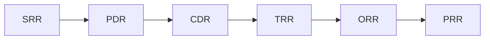

# Phase 6 · WS8 — Systems Engineering Reviews

**Traces:** Design phase, V&V `06`, Readiness `../phase3/07`, Gates `../phase2/05`, `../phase3/08`.
Defines the mandatory milestone reviews that gate engineering progress. Each: objectives · required
evidence · participants · entry criteria · exit criteria · approval authority. These **complement**
(do not replace) the governance readiness gates; PRR/ORR feed the Production Evidence Package.

---

## 1. Review sequence

## 2. Review definitions

### SRR — System Requirements Review
- **Objectives:** confirm requirements (RTM `../phase2/04`) complete, traceable, testable.
- **Evidence:** RTM, assumptions register, threat model refs.
- **Participants:** ARB, ISRB, PRB, product, QA.
- **Entry:** requirements baselined. **Exit:** requirements approved, traceable, no orphans.
- **Approval:** ARB (+ TSC).

### PDR — Preliminary Design Review
- **Objectives:** confirm the design (Design phase) satisfies requirements; interfaces defined.
- **Evidence:** architecture, per-context specs `02`, contracts `03`, DDRs.
- **Participants:** ARB, ISRB, PRB, SRE.
- **Entry:** specs + contracts drafted. **Exit:** design approved; interfaces frozen for build.
- **Approval:** ARB.

### CDR — Critical Design Review
- **Objectives:** confirm detailed design/build-readiness of each context, esp. 🔒 subsystems.
- **Evidence:** detailed specs, security controls, threat mitigations, test plans.
- **Participants:** ARB, **ISRB + cryptographer (🔒)**, forensics, PRB.
- **Entry:** detailed design complete. **Exit:** build authorized (per context); 🔒 designs signed.
- **Approval:** ARB + ISRB (🔒).

### TRR — Test Readiness Review
- **Objectives:** confirm test environment, cases, and data (synthetic) are ready.
- **Evidence:** V&V framework `06`, test cases `07`, synthetic datasets `05`.
- **Participants:** QA, ISRB, SRE.
- **Entry:** build complete on synthetic; tests written. **Exit:** testing authorized.
- **Approval:** QA lead + ISRB.

### ORR — Operational Readiness Review
- **Objectives:** confirm operations can run it (runbooks, SLOs, IR/DR, support).
- **Evidence:** ESM `../phase3/06`, runbooks, IR game-day + DR drill reports, readiness scorecard.
- **Participants:** OMT, ISRB, IRB.
- **Entry:** operations documented + drilled. **Exit:** ops readiness confirmed (feeds scorecard
  `../phase3/07`).
- **Approval:** OMT + ISRB.

### PRR — Production Readiness Review
- **Objectives:** final go/no-go readiness for a scope; assembles evidence for OB.
- **Evidence:** Production Evidence Package `../phase5/06`/`../phase4/13`; all reviews closed; no open
  Critical/High.
- **Participants:** OB, ISRB, PRB, ARB, Legal, Finance.
- **Entry:** ORR passed; readiness scorecard GREEN (Critical/🔒). **Exit:** recommendation to OB.
- **Approval:** **Oversight Board** (the go-live decision, `../phase3/08`) 🔒.

## 3. Relationship to governance gates

**[FACT]** The SE reviews are the **engineering** evidence path; the **Operational Readiness Gate**
(`../phase2/05`) and **Production Go-Live Gate** (`../phase3/08`) are the **governance** decisions.
PRR feeds the go-live gate; **neither the reviews nor the PMO can authorize production — only the OB
can** (WS10, `../phase5/01`).

## 4. Quality gate

- **Traces to:** `../phase2/04/05`, `../phase3/07/08`, `06`, `07`.
- **Preserves:** staged engineering discipline; 🔒 reviews before build/test/prod.
- **Residual risks:** review overhead/schedule (accepted); reviewer availability (RK-18).
- **Trade-offs:** ⚠️ six formal reviews slow delivery — standard for safety-critical national systems.
- **Acceptance criteria:** each review has objectives/evidence/participants/entry/exit/approval; 🔒
  subsystems pass CDR before build; PRR feeds OB go-live.
- **🔒 Required review:** ARB, ISRB (all), OB (PRR/go-live), legal/finance (PRR).

*Next: `09-devsecops-engineering.md`.*
