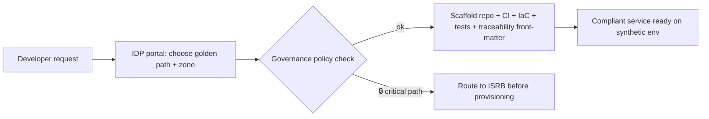

# Phase 7 · WS1 — Internal Developer Platform (IDP)

**Traces:** DevSecOps `../design/07`, Engineering Standards `../phase6/04`, Governance `../phase3/01`.
**Purpose:** a self-service platform where teams provision compliant services in minutes — with zone
isolation, ABAC, minimization, audit, and CI gates **pre-wired**. Self-service is bounded by
governance: teams get speed *within* guardrails, never around them.

---

## 1. IDP capabilities

| Capability | What it gives a team | Guardrail baked in |
|-----------|----------------------|--------------------|
| **Service templates** | New service scaffolded to a golden path (`02`) | Zone-tagged; ABAC + audit + observability wired; no-identity by default |
| **Project scaffolding** | Repo, CI, IaC, tests, docs stubs | CI gates + invariant tests preinstalled |
| **Local dev environments** | `make dev` synthetic multi-zone stack (`../phase6/05`) | Synthetic data only; zone networks isolated |
| **Secrets management** | Short-lived secrets from the manager | Never in code/logs; JIT + audited (`../phase6/04 §9`) |
| **Environment provisioning** | Dev/test/staging via IaC self-service | No prod target; per-zone isolation enforced |
| **CI/CD integration** | Pipeline attached automatically | Fail-closed gates, HUMAN gate for 🔒 (`03`) |
| **Deployment automation** | Progressive delivery to synthetic staging | Prod deploy blocked unless gates GREEN |
| **Developer self-service** | Portal to request the above | Governance policy enforced at request time |

## 2. Service-creation workflow (self-service, governed)

**[REC]** Choosing a **zone** and a **golden path** is mandatory at creation; the scaffold applies the
zone's isolation, keys, and ABAC automatically — a team cannot accidentally create a cross-zone or
identity-collecting service.

## 3. Onboarding workflow (developer)

1. Access request → IAM (FIDO2, least privilege, zero standing privilege).
2. Environment + tooling provisioned; synthetic datasets granted.
3. Onboarding guide + golden paths + playbooks (`05`).
4. First service via template; CI gates explained; 🔒 boundaries briefed.
5. Mentor/champion assigned (skills pipeline, A-OPS-01).

## 4. Governance controls in the IDP

- **Policy-at-request:** the portal calls the policy engine (`03`) — non-compliant requests are
  refused or routed to review.
- **Zone-correct by construction:** templates encode zone ownership (D-06); cross-zone wiring is not
  offered as a self-service option.
- **🔒 critical paths gated:** creating/altering an anonymity/crypto/custody/metadata/AI component
  routes to ISRB (`04`, `../phase6/10`).
- **Everything traceable:** scaffolds include traceability front-matter (`../phase6/01`).

## 5. Quality gate

- **Traces to:** `../design/07`, `../phase6/01/04`, `../phase3/01`; D-06, DDR-09/13.
- **Preserves:** zone isolation, minimization, zero standing privilege, autonomy boundary — as
  defaults.
- **Threats/risks mitigated:** E-1/E-3 (least privilege by default), I-6 (no self-service cross-zone),
  RK-06.
- **Residual risks:** teams could request exceptions (mitigated: governed exceptions `../phase2/03 §5`);
  IDP itself is a trust concentration (mitigated: it provisions synthetic-only, gated).
- **Trade-offs:** ⚠️ constrained self-service is less flexible than "do anything" — bought for safety
  and consistency.
- **Acceptance criteria:** a new golden-path service is provisioned compliant (zone/ABAC/audit/CI) in
  minutes on synthetic data; 🔒 requests route to ISRB; no cross-zone self-service path exists.
- **🔒 Required review:** platform-eng lead, ISRB (critical-path routing), ARB (templates).

*Next: `02-golden-paths.md`.*
