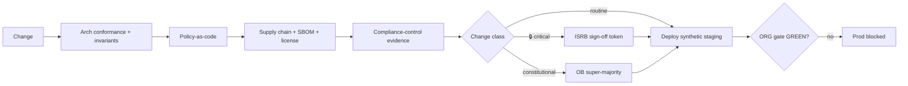

# Phase 7 · WS3 — Engineering Governance Automation (Governance-as-Code)

**Traces:** Policy Engine `../phase2/02`, DevSecOps `../design/07`, Engineering Governance
`../phase6/10`. **Purpose:** make governance **executable and unavoidable** — deployments that
violate approved architecture, security, privacy, or supply-chain policy simply cannot proceed.
Governance stops being a meeting and becomes a gate.

---

## 1. Governance-as-code controls

| Control | Mechanism | Blocks on |
|---------|-----------|-----------|
| **Architecture conformance** | CI invariant tests + graph checks (`../phase6/01`) | Cross-zone DB path; identity column; missing field_policy; DDR non-conformance |
| **Policy-as-code** | OPA/Conftest-style evaluation at CI + runtime (`../phase2/02`) | ABAC/zone/retention/disclosure policy violations; fail-closed |
| **Dependency management** | Pinning + provenance + CVE scan | Unpinned/unvetted/vulnerable deps |
| **Supply-chain security** | SLSA provenance + reproducible build verify | Provenance mismatch; fingerprint drift (S-1) |
| **SBOM generation** | Per-build SBOM + diff | New/unexpected components |
| **License compliance** | License scan against allowlist | Disallowed/incompatible licenses |
| **Automated compliance gates** | Mapped controls (ISO/NIST/OWASP/DPA) evidenced | Missing control evidence (`../phase4/03`) |
| **Release approval workflow** | Change-class routing → required sign-offs | Missing ISRB token (🔒); missing OB approval (constitutional); gate ≠ GREEN |

## 2. The deployment decision (fail-closed)

**[FACT]** Any failing check blocks; missing 🔒 sign-off blocks; production is blocked unless the
Operational Readiness Gate is GREEN — **the pipeline cannot be talked into a deploy**.

## 3. Preventing governance violations (not just detecting)

- **Shift-left:** conformance/policy checks run in local dev (`01`) and on every PR, so violations are
  caught before review, not at release.
- **No override in tooling:** there is **no CI flag** to skip a security/privacy invariant; a genuine
  exception requires the governed process (`../phase2/03 §5`) and, for invariants, OB super-majority —
  recorded in the anchored audit (DDR-13).
- **Evidence auto-collected:** gate results become evidence artifacts (`../phase5/06`, EV-05..08).

## 4. Reusability

**[REC]** Governance-as-code is **parameterized** by the programme's invariants — for NJTIP: three
zones, no-identity, chain of custody, fail-closed. A future national DPI programme configures its own
invariants; the enforcement machinery is reused.

## 5. Quality gate

- **Traces to:** `../phase2/02`, `../design/07`, `../phase4/03`; DDR-04/07/13/15; RK-06/12.
- **Preserves:** all approved governance/architecture — as enforced gates.
- **Threats mitigated:** I-6/E-3 (conformance), T-3 (supply chain), unauthorized deploy.
- **Residual risks:** policy-authoring errors (mitigated: tested policies, fail-closed); a determined
  insider with pipeline control (mitigated: SoD, signing, audit).
- **Trade-offs:** ⚠️ fail-closed automation can block delivery on policy errors — accepted (safety over
  convenience).
- **Acceptance criteria:** violations fail CI; no invariant-skip flag exists; 🔒/constitutional changes
  require the right sign-off; prod blocked unless gate GREEN; gate results archived as evidence.
- **🔒 Required review:** ISRB (enforcement), ARB (conformance rules), OB (constitutional gate).

*Next: `04-ai-engineering-guardrails.md`.*
