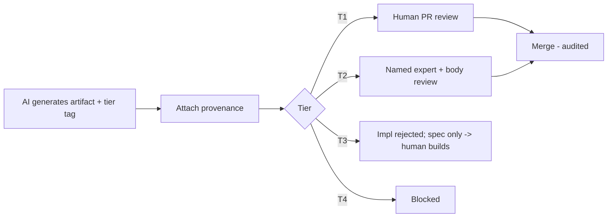

# Phase 7 · WS4 — AI Engineering Guardrails

**Traces:** Engineering Governance `../phase6/10`, DevSecOps `../design/07 §6`, AI Architecture
`../design/05`. **Purpose:** define exactly what AI-assisted engineering may and may not do, with
provenance, approval, and audit for every AI-generated artifact. This is the "autonomous delivery"
of the phase title — **bounded** autonomy, never unbounded.

---

## 1. Activity classification (the four tiers)

| Tier | AI may… | Review | Examples |
|------|---------|--------|----------|
| **T1 — Autonomous (subject to review)** | Generate + open a PR that a human reviews before merge | Standard human PR review | Non-critical UI, docs, glue code, test scaffolding, IaC scaffolding, refactors |
| **T2 — Draft, mandatory expert review** | Draft, but a **named expert** must review & sign before merge | Domain expert + governance body | Golden-path changes, ABAC policy, event schemas, integration ACLs, observability of sensitive paths |
| **T3 — Specification only** | Produce specs/interfaces/test specs; **not** the implementation | Expert implements | 🔒 crypto, anonymity, chain of custody, metadata intake, AI-assistance boundaries |
| **T4 — Prohibited** | Nothing | — | Approving production changes; bypassing gates; replacing legal/judicial/procurement/governance/constitutional review; using production data |

**[DECISION]** The 🔒 critical subsystems are **T3** — AI writes the spec + tests, humans write the
code. This is the hard line that keeps reporter-safety guarantees under human authorship.

## 2. Provenance & traceability for AI artifacts

Every AI-generated artifact carries metadata: **model + version, prompt/context hash, generation
timestamp, tier (T1–T4), human reviewer, approval status**, recorded in the architecture repository
(`../phase6/01`) and anchored audit (DDR-13). **[REC]** AI artifacts are labelled in the repo so
reviewers know provenance; nothing AI-generated merges without a recorded human decision.

## 3. Approval workflow

## 4. Enforcement (not just policy)

- **CI classifies changed paths:** a change touching a 🔒 critical path with AI provenance and no human
  authorship is **blocked** (T3 enforcement); the HUMAN gate requires ISRB sign-off (`03`,
  `../phase6/10`).
- **No self-approval:** AI can never be the approver; approvals are human, recorded, non-repudiable.
- **Audit:** every AI artifact + its review/approval is auditable end-to-end.

## 5. Honesty on AI-assisted engineering

⚠️ AI accelerates engineering **and** introduces risks: subtle bugs, insecure patterns, license/IP
issues, and over-trust. The guardrails (tiers + provenance + mandatory review + CI enforcement)
manage these; they are **enforced by tooling, not goodwill**. Removing them to "ship faster" on the
🔒 paths would directly threaten reporter safety — so it is prohibited (T4).

## 6. Quality gate

- **Traces to:** `../phase6/10`, `../design/05/07`; D-09; T-3, T-7, RK-12.
- **Preserves:** the autonomy boundary; human authority over 🔒 domains and production.
- **Threats mitigated:** T-3 (AI-introduced supply-chain/insecure code), T-7 (AI manipulation),
  premature/unauthorized change.
- **Residual risks:** review fatigue; AI over-trust (mitigated: tiering, provenance, sampling audits).
- **Trade-offs:** ⚠️ T3 (spec-only for 🔒) slows critical-path delivery — accepted; safety over speed.
- **Acceptance criteria:** every AI artifact tagged with tier + provenance; 🔒 paths are T3 (no AI
  impl merges); T4 activities have no pathway; all approvals human + audited.
- **🔒 Required review:** ISRB (enforcement + 🔒 tiering), ARB, EC (AI-ethics), governance.

*Next: `05-developer-experience.md`.*
