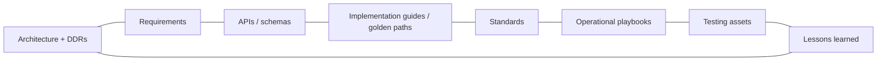

# Phase 7 · WS10 — Enterprise Engineering Knowledge Platform

**Traces:** Architecture Repository `../phase6/01`, Enterprise Traceability `../phase5/11`, DX `05`.
**Purpose:** a single, searchable, versioned knowledge platform that links every engineering artifact
to its architecture, requirements, DDRs, and lessons — so nothing is lost, everything is discoverable,
and traceability is a living property, not a document.

---

## 1. Knowledge graph (what it links)

**[REC]** Built on the same traceability graph as `../phase6/01` — the knowledge platform is its
**human-facing, searchable surface**: one source of truth, two views (machine-checked graph + browsable
portal).

## 2. Content domains

| Domain | Source |
|--------|--------|
| Architecture + DDRs | `../design/*`, `../phase6/01` |
| Requirements | `../phase2/04` |
| APIs / schemas | `../phase6/03` |
| Implementation guides / golden paths | `02`, `../phase6/02` |
| Standards | `../phase6/04` |
| Operational playbooks / runbooks | `../phase3/06`, `08` |
| Testing assets | `06`, `../phase3/04` |
| Lessons learned | PIRs (`08`, `../phase5/10`) |

## 3. Properties (every artifact)

- **Versioned:** immutable history; current + prior versions; change reason.
- **Traceable:** linked to requirement/DDR/threat/risk/test/evidence (`../phase5/11`).
- **Discoverable:** full-text + graph search; "what depends on this?" and "why does this exist?"
  queries.
- **Governed:** edits reviewed; 🔒 content flagged; provenance for AI-generated content (`04`).
- **Access-controlled:** internal; no reporter/case data ever (it's engineering knowledge, not
  operational data).

## 4. Lessons-learned loop

PIRs and assurance findings (`08`, `../phase5/08`) become searchable lessons linked to the artifacts
they affect; recurring lessons drive golden-path/standard updates (`02`, `../phase6/04`) — the
platform *learns*. **[REC]** A lesson is not "captured" until it links to a concrete change (or an
accepted decision not to change).

## 5. Reusability for future national DPI

**[FACT]** The knowledge platform + traceability model + golden paths + governance automation together
constitute a **reusable engineering-factory blueprint**: a future national DPI programme inherits the
machinery and configures its own architecture/invariants/knowledge — without rebuilding the factory.
This is the phase's "reusable across future initiatives" objective, made concrete.

## 6. Quality gate

- **Traces to:** `../phase6/01`, `../phase5/11`, `05`; all engineering artifacts.
- **Preserves:** single source of truth; traceability; governance over knowledge; no operational data.
- **Threats mitigated:** knowledge loss/duplication; supports audit of every artifact's lineage.
- **Residual risks:** stale content if unmaintained (mitigated: versioning + lessons loop + DX metrics
  `09`); search quality.
- **Trade-offs:** ⚠️ maintaining a living knowledge graph is standing effort — the price of a durable,
  auditable, reusable factory.
- **Acceptance criteria:** every engineering artifact is versioned, traceable, and discoverable; graph
  + portal share one source of truth; lessons link to changes; no reporter/case data present.
- **🔒 Required review:** ARB, knowledge/DX lead, independent auditor (traceability completeness).

---

## Phase 7 complete — Engineering Factory & Autonomous Delivery Framework delivered

Phase 7 provides the **Internal Developer Platform, golden paths, governance-as-code, AI engineering
guardrails, developer experience, and the quality/observability/SRE/metrics/knowledge platforms** — an
engineering ecosystem that makes the **safe, compliant path the default** and the non-compliant path
**fail CI**, while keeping the 🔒 human-review domains (cryptography, anonymity, evidence integrity,
legal, constitutional, judicial, production approvals, governance policy, procurement, cross-border)
under human authority.

**[FACT]** No production application code; synthetic-data-only; approved architecture/governance/specs
not redesigned; AI autonomy is bounded (T1–T4, `04`); production go-live remains the Oversight Board's
decision behind the readiness gates. The factory is designed to be **reusable across future national
DPI initiatives** while preserving NJTIP's constitutional safeguards.
