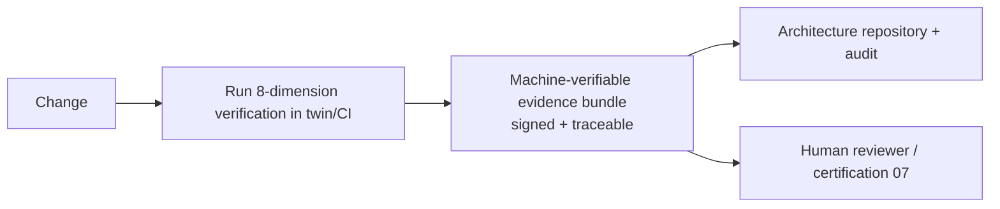

# Phase 8 · WS4 — Continuous Verification Framework

**Traces:** V&V `../phase6/06`, Quality Platform `../phase7/06`, Architecture-as-Code `03`. **Purpose:**
automate verification across all engineering dimensions on **every change**, producing
machine-verifiable evidence suitable for human review. Verification is continuous, not a phase.

---

## 1. Verification dimensions (each automated, each produces evidence)

| Dimension | Automated checks | Evidence artifact |
|-----------|------------------|-------------------|
| **Functional correctness** | Unit/integration/system tests on synthetic data | test report |
| **Interoperability** | Contract tests (OpenAPI/AsyncAPI); conformance suite (`../phase2/07`) | conformance report |
| **Security** | SAST/DAST/dep-scan; abuse tests; authz fail-closed | security scan + results |
| **Privacy** | No-PII/IP scanners; no-identity-column; disclosure-control | privacy report (0 leakage) |
| **Resilience** | Fault injection; degrade-to-minimal-intake; chaos (`../phase7/06`) | resilience report |
| **Governance** | Threshold/CoI/gate/policy enforcement checks | governance report |
| **Observability** | Telemetry-has-no-PII; SLO instrumentation present | observability report |
| **Performance** | Load/soak; SLO assertions | performance report |

## 2. Evidence-per-change

**[REC]** Every change generates a **signed evidence bundle** linked to the requirements/DDRs/threats
it touches (`../phase6/01`); the bundle is what humans review and what certification (`07`) and the
Production Evidence Package (`../phase5/06`) consume. No hand-assembled evidence.

## 3. Continuous (not point-in-time)

The twin re-runs verification continuously and on every change; regressions surface immediately.
Guardrail dimensions (privacy, governance/invariant) are **must-be-green** — a regression there is
release-blocking regardless of functional status (`../phase7/06`).

## 4. Human-reviewable by design

Evidence is structured for human assessment: pass/fail per check, linked to the decision it supports,
with enough context for an independent reviewer to judge — **verification informs the human, it does
not replace them** (`09`).

## 5. Quality gate

- **Traces to:** `../phase6/06`, `../phase7/06`, `03`; all requirements/DDRs/threats.
- **Preserves:** guardrail dimensions as blockers; evidence traceability.
- **Threats mitigated:** validates mitigations for I-2/ID-1 (privacy), I-6/E-3 (governance), D-1/D-4
  (resilience) continuously.
- **Residual risks:** verification covers what is testable; un-testable guarantees rely on human
  validation (`09`) — labelled honestly.
- **Trade-offs:** ⚠️ continuous 8-dimension verification is compute/effort — bought for standing
  assurance.
- **Acceptance criteria:** every change produces a signed, traceable evidence bundle; 8 dimensions
  automated; guardrail regressions block; evidence is human-reviewable.
- **🔒 Required review:** ISRB/PRB/ARB (their dimensions), QA, independent assurance.

*Next: `05-adversarial-simulation.md`.*
