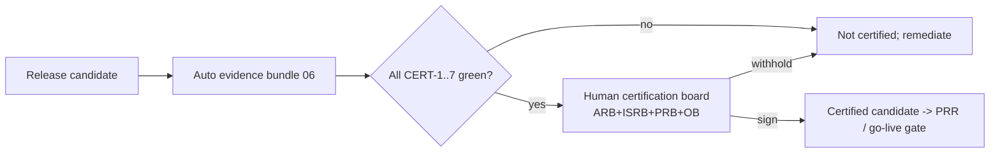

# Phase 8 · WS7 — Platform Certification

**Traces:** SE Reviews `../phase6/08`, Readiness Gate `../phase2/05`, Go-Live Gate `../phase3/08`,
Evidence Automation `06`. **Purpose:** a release-certification process where a candidate progresses
toward production **only** on demonstrated evidence — and **certification remains a human decision
supported by automated evidence**, never an automated pass.

---

## 1. Certification criteria (all required, evidenced)

| # | Criterion | Evidence (auto, `06`) | Authority |
|---|-----------|----------------------|-----------|
| CERT-1 | **Architecture compliance** | Fitness functions green (`03`) | ARB |
| CERT-2 | **Successful verification** | 8-dimension verification green (`04`) | QA/ISRB |
| CERT-3 | **Governance approval** | Threshold/CoI/gate logs; body sign-offs | OB |
| CERT-4 | **Security validation** | Scans + adversarial sims (`05`) + independent review | ISRB 🔒 |
| CERT-5 | **Privacy validation** | 0 PII/IP; disclosure control; DPIA | PRB 🔒 |
| CERT-6 | **Resilience testing** | DR/chaos/degrade results | SRE/ISRB |
| CERT-7 | **Traceability completeness** | Arch repo: no orphans (`../phase6/01`, `../phase5/11`) | ARB/auditor |

## 2. Certification flow

**[FACT]** Green evidence is **necessary but not sufficient** — the human certification board reviews
the evidence and the **honest residual-risk statement** and makes the call. A candidate can be
technically green and still **not** certified if human judgment (legal exposure, governance readiness,
residual risk) says wait.

## 3. Relationship to gates

Certification feeds the **Production Readiness Review** (`../phase6/08`) and the **Production Go-Live
Gate** (`../phase3/08`); the **Oversight Board** makes the final go-live decision. Certification is an
engineering-quality bar; the gates add the governance/legal/funding conditions. **Neither certifies
away the honest residuals.**

## 4. Scope-limited certification

**[REC]** Certification is **per scope** (MVP first, D-05): the confidential-reporting slice can be
certified before later phases; each new scope re-certifies. No blanket "platform is certified."

## 5. Quality gate

- **Traces to:** `../phase6/08`, `../phase2/05`, `../phase3/08`, `06`; all Critical risks.
- **Preserves:** human decision authority; evidence-based progression.
- **Threats mitigated:** premature/unaccountable release (evidence + human board).
- **Residual risks:** green ≠ safe in the real world (device/global adversary/legal) — the board
  weighs these; certification records them as accepted residuals, not resolved.
- **Trade-offs:** ⚠️ human certification on top of green evidence is slower than auto-promote —
  required; auto-promoting a justice-safety platform would be reckless.
- **Acceptance criteria:** CERT-1..7 evidenced green before human review; certification is a recorded
  human board decision; scope-limited; feeds PRR/go-live gate; residuals stated.
- **🔒 Required review:** ARB, ISRB, PRB, OB (certification board), independent auditor.

*Next: `08-engineering-analytics.md`.*
