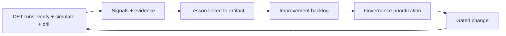

# Phase 8 · WS10 — Continuous Learning (Twin-Driven Improvement)

**Traces:** Continuous Improvement `../phase5/10`, Knowledge Platform `../phase7/10`, Analytics `08`.
**Purpose:** use the Digital Engineering Twin as a **learning engine** — every verification run,
adversarial simulation, and drill teaches the programme how to improve standards, tooling, tests,
docs, automation, and operations — **while preserving approved architectural intent.**

---

## 1. What the twin teaches (and where the lesson goes)

| Signal from the twin | Improves | Governed by |
|----------------------|----------|-------------|
| Recurring verification failures | Engineering standards (`../phase6/04`), golden paths (`../phase7/02`) | ARB |
| Adversarial-sim findings (`05`) | Security controls, threat model refresh (`../phase3/03 A7`) | ISRB |
| Fitness-function gaps (`03`) | New fitness functions; DDR reassessment triggers | ARB |
| Flaky/slow tests | Quality frameworks (`../phase7/06`), DX (`../phase7/05`) | QA |
| Drill/DR results (`05`) | Runbooks (`../phase3/06`, `../phase7/08`), resilience | SRE/IRB |
| Coverage/debt analytics (`08`) | Tooling, automation, docs | TSC |

## 2. Learning loop

**[REC]** A lesson is "captured" only when it links to a **concrete change** (or an accepted decision
not to change), recorded in the knowledge platform (`../phase7/10`) — learning that doesn't change
anything is just noise.

## 3. Preserving architectural intent while learning

⚠️ Improvement must not drift from approved decisions: changes go through the same gates
(`../phase7/03`), and anything touching an **invariant** needs ARB/OB approval (`../phase2/02 §5`).
The twin makes intent *measurable* (fitness functions `03`), so drift is caught — learning sharpens
conformance, it doesn't erode it. New threats get RTM rows + mitigations before they're "accepted."

## 4. Compounding value (and the honest caveat)

Over time the twin + knowledge platform (`../phase7/10`) compound into a **self-improving,
evidence-backed engineering system** — and a **reusable asset for future national DPI** (`../phase7/10
§5`). ⚠️ Caveat: this compounds *engineering* quality; it does **not** resolve the non-technical
conditions (governance independence, funding, legal validation, institutional participation) that
still determine whether NJTIP can safely launch — those remain human, gated, and outside the twin.

## 5. Quality gate

- **Traces to:** `../phase5/10`, `../phase7/10`, `08`, `03`; RK-03/11/15.
- **Preserves:** architectural intent (gated learning); no invariant erosion.
- **Threats mitigated:** stagnation; threat-model staleness; drift.
- **Residual risks:** learning underfunded/ignored (mitigated: analytics + backlog governance);
  over-fitting to synthetic conditions (mitigated: pilot/hypercare, independent red team).
- **Trade-offs:** ⚠️ disciplined, gated learning is slower than ad-hoc change — accepted (ad-hoc change
  is how safety erodes).
- **Acceptance criteria:** twin signals feed a governed improvement backlog; lessons link to concrete
  changes; every change gated; invariant-affecting learning needs ARB/OB; intent preserved.
- **🔒 Required review:** ARB (intent), ISRB (security learning), OB (governance maturity).

---

## Phase 8 complete — Digital Engineering Twin & Continuous Verification delivered

Phase 8 defines a **synthetic, isolated, executable Digital Engineering Twin** and a **Continuous
Verification Framework** that continuously proves — with machine-verifiable, human-reviewable evidence
— that NJTIP's architecture, security, privacy, governance, interoperability, resilience, and
operational controls **work together under realistic synthetic conditions**, while preserving every
approved safeguard and full traceability.

**[FACT]** Synthetic data only; no production deployment/integrations; no redesign of approved
architecture/governance; no autonomous approval of high-risk decisions; human accountability
mandatory. ⚠️ A green twin demonstrates the design and controls are internally consistent and hold
under simulation — it does **not** certify real-world anonymity vs a global adversary, legal
admissibility, or that the governance/legal/funding conditions are met. **Those remain human
decisions behind the readiness and go-live gates.**
