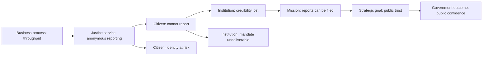

# Enterprise Knowledge Graph (Phase 12, Part 20)

`src/graph/enterprise-graph.js` extends the graph bounded context from the *investigation* graph to a
graph of the **platform itself**.

Gated by `APP-FIT-ENTERPRISE-GRAPH`. Live: `GET /api/graph/enterprise` ·
`GET /api/graph/enterprise/impact/:key`.

## Why this is not `KnowledgeGraph`

`src/graph/graph.js` is the investigation graph: undirected, typed to
Person/Organization/Evidence/…, and it refuses identifying properties on add. Widening its type set
to admit ADRs and bounded contexts would let investigation code create architecture nodes and vice
versa — a coupling defect dressed up as reuse. This is a separate graph in the same bounded context:
directed, with its own types, and holding no personal data at all because none of its node kinds is a
person.

## Thirteen node kinds, each read from a registry

| Kind | Read from |
|---|---|
| `adr` | `docs/adr/*.md` |
| `bounded-context` | `src/architecture/context-map.js` |
| `service` | `src/observability/telemetry.js` |
| `api` | `src/contracts/integration-contracts.js` |
| `risk` | `src/security/threat-model.js` |
| `control` · `evidence` | the fitness identifiers and results that actually ran |
| `policy` | `src/twin2/multi-region.js` |
| `dataset` | the governed data estate |
| `metric` | `src/observability/business.js` |
| `owner` | `src/governance/ownership.js` |
| `readiness-dimension` | `src/assurance/evidence-confidence.js` |
| `compliance-obligation` | `src/legislation/registry.js` |

Built on each construction, never maintained beside them; the composition root builds one per call
for that reason. Two graphs from the same registries produce the same digest.

**Every edge kind states what it means.** An edge whose meaning is not written down is a line on a
diagram, and a graph of those answers questions confidently and wrongly. `_link()` refuses a
relationship it has no declared meaning for.

`governs` and `verified-by` are not redundant: they are the same relationship read for two different
questions — *"what does this control cover?"* and *"what shows this context is what it claims?"* —
and traceability follows only the second.

## Traceability

> A graph where everything is connected to everything proves nothing.

So `traceability()` asks a **narrow** question of each node: is there a path from here to a piece of
**evidence**, meaning an executable check that actually ran and **held**? Consequences:

- **A path to a failing check is not traceability** — it is a demonstrated defect. `requireHolding`
  defaults to true and the note says so.
- **Untraceable entities are named**, per kind and individually. That is the useful output; a green
  tick over the whole graph would not be.
- **Aggregation is to the weakest kind**, tie-broken on kind name so the answer is deterministic.
- **A graph with no evidence traces nothing** — coverage 0, not "complete".

As composed, coverage is ~0.92. The two kinds at zero are a real finding, not a bug: `service` and
`metric` reach no executable check, because the platform's controls are attached to **bounded
contexts**, not to individual services. An obligation mapping to no control also stays untraceable —
which is precisely the Part 19 compliance gap, surfacing here as well.

## Impact analysis

`impactOf(key)` walks **both** directions:

| Field | Question it answers |
|---|---|
| `dependsOn` | What is this standing on? |
| `dependents` | What breaks if this changes? |

A single-direction traversal quietly answers only one of them. Depth is bounded and the bound is
reported; the caveat states that traversal is over **declared** edges, so the result is a lower
bound. An entity the graph does not contain returns `known: false` with *"absence of a node is not
absence of the thing"* rather than an empty result that reads like safety.

---

# Temporal Knowledge Graph (Phase 13, Part 5)

Phase 12's graph could answer *"what is true now"*. The questions that matter in an investigation are
all of the form *"what was true **then**"* — which policies governed this dataset on that date, which
controls existed during the investigation, which ADRs were active at deployment, who approved.

Every edge now carries five temporal fields:

| Field | Derived from |
|---|---|
| `createdAt` | The graph epoch, or the caller's history |
| `expiredAt` | `null` while in force |
| `version` | 1 unless re-established |
| `evidence` | **The control that would fail if this edge were wrong** — declared per relationship |
| `owner` | Resolved from the endpoints' ownership |

`evidence` is what makes an edge evidenced rather than merely asserted, and it is declared per
relationship rather than guessed: an edge whose evidence was inferred from a name would eventually
cite a control that checks something else entirely. The fitness function asserts every cited control
actually runs.

## The queries

| Call | Answers |
|---|---|
| `edgesAsOf(t)` | Which relationships were in force at that instant |
| `asOf(t, { node })` | The policies, controls, ADRs, owners, datasets and readiness dimensions reachable from a node then |
| `temporalImpact(from, to)` | What came into force, what ended, what was re-versioned |
| `temporalIntegrity()` | Per-edge: dated, owned, evidenced, and no expiry before creation |

## Two properties worth stating

**An undated edge is excluded, not assumed eternal.** A half-migrated graph would otherwise answer
historical questions confidently and wrongly. Undated edges are named in every temporal query:
*"an undated relationship cannot honestly be placed in the past."*

**History is supplied, never invented.** This module has no store. Superseded edges come from the
caller; manufacturing a history it never observed is exactly the fabrication the global requirements
forbid. A relationship that expired and was later re-established is **not** reported as removed —
it still holds.

Live: `GET /api/graph/enterprise/as-of/:instant?node=<key>`.

## The mission chain, drawn

The consequence chain the forecast actually traverses, as data rather than as illustration: every
node is a declared mission-chain node and every arrow a link in `MISSION_IMPACT_LINKS`. Verified by
`APP-FIT-DIAGRAM-ASSURANCE`, which is what stops a board being shown a chain the forecast does not
walk.

Read left to right this is nine hops from a throughput metric to public confidence in the state. Each
hop states its mechanism in the source; none of them is an inference drawn here.
